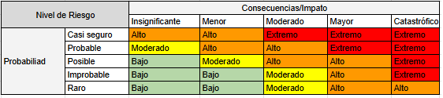
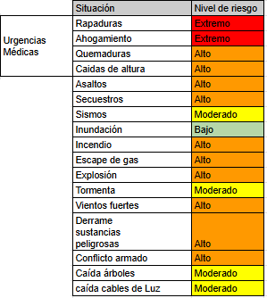

# 🧪 Análisis de Riesgos Nivel Grupo 🧪

Éste es un ejercicio de riesgos que hicimos en nuestro grupo que se encuentra en la CDMX en un parque el cuál queremos compartir. Sabemos que no es perfecto y que se puede mejorar, sin embargo es un punto de partida

## Riesgos y su clasificación

## Tratamiento de Riesgos

<table>
    <thead>
        <tr>
            <th>Tipo Riesgo</th>
            <th>Acciones</th>
            <th>Responable</th>
        </tr>
    </thead>
    <tbody>
        <tr>
            <td>Emergencias médicas</td>
            <td>
                <ul>
                    <li> Comprar botiquín para el grupo </li>
                    <li>  Solicitar botiquines para sección</li>
                    <li>  Tomar cursos de primeros auxilios</li>
                    <li>  Tomar cursos emergercias psicológicas</li>
                    <li>  Tomar cusos Safe from Harm(SFH) 1,2,3</li>
                    <li>  Crear protocolo de seguridad del local de grupo</li>
                    <li>  Solicitar fichas médicas</li>
                    <li>  Solicitar directorios al comité y por secciones</li>
                    <li>  Soliictar que todas las actividades sean seguras</li>
                    <li>  Organizar brigada de emergecia</li>
                </ul> 
            </td>
            <td>Grupo</td>
        </tr>
        <tr>
            <td>Asaltos</td>
            <td>
                <ul>
                    <li>Crear protocolo de seguridad del local de grupo </li>
                    <li>Crear mapa del local con zonas de peligro </li>
                    <li>Compara silbatos para el grupo </li>
                    <li>Solicitar silbatos por sección </li>
                    <li>Organizar brigada Seguridad </li>
                 </ul> 
            </td>            
            <td>Grupo</td>
        </tr>
        <tr>
            <td>Secuestros</td>
            <td>
                <ul>
                    <li>Crear protocolo de seguridad del local de grupo </li>
                    <li>Crear mapa del local con zonas de peligro </li>
                    <li>Solicitar silbatos por sección </li>
                    <li>Solicitar reporte de salida y llegada segura al local en los chats por sección </li>
                    <li>Organizar brigada Seguridad </li>
                 </ul> 
            </td>            
            <td>Grupo</td>
        </tr>
        <tr>
            <td>Sismos</td>
            <td>
                <ul>
                    <li>Crear protocolo de seguridad del local de grupo </li>
                    <li>Crear mapa de zona segura en el local </li>
                    <li>Ubicar zonas seguras en casa, escuela, trabajo </li>
                    <li>Solicitar que por seccion se reporten en sus chats </li>
                    <li>Solicitar que los Scouter se reporten en el chat de jefes </li>
                    <li>Organizar brigada de emergecia </li>
                 </ul> 
            </td>            
            <td>Grupo</td>
        </tr>
        <tr>
            <td>Inundación</td>
            <td>
                <ul>
                    <li>Crear protocolo de seguridad del local de grupo </li>
                    <li>Crear mapa de zona segura en el local </li>
                    <li>Ubicar zonas seguras en casa, escuela, trabajo </li>
                    <li>Organizar brigada de emergecia </li>
                </ul>
            </td>            
            <td>Grupo</td>
        </tr>
        <tr>
            <td>Incendio</td>
            <td>
                <ul>
                    <li>Crear protocolo de seguridad del local de grupo</li>
                    <li>Crear mapa de zona segura en el local</li>
                    <li>Ubicar zonas seguras en casa, escuela, trabajo</li>
                    <li>Comprar extintor</li>
                    <li>Comprar garrafón con agua</li>
                    <li>Organizar brigada de emergecia</li>
                </ul>
            </td>            
            <td>Grupo</td>
        </tr>
        <tr>
            <td>Escape de gas</td>
            <td>
                <ul>
                    <li>Crear protocolo de seguridad del local de grupo</li>
                    <li>Crear mapa de zona segura en el local</li>
                    <li>Ubicar zonas seguras en casa, escuela, trabajo</li>
                    <li>Organizar brigada de emergecia</li>
                </ul>
            </td>            
            <td>Grupo</td>
        </tr>
        <tr>
            <td>Tormenta</td>
            <td>
                <ul>
                    <li>Crear protocolo de seguridad del local de grupo</li>
                    <li>Crear mapa de zona segura en el local</li>
                    <li>Ubicar zonas seguras en casa, escuela, trabajo</li>
                    <li>Organizar brigada de emergecia</li>
                </ul>
            </td>            
            <td>Grupo</td>
        </tr>
        <tr>
            <td>Vientos fuertes</td>
            <td>
                <ul>
                    <li>Crear protocolo de seguridad del local de grupo</li>
                    <li>Crear mapa de zona segura en el local</li>
                    <li>Ubicar zonas seguras en casa, escuela, trabajo</li>
                    <li>Organizar brigada de emergecia</li>
                </ul>
            </td>            
            <td>Grupo</td>
        </tr>
        <tr>
            <td>Derrame  sustancias peligrosas</td>
            <td>
                <ul>
                    <li>Crear protocolo de seguridad del local de grupo</li>
                    <li>Crear mapa de zona segura en el local</li>
                    <li>Ubicar zonas seguras en casa, escuela, trabajo</li>
                    <li>Organizar brigada de emergecia</li>
                </ul>
            </td>            
            <td>Grupo</td>
        </tr>
        <tr>
            <td>Conflicto armado</td>
            <td>
                <ul>
                    <li>Crear protocolo de seguridad del local de grupo</li>
                    <li>Crear mapa de zona segura en el local</li>
                    <li>Ubicar zonas seguras en casa, escuela, trabajo</li>
                    <li>Organizar brigada de emergecia</li>
                </ul>
            </td>            
            <td>Grupo</td>
        </tr>
        <tr>
            <td>Caída de árboles </td>
            <td>
                <ul>
                    <li>Crear protocolo de seguridad del local de grupo</li>
                    <li>Crear mapa de zona segura en el local</li>
                    <li>Ubicar zonas seguras en casa, escuela, trabajo  </li>
                    <li>Organizar brigada de emergecia</li>
                </ul>
            </td>            
            <td>Grupo</td>
        </tr>
        <tr>
            <td>Caída de cables</td>
            <td>
                 <ul>
                    <li>Crear protocolo de seguridad del local de grupo</li>
                    <li>Crear mapa de zona segura en el local</li>
                    <li>Ubicar zonas seguras en casa, escuela, trabajo</li>
                    <li>Organizar brigada de emergecia</li>
                </ul>
            </td>            
            <td>Grupo</td>
        </tr>
    </tbody>
</table>

## Checlist

|Equipo	                                                |¿Se tiene?|	Detalle          |
|-------------------------------------------------------|----------|---------------------|
|Botiquín de grupo(materiales y equipos médicos básicos)|[X]       |                     |	
|Botiquín por sección Lobatos                           |[X]       |                     |	
|Botiquín por sección Tropa                             |[X]       |                     |		
|Botiquín por sección Comunidad                         |[X]       |                     |	
|Botiquín por sección Clan                              |[X]       |                     |	
|Protocolo de emergencias en el local de grupo          |[X]       |                     |	
|Refugio para atención de lesionados	                |[X]       |     ubicación...    |	
|Bandera de grupo	                                    |[X]       |                     |	
|Bandera de Lobatos	                                    |[X]       |                     |	
|Bandera de Tropa	                                    |[X]       |                     |	
|Bandera de Comunidad	                                |[X]       |                     |	
|Bandera de Clan	                                    |[X]       |                     |	
|Directorio de emergencia Scouters del Grupo	        |[X]       |                     |	
|Directorio de emergencia Lobatos	                    |[X]       |                     |	
|Directorio de emergencia  Tropa	                    |[X]       |                     |	
|Directorio de emergencia  Comunidad	                |[X]       |                     |	
|Directorio de emergencia  Clan	                        |[X]       |                     |	
|Plano  o Mapa con Indicaciones de punto de reunión	    |[X]       |                     |	
|Mapa puntos de reunión Grupo	                        |[X]       |                     |	
|Mapa puntos de reunión sección Lobatos	                |[X]       |                     |	
|Mapa puntos de reunión sección Tropa	                |[X]       |                     |	
|Mapa puntos de reunión sección Comunidad	            |[X]       |                     |	
|Mapa puntos de reunión sección Clan	                |[X]       |                     |	
|Silbatos en caso de emergencia Grupo	                |[X]       |                     |	
|Silbatos en caso de emergencia Lobatos	                |[X]       |                     |	
|Silbatos en caso de emergencia Tropa	                |[X]       |                     |	
|Silbatos en caso de emergencia Comunidad	            |[X]       |                     |	
|Silbatos en caso de emergencia Clan	                |[X]       |                     |	
|Radios  dos vías Grupo	                                |[X]       |                     |	
|Radios  dos vías  Sección Lobatos	                    |[X]       |                     |	
|Radios  dos vías  Sección Tropa	                    |[X]       |                     |	
|Radios  dos vías  Sección Comunidad	                |[X]       |                     |	
|Radios  dos vías  Sección Clan	                        |[X]       |                     |	
|Botiquines personales grupo	                        |[X]       |                     |	
|Botiquines personales Lobatos	                        |[X]       |                     |	
|Botiquines personales Tropa	                        |[X]       |                     |	
|Botiquines personales Comunidad	                    |[X]       |                     |	
|Botiquines personales Clan	                            |[X]       |                     |	
|Navaja con herramientas Básicas grupo	                |[X]       |                     |	
|Navaja con herramientas Lobatos	                    |[X]       |                     |	
|Navaja con herramientas Tropa	                        |[X]       |                     |	
|Navaja con herramientas Comunidad	                    |[X]       |                     |	
|Navaja con herramientas Clan	                        |[X]       |                     |	
|Fichas Medicas Grupo	                                |[X]       |                     |	
|Fichas Medicas Seccón Lobatos	                        |[X]       |                     |	
|Fichas Medicas Seccón Tropa	                        |[X]       |                     |	
|Fichas Medicas Seccón Comunidad	                    |[X]       |                     |	
|Fichas Medicas Seccón Clan	                            |[X]       |                     |

## Plan de Emergencia
|Situación             |Acciones|Responsable|Teléfono de Emergencia|Cómo avisar al 911|Observaciones|
|----------------------|--------|-----------|----------------------|-----------|-------------|
|Raspadura             |        |           |Emergencias: 911, Cruz Roja:  55 5395 1111 Ext 103 y 121.|Prioridades,Identificación de quién llama, Dónde estamos, Coordenada en caso de aplicar, Tipo/Descripción de emergencia,Número de afectados,Accesos,Asistentes totales,Acciones del plan de emergencia realizadas,Solicitud de apoyo,Condiciones meteorológicas,Teléfono de dónde se llama|      Protocolo de seguridad de Grupo       |
|Ahogamiento           |        |           |                      |           |             |
|Caidas moderas        |        |           |                      |           |             |
|Asaltos               |        |           |                      |           |             |
|Secuestros            |        |           |                      |           |             |
|Sismos                |        |           |                      |           |             |
|Inundación            |        |           |                      |           |             |
|Incendio              |        |           |                      |           |             |
|Escape de gas         |        |           |                      |           |             |
|Explosión             |        |           |                      |           |             |
|Tormenta              |        |           |                      |           |             |
|Vientos fuertes       |        |           |                      |           |             |
|Derrame               |        |           |                      |           |             |
|sustancias peligrosas |        |           |                      |           |             |
|Conflicto armado      |        |           |                      |           |             |
|Caida de árboles      |        |           |                      |           |             |
|caida de cables       |        |           |                      |           |             |

## Plan de Evacuación

|Acciones básicas a tomar:|
|---------------------------------------------|
|Reconocimiento previo de la zona y recorrido |
|Identificación de recursos de apoyo en caso de emergencia |
|Programa de actividades conocidos por todos |
|Identificación de los puntos de reunión |
|Mapa de riesgos |
|Señales de alarma |