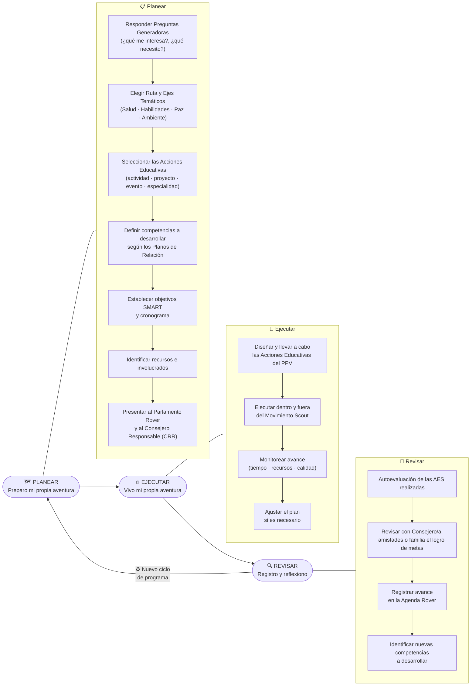

# ✏️ Metodología PER — Clan de Rovers
### Ciclo Personal de Programa | Jóvenes 18 a 21 años



> **Duración recomendada del Ciclo Personal de Programa:** 3, 4 o 6 meses máximo, para mantener objetivos SMART alcanzables.
> El ciclo es **personal e independiente** al Ciclo de Programa de la Sección.
```
