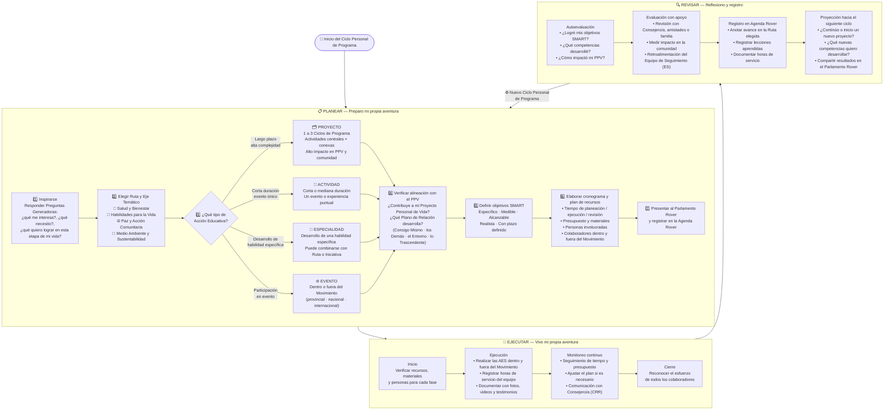

# ✏️ Selección de Proyectos y Actividades — Clan de Rovers
### Proceso dentro del Ciclo PER | Jóvenes 18 a 21 años



> **Tipos de Acción Educativa (AES) en el Clan de Rovers:**
> - **Proyecto:** 1 a 3 Ciclos de Programa; objetivos acotados; evaluado para la progresión personal.
> - **Actividad:** corta o mediana duración; un Rover puede participar en actividades distintas a las del resto del Clan en el mismo fin de semana.
> - **Especialidad:** desarrollo de una habilidad; puede detonar un proyecto o iniciativa.
> - **Evento:** dentro o fuera del Movimiento (provincial, nacional, internacional).
>
> El **Parlamento Rover** selecciona las actividades colectivas del Clan (Ciclo de Programa y Macrociclo).
> El **Ciclo Personal de Programa** es independiente y responde al PPV de cada Rover.
```
