# 🚀 Ciclo de Programa: herramientas administrativas

## Propuesta

Usar la herramienta de seguimiento ed proyectos [Trello](https://trello.com/es/tour) para dar seguimiento del **Proyecto de Personal de Vida** 
/ **Progresión Personal** / **Ciclo de programa**, ya que Trello es muy intuitivo y cuenta con versión Gratuita.

### Algunas funcionalidades Trello

#### Vista Tableros, espacio de trabajo defecto **Espacio de trabajo de Trello**

  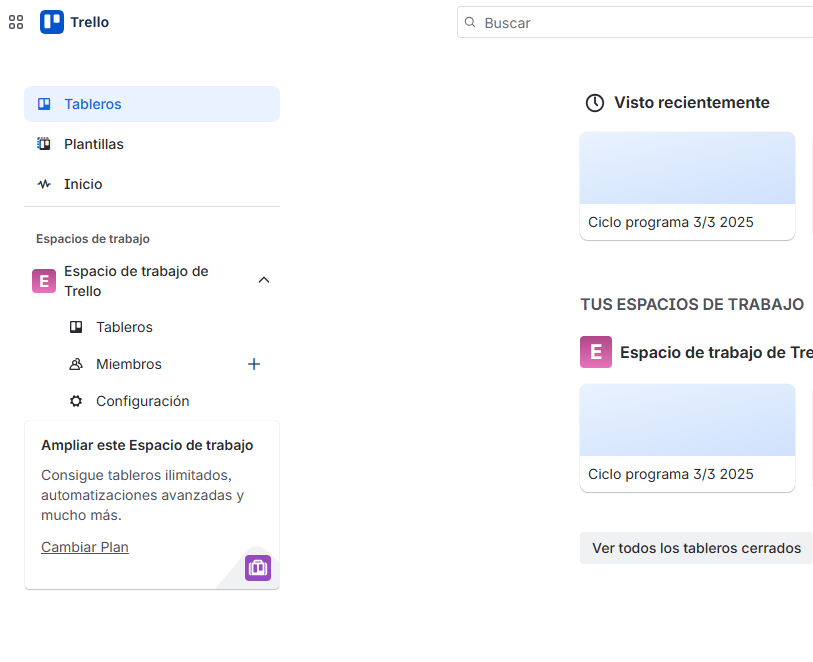

#### Creación Trablero de seguimiento de Proyectos 

  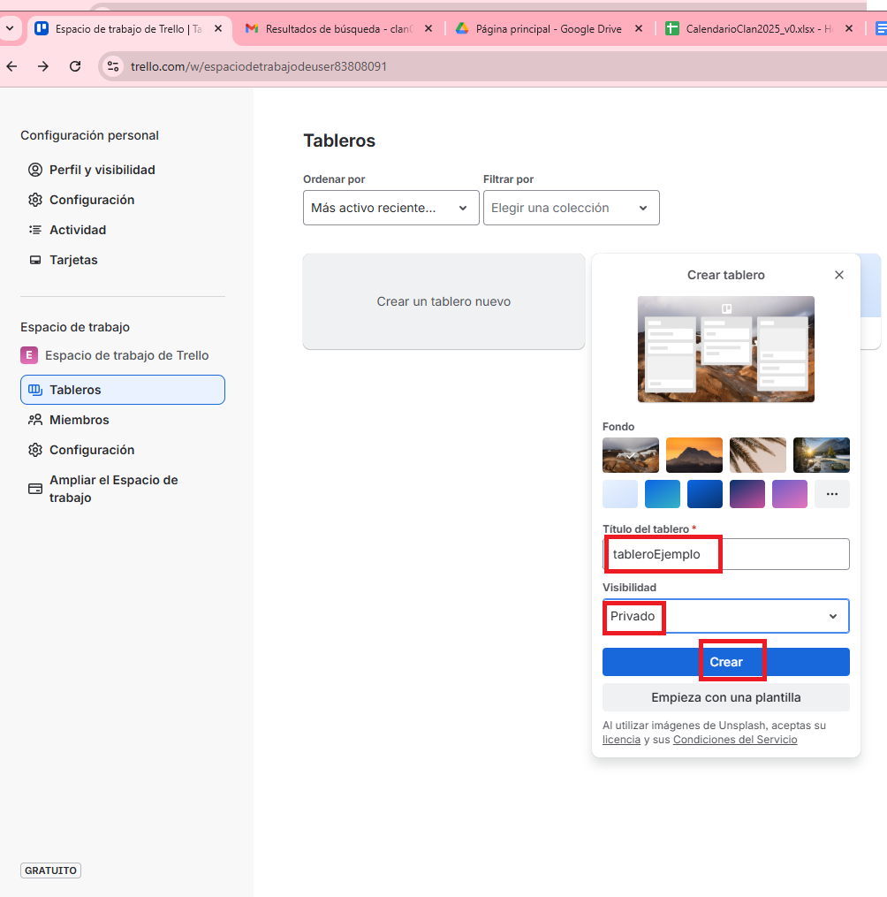 

  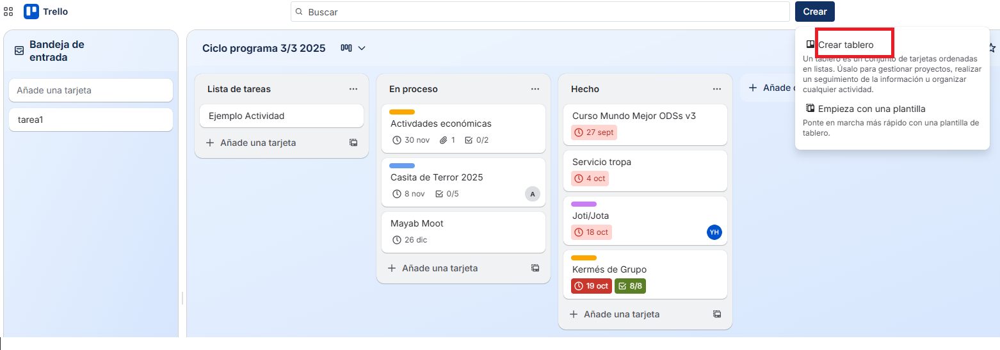

#### Cambiar vista 

  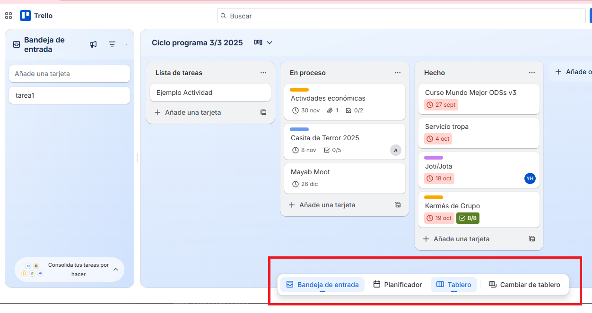 

#### Crear tareas

  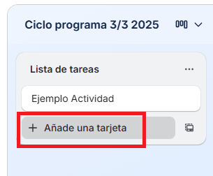

#### Crear lista (por defecto se crea la lista de tareas, **En proceso** y **Hecho**) 

  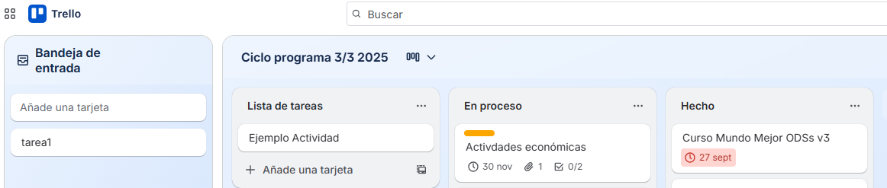 

  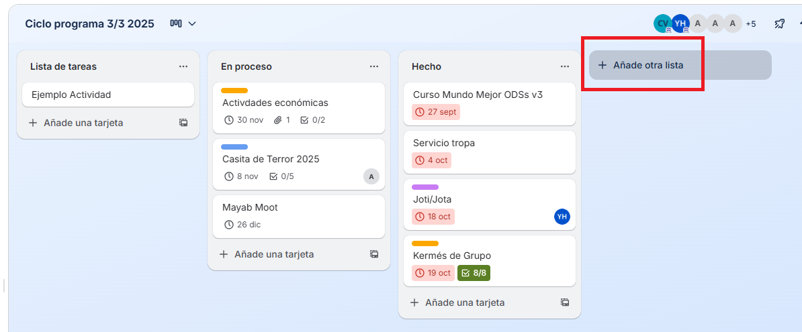

  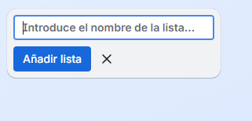
#### Crear etiquetas de colores y/o con texto 

  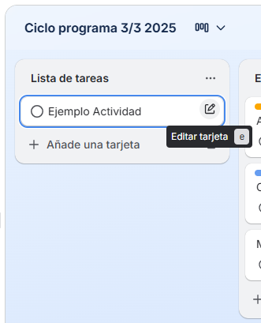 

  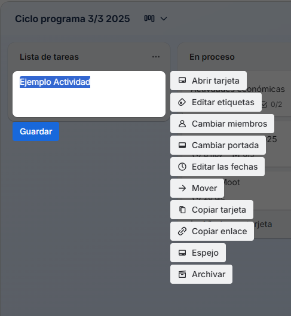

  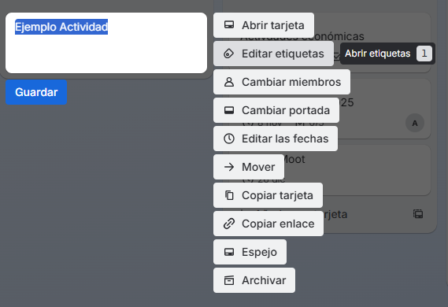

  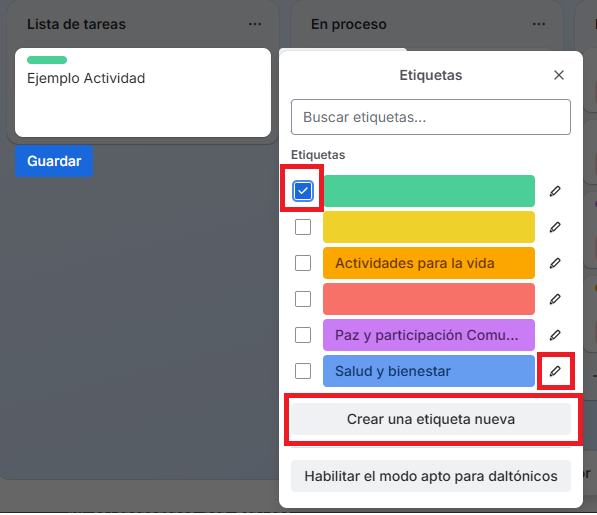

#### Asignar responsable(s)

  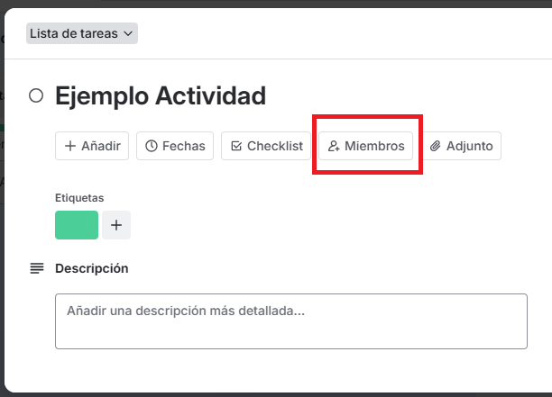 

  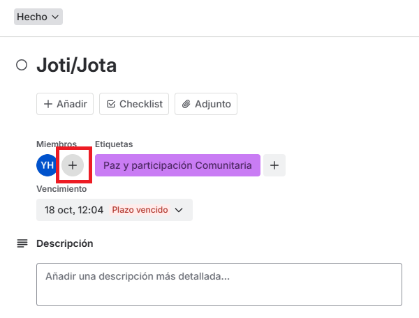

#### Asignar Fecha de Vencimiento

  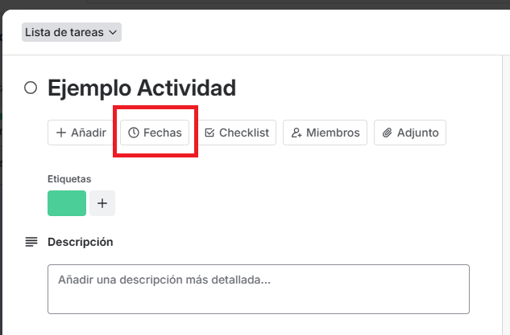

  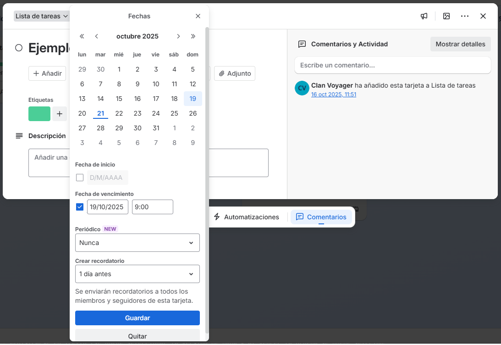

#### Automaticamente envía email con actividades proximas a vencer

  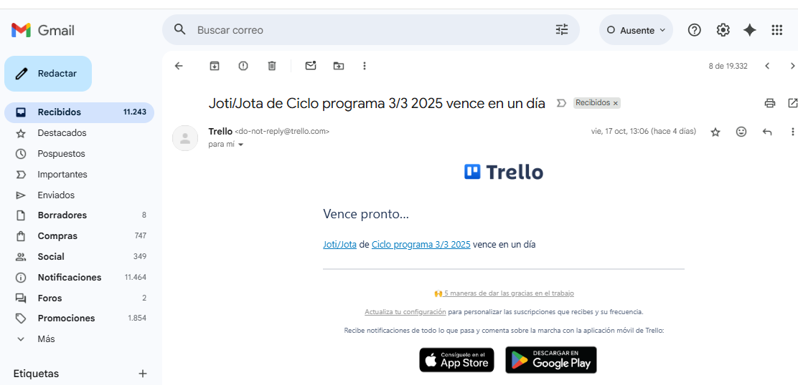

#### Vista rápida de porcentajes de avance de la tareas

  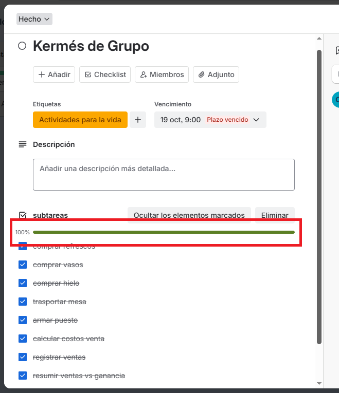

#### Reportes a los que se le pueden aplicar diversos filtros

#### Se pueden archivar alguna lista
  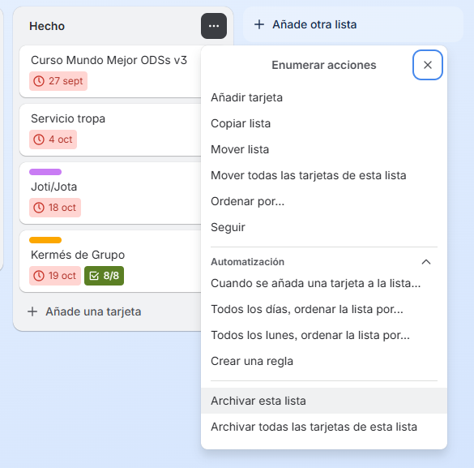

#### Ver elementos archivados

  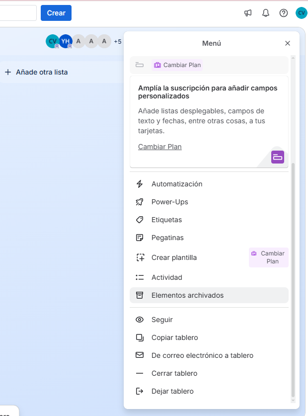

#### Además de la vista web, Trello se puede instalar en el celular, es compatible con Andriod y iPhone

### Algunas limitanes de Trello

- Únicamente 10 colaboradores por tablero

### Pasos para dar de alta un tablero

#### Usuarios administradores(Consejeros)
 
- Seleccionar el plan gratuito 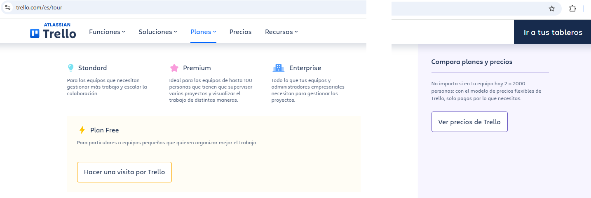
- Registrarse en Trello (se puede seleccionar la version de paga y al vencer la prueba se puede selccionar la version Free)
- Crear un tablero 
- Crear la lista de tarea
- Invitar a miembros del equipo
- Crear estados de las tareas, se sugieren **en proceso** y **Hecho** 

- Asignar Tareas a los Rovers

#### Rovers(Usuarios o grupo de seguimiento)

- Crear lista de tareas relacionadas a su PPV / Progresión / Ciclo de Programa 
- Agregar subtareas 
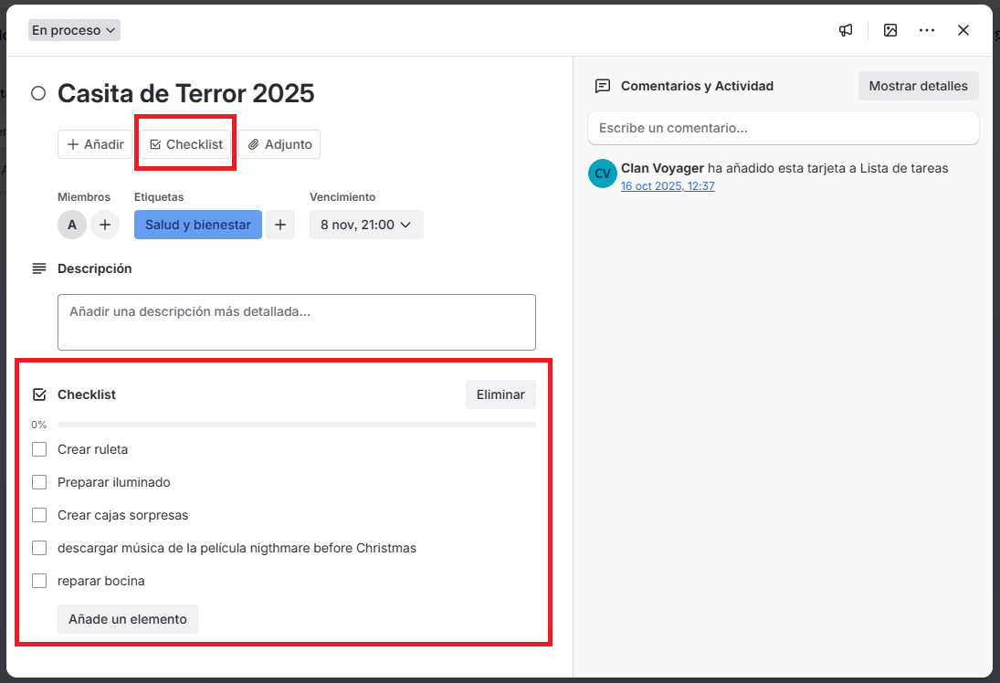
- Mover las tareas al estado correspondiente 

- Adjuntar evidencia, marca lista de subtareas terminadas 

##### Agradecimientos

- Diana Unzueta, que lleva tiempo usando Trello, junto la metodología Scrum y Kanvan Board para dar seguimiento al Ciclo de Programa/PPV/Progresión Personal, etc..

##### Redactora

- Yolanda Castillo