# 🧪 Cuestionarios de Autoconocimiento del Clan Anzanc-Alcira

La intención de éste documento es facilitar a otros clanes la herramienta que creamos de autoconocimiento, la cual les podemos ayudar a replicar en nuestro hosting con base de datos independiente y usuario administrador independiente,
cuyo objetivo es poder aplicar algunos cuestionarios como la clasificación de programación neurolinguística, qué tipo de alumno se es, cómo se aprende. 

Aclarando que no somos expertos en el tema y los resultados dan una sugerencia.

Nuestro site está basado en el proyecto en el lenguaje de programción PHP y base de datos MySQL con licencia MIT https://github.com/phpdave11/php-survey-builder con algunas mejoras e incorporación de gráficos

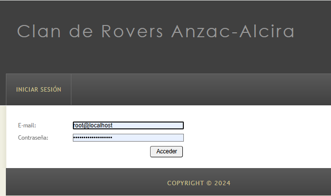
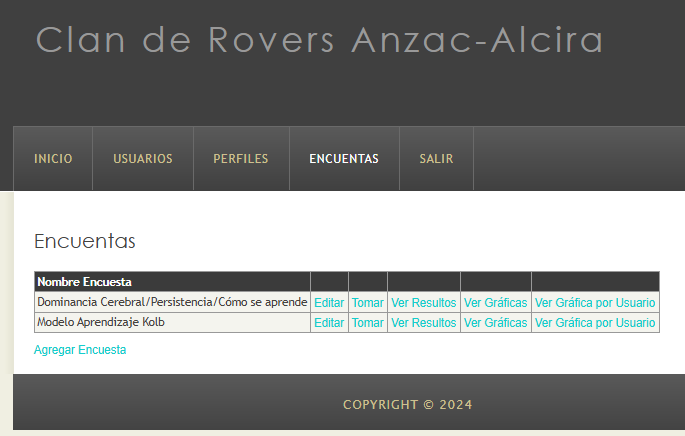

Algunos resultados de la aplicación de los cuestionarios
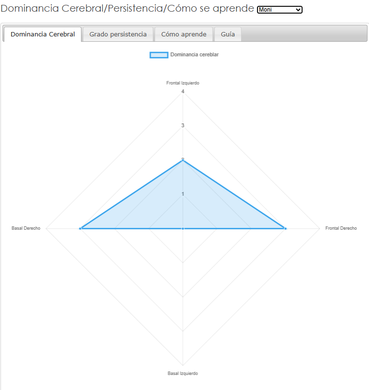
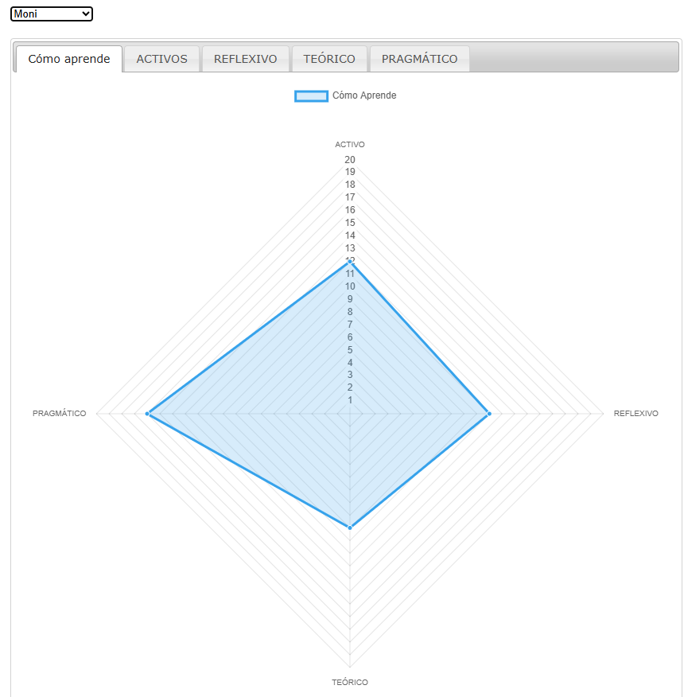

Guías de los resultados
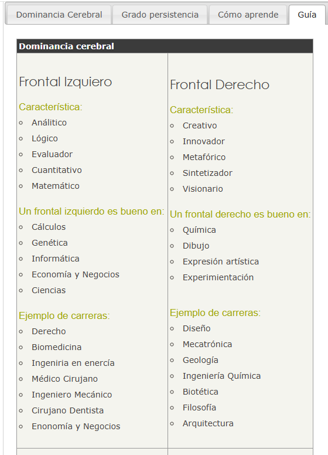
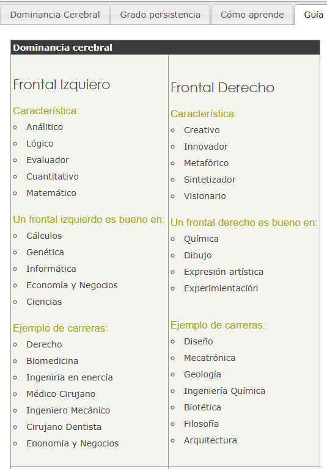
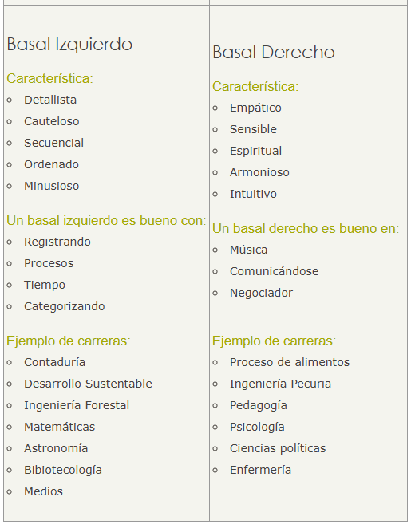
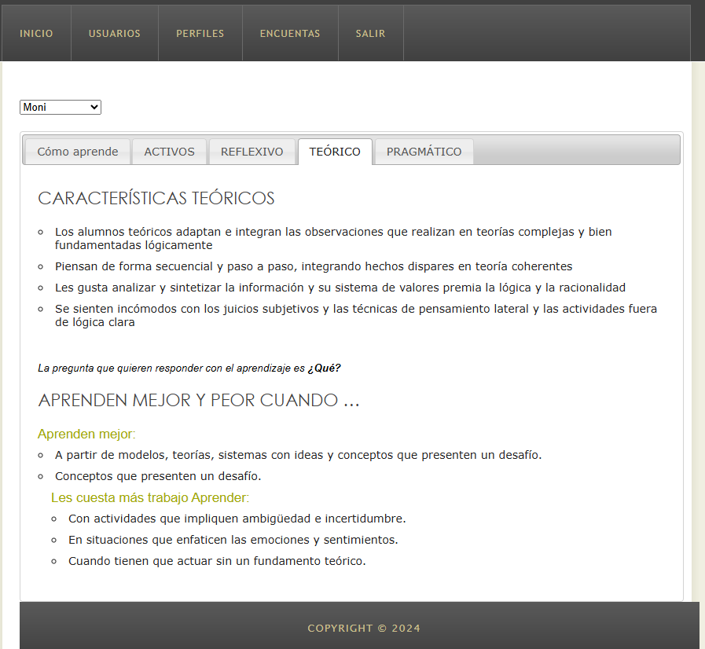
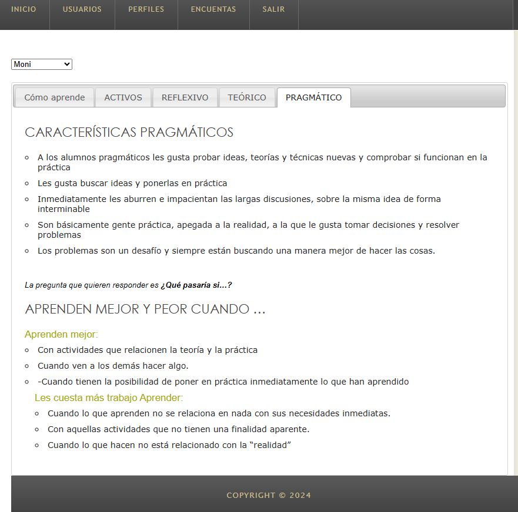

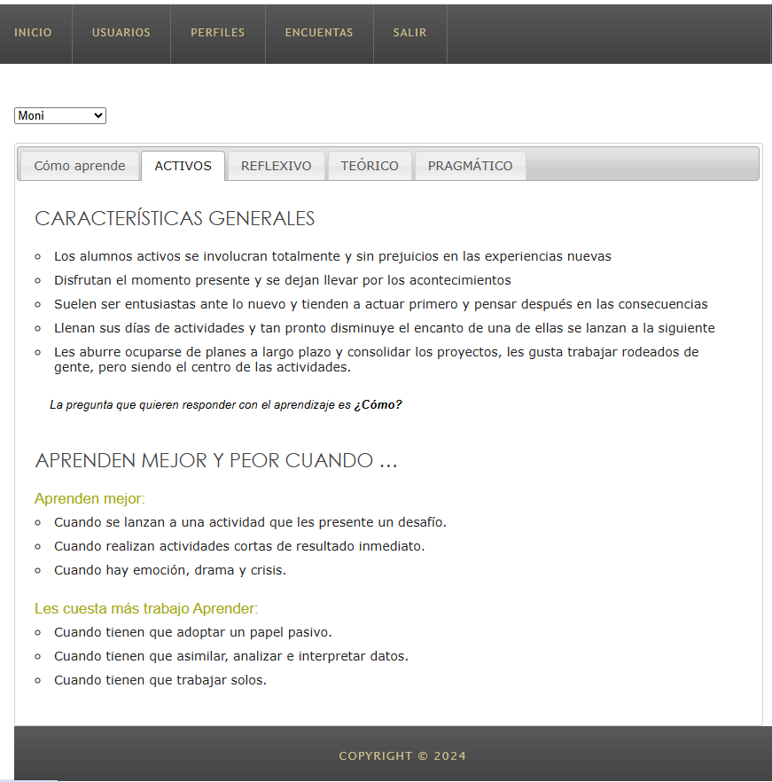
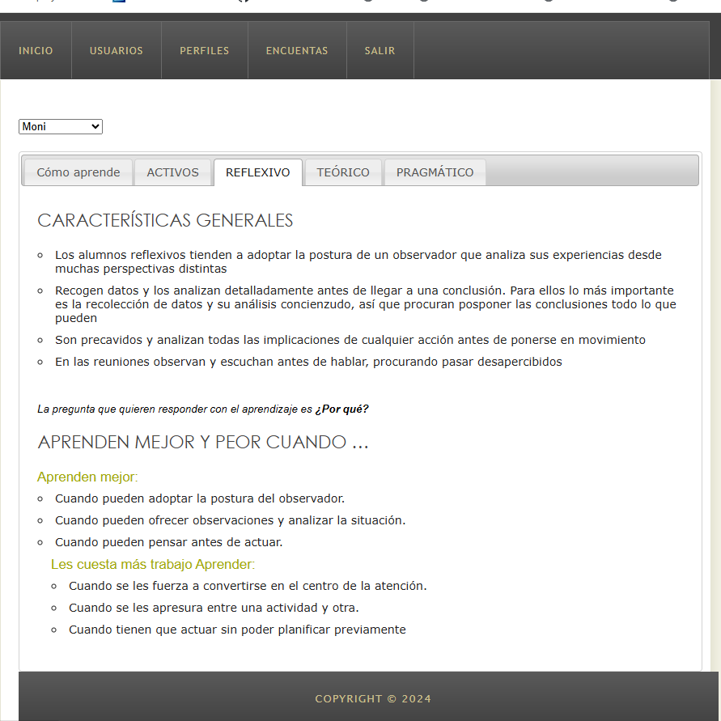

## Nuestra herramienta la basamos en cuestionarios como los que se listana abajo

Cuestionario de tipo de aprendizaje se tiene relacionado a si se es kinestesico, auditivo, visual
por ejemplo 

Cuestionarios de qué tipo de estudiante se es, por ejemplo:

Cuestionarios sobre que clasificación desdes el punto de vista de programación neurolinguistica

