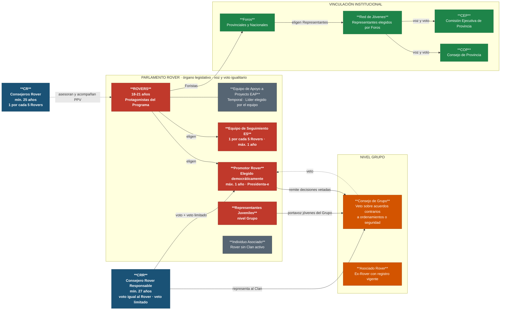

# Estructura del Clan de Rovers

Esta propuesta no sustituyen la documentación oficial, no nos hacemos responsables del mal uso.

**Sección:** Clan de Rovers · **Edades:** 18 a 21 años · **Lema:** ¡Servir!

> Fuentes: *Las Rutas del Rover* (ASMAC, 2024) · *Guía de Scouter de Clan de Rovers* (DNME/CNAM, 2024)

---

| Elemento | Quiénes | Edad | Función clave |
|---|---|---|---|
| **Rovers** | Jóvenes protagonistas | 18-21 años | Planean, ejecutan y evalúan su PPV; voz y voto igualitario en el Parlamento |
| **Promotor Rover** | Rover elegido por el Parlamento | 18-21 años | Preside el Parlamento; administra y coordina el Clan; máx. 1 año |
| **Equipo de Seguimiento (ES)** | Rovers elegidos por el Parlamento | 18-21 años | Seguimiento al PPV; informa al Parlamento; 1 por cada 5 Rovers; máx. 1 año |
| **Equipo de Apoyo a Proyecto (EAP)** | Rovers por proyecto | 18-21 años | Equipo temporal; Líder elegido por el equipo |
| **Representantes Juveniles** | Rovers elegidos por sus pares | 18-21 años | Portavoces de todos los jóvenes del Grupo ante el Consejo de Grupo |
| **Consejero Rover Responsable (CRR)** | Adulto voluntario | mín. 27 años | Único representante del Clan ante el CG; miembro permanente del Parlamento; voto + veto limitado |
| **Consejeros Rover (CR)** | Adultos voluntarios | mín. 25 años | Asesoría educativa y acompañamiento del PPV; 1 por cada 5 Rovers |
| **Individuo Asociado** | Rover sin Clan activo | 18-21 años | Registrado en ASMAC; recibe acompañamiento de su Consejero |
| **Asociado Rover** | Ex-Rover | +22 años | Concluyó el Programa; mantiene registro vigente |
| **Consejo de Grupo** | Jefes de Sección + CRR | — | Veto sobre acuerdos contrarios a ordenamientos o que pongan en riesgo la seguridad |
| **Foros Provinciales/Nacionales** | Rovers Foristas | 18-21 años | Participación juvenil; elección democrática de Representantes al Comité Red de Jóvenes |
| **Red de Jóvenes** | Representantes elegidos en Foros | 18-21 años | Voz y voto ante COP y CEP de Provincia |

##### Autora

- Yolanda Castillo