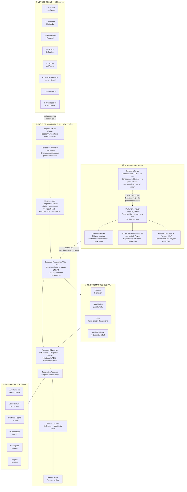

# Diagrama: Funcionamiento del Clan de Rovers



---

## Resumen del funcionamiento

| Elemento | Descripción |
|---|---|
| **Edad** | 18 años – un día antes de cumplir 22 |
| **Lema** | ¡Servir! |
| **Marco Simbólico** | "Vivir mi propia aventura mediante un proyecto de vida" |
| **Órgano legislativo** | Parlamento Rover (todos los Rovers, voto igual) |
| **Herramienta central** | Proyecto Personal de Vida (PPV) |
| **Metodología de proyectos** | PER — Planeo · Ejecuto · Reviso |
| **Objetivos** | SMART — Específico · Medible · Alcanzable · Realista · Tiempo |
| **Ceremonias** | Compromiso Rover (Vigilia + Investidura) y Partida Rover |
| **Consejero** | Asesora y acompaña, no dirige; CRR ≥ 27 años |

#### Herramientas usadas para generar los diargramas

- [Claude Code](https://claude.com/pricing) 
- [Microsoft Marktdown](https://github.com/microsoft/markitdown) 

##### Redactora

- Yolanda Castillo

```