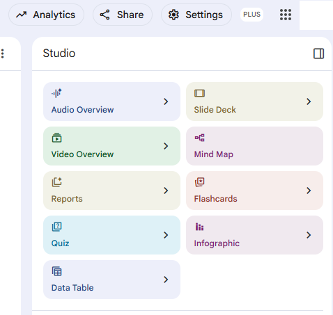

# ✏️ Herramientas IA Generativa

## NotebookLM

[NotebookLM]( https://notebooklm.google.com/) es una herramienta de Google a la cual se le suben fuentes y con IA generativa se le pueden pedir algunas de las tareas 

## Surfense

[https://www.surfsense.com/](https://www.surfsense.com/) es otra herramienta que a diferencia de NotbookLM se tiene más control

##### Autora

- Yolanda Castillo