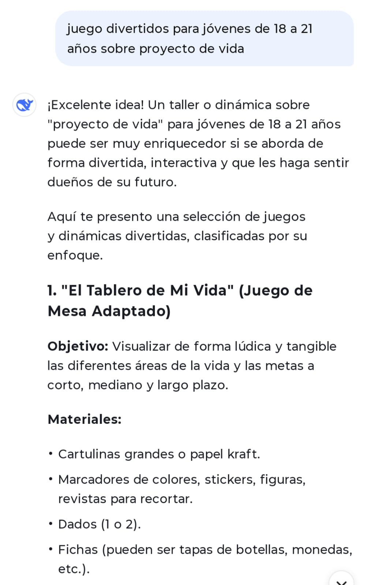

# 🚀 Inteligencia artificial: herramientas administrativa para Actividades

## Propuesta

Usar inteligencia artificiales para crear actividades atractivas

## Algunos proveedores de IA

- ChatGPT
- Deep Seek
- Claude
- Gemini
- Copilot


## Notas importantes sobre las IAs

- Las IAs son no deterministas, eso  quiere decir que cada vez que se haga una consulta se obtendrá una respuesta diferente,
hoy en día las respuesta será casi iguales en cada consulta
- El conocimiento o contexto de las IAs depende de la versión y fecha de creación si una versión se liberó en  31 de diciembre de 2020, 
la IA no sabe que pasó despues de ese día. Se puede comprobar preguntado que día es hoy
- Las IAs tiene versión móvil Android y iPhone
- Las IAs no son perfecta, es de nosotros modificar a nuestra conveniencia sus sugerencia o mejor lo específico de nuestro prompt para obtener la mejor respuesta posible

## Qué es un "propmt" de IA

Son las instrucciones que le damos a la IA para obtener una respuesta

### Tipos de Prompts


### Trucos para redactar buenos prompts

El tipo de prompt sugerido para crear actividade divertidas es RTF


## Ejemplo de un prompt

```bash
Crea un juego divertivo para jóvenes de 18 a 21 años sobre su proyecto de vida
```
La respuesta se verá como



```bash
¡Excelente idea! Un taller o dinámica sobre "proyecto de vida" para jóvenes de 18 a 21 años puede ser muy enriquecedor si se aborda de forma divertida, interactiva y que les haga sentir dueños de su futuro.

Aquí te presento una selección de juegos y dinámicas divertidas, clasificadas por su enfoque.

1. "El Tablero de Mi Vida" (Juego de Mesa Adaptado)

Objetivo: Visualizar de forma lúdica y tangible las diferentes áreas de la vida y las metas a corto, mediano y largo plazo.

Materiales:

· Cartulinas grandes o papel kraft.
· Marcadores de colores, stickers, figuras, revistas para recortar.
· Dados (1 o 2).
· Fichas (pueden ser tapas de botellas, monedas, etc.).

Cómo se juega:

1. Preparación: En la cartulina, cada participante crea su propio "tablero de juego". En lugar de casillas numeradas, dibujan un camino que representa su vida. Dividen el camino en secciones (ej: 18-25 años, 26-35, 36-50, 50+).
2. Las "Casillas": En cada sección, dibujan o pegan imágenes que representen metas en diferentes áreas: Carrera/Estudios (ej: graduarse, primer empleo), Personal (ej: viajar a X lugar, aprender un idioma), Salud (ej: correr una maratón), Relaciones (ej: formar una familia, tener un círculo sólido de amigos).
3. Jugando: Por turnos, tiran el dado y avanzan. Cuando caen en una "casilla-meta", deben compartir con el grupo: "¿Por qué esta meta es importante para mí?" y "¿Qué primer paso pequeño puedo dar este año para acercarme a ella?".
4. Variante: Se pueden añadir "cartas de oportunidad" (ej: "Conociste a una persona inspiradora, avanza 2 casillas") o "cartas de desafío" (ej: "Planes cambiaron, reflexiona y adapta una meta").

Por qué es divertido: Es creativo, personalizable y se parece a un juego de mesa, lo que lo hace familiar y entretenido. Fomenta la reflexión profunda disfrazada de juego.

---

2. "Bingo de Habilidades y Sueños"

Objetivo: Identificar habilidades propias, reconocerlas en otros y conectar cómo pueden ser la clave para lograr sus sueños.

Materiales:

· Tarjetas de bingo personalizadas (pueden crearlas ellos mismos).
· Lista de habilidades y sueños (preparada por el facilitador).

Cómo se juega:

1. Preparación: Cada participante crea su cartón de bingo. En cada casilla, escribe una habilidad que tenga (ej: "soy buen escuchando", "me defiendo con el inglés", "soy persistente", "cocino bien") o un sueño/meta (ej: "vivir en el extranjero", "tener mi propio emprendimiento").
2. El Juego: El facilitador lee en voz alta frases como:
   · "¿Quién tiene una habilidad que le ayude en una crisis?"
   · "¿Quién tiene un sueño que requiera aprender algo nuevo?"
   · "¿Quién conoce a alguien (señalando a un compañero) que sea bueno liderando?"
   · "¿Quién tiene una meta para los próximos 5 años?"
3. Si la descripción coincide con una casilla de su cartón, la marcan. Grita "Bingo!" quien complete una línea o el cartón lleno.
4. Discusión final: La clave es la conversación posterior. El ganador debe compartir ejemplos de sus habilidades y sueños. Preguntar al grupo: "¿Cómo la habilidad X de [nombre] puede ayudarle a lograr el sueño Y?"

Por qué es divertido: Es social, activo y les hace sentirse valorados al reconocer sus talentos y los de sus compañeros.

---

3. "El Viaje del Héroe" (Role-Playing Narrativo)

Objetivo: Enmarcar la vida como una historia épica donde ellos son los protagonistas, identificando desafíos, aliados y su "misión".

Cómo se juega:

1. Introducción: Explícales la estructura clásica de "El Viaje del Héroe" (de Joseph Campbell): un héroe con una vida normal recibe una "llamada a la aventura", enfrenta pruebas, encuentra mentores y aliados, y regresa transformado.
2. Asignación de Roles: En grupos de 3-4, uno será el "Héroe/Protagonista". Los otros serán: El Mentor (da consejos sabios), El Aliado (apoya y ayuda) y El Guardián del Umbral (representa los obstáculos y miedos).
3. La Misión: El Héroe comparte una meta real o un desafío que enfrente (ej: "elegir la carrera correcta", "independizarme").
4. Role-Playing: Durante 10 minutos, los personajes interactúan. El Guardián plantea obstáculos ("¡No tendrás suficiente dinero!", "¡Es muy arriesgado!"). El Aliado y el Mentor ayudan al Héroe a encontrar soluciones y fortalecer su determinación.
5. Reflexión: Al final, el Héroe comparte qué aprendió, qué recursos internos descubrió y cómo se siente respecto a su desafío ahora.

Por qué es divertido: Es teatral, creativo y permite abordar miedos reales de una manera metafórica y menos intimidante. La colaboración es clave.

---

4. "Timeline Collage" (Dinámica Creativa Grupal)

Objetivo: Crear una línea de tiempo visual y colectiva que inspire sobre las infinitas posibilidades del futuro.

Materiales:

· Una pared grande o varias cartulinas unidas.
· Muchas revistas viejas para recortar.
· Pegamento, tijeras, marcadores.
· Música inspiradora de fondo.

Cómo se juega:

1. Preparación: Pegan las cartulinas en la pared y trazan una línea de tiempo gigante con décadas (2020s, 2030s, 2040s, etc.).
2. Creación: Los participantes buscan en las revistas imágenes, palabras o frases que representen cómo se imaginan su futuro en esas décadas. No solo cosas materiales, sino sensaciones, logros, viajes, familia, contribuciones a la sociedad.
3. Presentación: Cada persona pega sus imágenes en la década correspondiente y explica brevemente al grupo qué eligió y por qué. Por ejemplo: "Puse esta imagen de alguien dando un discurso en los 2030 porque para entonces me veo como un experto en mi campo, compartiendo lo que sé."
4. Resultado: Se crea un mural colorido y poderoso que representa los sueños colectivos del grupo.

Por qué es divertido: Es muy visual, artístico y colaborativo. La energía de crear algo juntos es motivadora y ver las aspiraciones de otros amplía su propia perspectiva.

---

Consejos para el Facilitador:

· Ambiente: Crea un ambiente seguro y de confianza. Lo que se comparta debe ser respetado.
· Tono: Mantén un tono energético y positivo. Evita que se convierta en una clase o una terapia.
· Reflexión Final: Siempre cierra con una ronda de conclusiones. Pregunta: "¿Qué se llevan de hoy?", "¿Cuál fue la idea más sorprendente que tuvieron?" o "¿Qué acción pequeña harán esta semana?".
· Flexibilidad: Adapta las reglas de los juegos a tu grupo y al tiempo disponible.

¡Espero que estas ideas te sirvan para crear una experiencia memorable y muy útil para esos jóvenes!
```

### Dónde se puede ver para qué es mejor la  cada IA

En [Velum](https://www.vellum.ai/llm-leaderboard) se pueder observar bencharmarks o pruebas de performance, para que sirve mejor cada una


##### Redactora

Yolanda Castillo