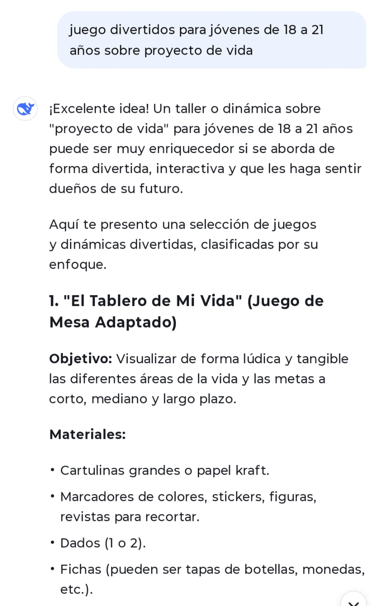

#  Inteligencia artificial: herramientas administrativa para Actividaes

## Propuesta

Usar inteligencia artificiales para crear actividades atractivas

## Algunos proveedores de IA

- ChatGPT
- Deep Seek
- Claude
- Gemini
- Copilot


## Notas importantes sobre las IAs

- Las IAs son no deterministas, eso  quiere decir que cada vez que se haga una consulta se obtendr谩 una respuesta diferente,
hoy en d铆a las respuesta ser谩 casi iguales en cada consulta
- El conocimiento o contexto de las IAs depende de la versi贸n y fecha de creaci贸n si una versi贸n se liber贸 en  31 de diciembre de 2020, 
la IA no sabe que pas贸 despues de ese d铆a. Se puede comprobar preguntado que d铆a es hoy
- Las IAs tiene versi贸n m贸vil Android y iPhone
- Las IAs no son perfecta, es de nosotros modificar a nuestra conveniencia sus sugerencia o mejor lo espec铆fico de nuestro prompt para obtener la mejor respuesta posible

## Qu茅 es un "propomt" de IA

Son las instrucciones que le damos a la IA para obtener una respuesta

### Tipos de Prompts


### Trucos para redactar buenos prompts

El tipo de prompt sugerido para crear actividade divertidas es RTF


## Ejemplo de un prompt

```bash
Crea un juevo divertivo para j贸venes de 18 a 21 a帽os sobre su proyecto de vida
```
La respuesta se ver谩 como



```bash
隆Excelente idea! Un taller o din谩mica sobre "proyecto de vida" para j贸venes de 18 a 21 a帽os puede ser muy enriquecedor si se aborda de forma divertida, interactiva y que les haga sentir due帽os de su futuro.

Aqu铆 te presento una selecci贸n de juegos y din谩micas divertidas, clasificadas por su enfoque.

1. "El Tablero de Mi Vida" (Juego de Mesa Adaptado)

Objetivo: Visualizar de forma l煤dica y tangible las diferentes 谩reas de la vida y las metas a corto, mediano y largo plazo.

Materiales:

路 Cartulinas grandes o papel kraft.
路 Marcadores de colores, stickers, figuras, revistas para recortar.
路 Dados (1 o 2).
路 Fichas (pueden ser tapas de botellas, monedas, etc.).

C贸mo se juega:

1. Preparaci贸n: En la cartulina, cada participante crea su propio "tablero de juego". En lugar de casillas numeradas, dibujan un camino que representa su vida. Dividen el camino en secciones (ej: 18-25 a帽os, 26-35, 36-50, 50+).
2. Las "Casillas": En cada secci贸n, dibujan o pegan im谩genes que representen metas en diferentes 谩reas: Carrera/Estudios (ej: graduarse, primer empleo), Personal (ej: viajar a X lugar, aprender un idioma), Salud (ej: correr una marat贸n), Relaciones (ej: formar una familia, tener un c铆rculo s贸lido de amigos).
3. Jugando: Por turnos, tiran el dado y avanzan. Cuando caen en una "casilla-meta", deben compartir con el grupo: "驴Por qu茅 esta meta es importante para m铆?" y "驴Qu茅 primer paso peque帽o puedo dar este a帽o para acercarme a ella?".
4. Variante: Se pueden a帽adir "cartas de oportunidad" (ej: "Conociste a una persona inspiradora, avanza 2 casillas") o "cartas de desaf铆o" (ej: "Planes cambiaron, reflexiona y adapta una meta").

Por qu茅 es divertido: Es creativo, personalizable y se parece a un juego de mesa, lo que lo hace familiar y entretenido. Fomenta la reflexi贸n profunda disfrazada de juego.

---

2. "Bingo de Habilidades y Sue帽os"

Objetivo: Identificar habilidades propias, reconocerlas en otros y conectar c贸mo pueden ser la clave para lograr sus sue帽os.

Materiales:

路 Tarjetas de bingo personalizadas (pueden crearlas ellos mismos).
路 Lista de habilidades y sue帽os (preparada por el facilitador).

C贸mo se juega:

1. Preparaci贸n: Cada participante crea su cart贸n de bingo. En cada casilla, escribe una habilidad que tenga (ej: "soy buen escuchando", "me defiendo con el ingl茅s", "soy persistente", "cocino bien") o un sue帽o/meta (ej: "vivir en el extranjero", "tener mi propio emprendimiento").
2. El Juego: El facilitador lee en voz alta frases como:
   路 "驴Qui茅n tiene una habilidad que le ayude en una crisis?"
   路 "驴Qui茅n tiene un sue帽o que requiera aprender algo nuevo?"
   路 "驴Qui茅n conoce a alguien (se帽alando a un compa帽ero) que sea bueno liderando?"
   路 "驴Qui茅n tiene una meta para los pr贸ximos 5 a帽os?"
3. Si la descripci贸n coincide con una casilla de su cart贸n, la marcan. Grita "Bingo!" quien complete una l铆nea o el cart贸n lleno.
4. Discusi贸n final: La clave es la conversaci贸n posterior. El ganador debe compartir ejemplos de sus habilidades y sue帽os. Preguntar al grupo: "驴C贸mo la habilidad X de [nombre] puede ayudarle a lograr el sue帽o Y?"

Por qu茅 es divertido: Es social, activo y les hace sentirse valorados al reconocer sus talentos y los de sus compa帽eros.

---

3. "El Viaje del H茅roe" (Role-Playing Narrativo)

Objetivo: Enmarcar la vida como una historia 茅pica donde ellos son los protagonistas, identificando desaf铆os, aliados y su "misi贸n".

C贸mo se juega:

1. Introducci贸n: Expl铆cales la estructura cl谩sica de "El Viaje del H茅roe" (de Joseph Campbell): un h茅roe con una vida normal recibe una "llamada a la aventura", enfrenta pruebas, encuentra mentores y aliados, y regresa transformado.
2. Asignaci贸n de Roles: En grupos de 3-4, uno ser谩 el "H茅roe/Protagonista". Los otros ser谩n: El Mentor (da consejos sabios), El Aliado (apoya y ayuda) y El Guardi谩n del Umbral (representa los obst谩culos y miedos).
3. La Misi贸n: El H茅roe comparte una meta real o un desaf铆o que enfrente (ej: "elegir la carrera correcta", "independizarme").
4. Role-Playing: Durante 10 minutos, los personajes interact煤an. El Guardi谩n plantea obst谩culos ("隆No tendr谩s suficiente dinero!", "隆Es muy arriesgado!"). El Aliado y el Mentor ayudan al H茅roe a encontrar soluciones y fortalecer su determinaci贸n.
5. Reflexi贸n: Al final, el H茅roe comparte qu茅 aprendi贸, qu茅 recursos internos descubri贸 y c贸mo se siente respecto a su desaf铆o ahora.

Por qu茅 es divertido: Es teatral, creativo y permite abordar miedos reales de una manera metaf贸rica y menos intimidante. La colaboraci贸n es clave.

---

4. "Timeline Collage" (Din谩mica Creativa Grupal)

Objetivo: Crear una l铆nea de tiempo visual y colectiva que inspire sobre las infinitas posibilidades del futuro.

Materiales:

路 Una pared grande o varias cartulinas unidas.
路 Muchas revistas viejas para recortar.
路 Pegamento, tijeras, marcadores.
路 M煤sica inspiradora de fondo.

C贸mo se juega:

1. Preparaci贸n: Pegan las cartulinas en la pared y trazan una l铆nea de tiempo gigante con d茅cadas (2020s, 2030s, 2040s, etc.).
2. Creaci贸n: Los participantes buscan en las revistas im谩genes, palabras o frases que representen c贸mo se imaginan su futuro en esas d茅cadas. No solo cosas materiales, sino sensaciones, logros, viajes, familia, contribuciones a la sociedad.
3. Presentaci贸n: Cada persona pega sus im谩genes en la d茅cada correspondiente y explica brevemente al grupo qu茅 eligi贸 y por qu茅. Por ejemplo: "Puse esta imagen de alguien dando un discurso en los 2030 porque para entonces me veo como un experto en mi campo, compartiendo lo que s茅."
4. Resultado: Se crea un mural colorido y poderoso que representa los sue帽os colectivos del grupo.

Por qu茅 es divertido: Es muy visual, art铆stico y colaborativo. La energ铆a de crear algo juntos es motivadora y ver las aspiraciones de otros ampl铆a su propia perspectiva.

---

Consejos para el Facilitador:

路 Ambiente: Crea un ambiente seguro y de confianza. Lo que se comparta debe ser respetado.
路 Tono: Mant茅n un tono energ茅tico y positivo. Evita que se convierta en una clase o una terapia.
路 Reflexi贸n Final: Siempre cierra con una ronda de conclusiones. Pregunta: "驴Qu茅 se llevan de hoy?", "驴Cu谩l fue la idea m谩s sorprendente que tuvieron?" o "驴Qu茅 acci贸n peque帽a har谩n esta semana?".
路 Flexibilidad: Adapta las reglas de los juegos a tu grupo y al tiempo disponible.

隆Espero que estas ideas te sirvan para crear una experiencia memorable y muy 煤til para esos j贸venes!
```

### D贸nde se puede ver para qu茅 es mejor la  cada IA

En [Velum](https://www.vellum.ai/llm-leaderboard) se pueder observar bencharmarks o pruebas de performance, para que sirve mejor cada una


##### Redactora

Yolanda Castillo