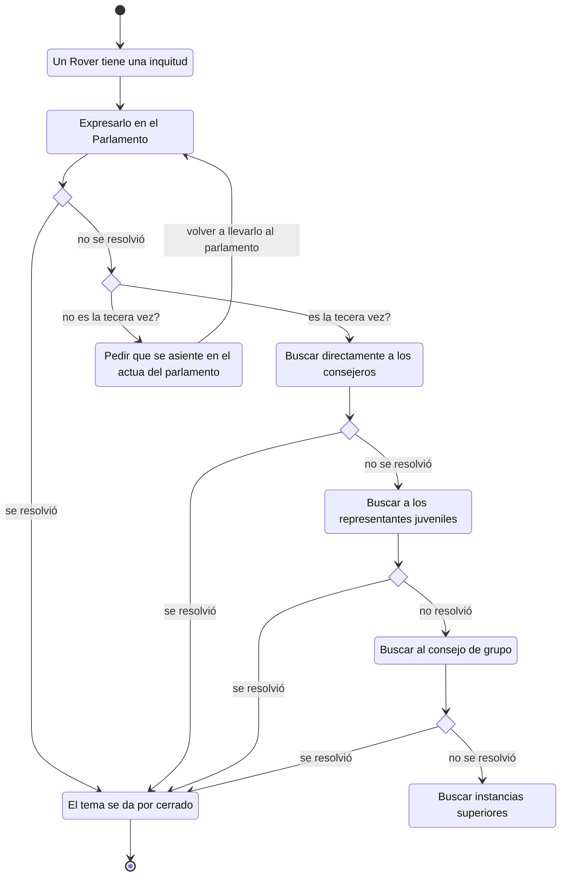

# 💡 Manejo de conflictos, problema o inquietud que no es de vida o muerte

Ésta es un propuesta sobre de como manejar algún conflicto, problema o inquitud de un Rover

Por **Instancias superiores** nos referimos a Provincia o Nacional

##### Autora

- Yolanda Castillo