# 👷 Diagrama: Ruta para la Insignia Mensajeros de la Paz

## Introducción

Ésta propuesta no sustituyen la documentación oficial, no nos hacemos responsables del mal uso.

## Diagrama Mensajeros de la Paz

Ésta propuesta no sustituyen la documentación oficial, no nos hacemos responsables del mal uso.

```mermaid
flowchart TD
    START(["🕊️ INICIO\nQuiero ser Mensajero de la Paz"])

    START --> QUIZ

    subgraph PREP["PRE-QUEST — sdgs.scout.org/youth"]
        QUIZ["❓ Haz el QUIZ\nIdentifica tu iniciativa"]
        INIT["Elige iniciativa:\n🕊️ MoP · 🌿 Earth Tribe\n💡 Life Leaders · ❤️ Health Allies"]
        QUIZ --> INIT
    end

    PREP --> P1

    subgraph P1["⚔️ PASO 1 — INSPIRA"]
        A1["🔍 Investiga el problema\nlocal y las necesidades"]
        A2["🌐 Explora proyectos\nen scout.org"]
        A3["📌 Elige ODS a impactar\n(de los 17 disponibles)"]
        A4["🤝 Contacta miembros\nde la comunidad"]
        A1 --> A2 --> A3 --> A4
    end

    P1 --> P2

    subgraph P2["🧠 PASO 2 — APRENDE Y DECIDE"]
        B1["💪 Identifica tus talentos\ny habilidades"]
        B2["📋 Define metas con\nla comunidad"]
        B3["🎯 Objetivos INTELIGENTES\nEspecífico · Medible\nAsignable · Realista · Temporal"]
        B4["📊 Plan de recursos\nTiempo · Presupuesto\nMateriales · Monitoreo"]
        B1 --> B2 --> B3 --> B4
    end

    P2 --> P3

    subgraph P3["🔥 PASO 3 — TOMA ACCIÓN"]
        C1["🚀 Inicio del proyecto\nActiva equipo y recursos"]
        C2["⚡ Ejecución\nActividades con beneficiarios\nFotos · Videos · Testimonios"]
        C3["📈 Monitoreo continuo\nTiempo · Presupuesto · Calidad"]
        C4["⏱️ Horas de servicio\nManada: 300 h\nTropa: 500 h\nCaminantes/Rovers: 800 h"]
        C5["📝 Evaluación y cierre\nMedir impacto · Lecciones\nReporte final"]
        C_R["⭐ REQ. ROVER EXTRA\nApoya a Manada y Tropa\na conocer MoP"]
        C1 --> C2 --> C3 --> C4 --> C5
        C5 -.-> C_R
    end

    P3 --> P4

    subgraph P4["📡 PASO 4 — COMPARTE"]
        D1["⬆️ Sube proyecto\na scout.org"]
        D2["🔑 Obtén el NODO\nde 6 dígitos"]
        D3["🌍 Publica en sdgs.scout.org\n→ Mapa global interactivo\n→ Badge digital"]
        D4["📱 Comparte en redes · medios\nlocales · boca a boca\nLecciones aprendidas"]
        D1 --> D2 --> D3 --> D4
    end

    P4 --> SOL

    subgraph SOL["📜 PROCESO DE SOLICITUD — ASMAC"]
        E1["Jefe de Sección:\nInforma al Parlamento Rover\ny firma la solicitud"]
        E2["Consejo de Grupo:\nJefe de Grupo firma\ny agrega al Acta"]
        E3["Provincia:\nComisionado de Programas\nMundiales firma"]
        E4["📧 Envío a\nmensajeros.paz@scouts.org.mx\n+ NODO de scout.org"]
        E5{{"¿Aprobado?"}}
        E6["✅ Insignia enviada\npor valija de correspondencia"]
        E1 --> E2 --> E3 --> E4 --> E5
        E5 -->|"✓ Sí"| E6
        E5 -->|"⚠️ Observaciones"| E3
    end

    E6 --> REWARD

    subgraph REWARD["🏆 RECOMPENSAS"]
        R1["🏅 Insignia MoP física\nAnilla sobre insignia compromiso\nBolsa izquierda · Toda la vida scout"]
        R2["🎖️ Badge digital\nEn tu perfil de sdgs.scout.org\nMoP · Earth Tribe · etc."]
        R3["🌍 Proyecto en\nmapa global interactivo\nde scout.org"]
    end

    style START fill:#4a7c59,color:#fff,stroke:#2d5a3d
    style REWARD fill:#1a1a2e,stroke:#c8a92b
    style R1 fill:#c8a92b,color:#000,stroke:#8a6910
    style R2 fill:#5b21b6,color:#fff,stroke:#3b0764
    style R3 fill:#1e40af,color:#fff,stroke:#1e3a8a
    style PREP fill:#1a1a2e,stroke:#374151
    style P1 fill:#1a120a,stroke:#92400e
    style P2 fill:#0a1628,stroke:#1e40af
    style P3 fill:#1a0a0a,stroke:#991b1b
    style P4 fill:#0f0a28,stroke:#5b21b6
    style SOL fill:#0a1a0a,stroke:#15803d
    style C4 fill:#7f1d1d,color:#fca5a5,stroke:#991b1b
    style C_R fill:#2e1065,color:#c4b5fd,stroke:#5b21b6
    style E5 fill:#064e3b,color:#fff,stroke:#065f46
```

---

## Fuentes

- [Guía Nacional para la Obtención de la Insignia Mensajeros de la Paz — ASMAC 2018](https://drive.scouts.org.mx/s/MwtEXMgo1EmIGJB?dir=/&editing=false&openfile=true)
- [Las Rutas del Rover — ASMAC 2024](https://drive.scouts.org.mx/s/qnisYDHz4TNbDpi?dir=/&editing=false&openfile=true)
- [Guía de Scouter de Clan de Rovers — ASMAC 2024](https://drive.scouts.org.mx/s/nPfaxYwRB4Ryiyw?dir=/&editing=false&openfile=true)
- [sdgs.scout.org/youth](https://sdgs.scout.org/youth)
- [scout.org/messengers-of-peace](https://www.scout.org/messengers-of-peace)
- [Proyectos y actividades educativas para jovenes de 15 a 21 años](https://www.scribd.com/doc/2366505/Proyectos-y-actividades-educativas-para-jovenes-de-15-a-21-anos)

### Plantilla interactiva

[Sobre Mensajeros de la Paz](https://y-castillo.com/ciclo-programa/mop-quest.html)

#### Autora

- Yolanda Castillo 

