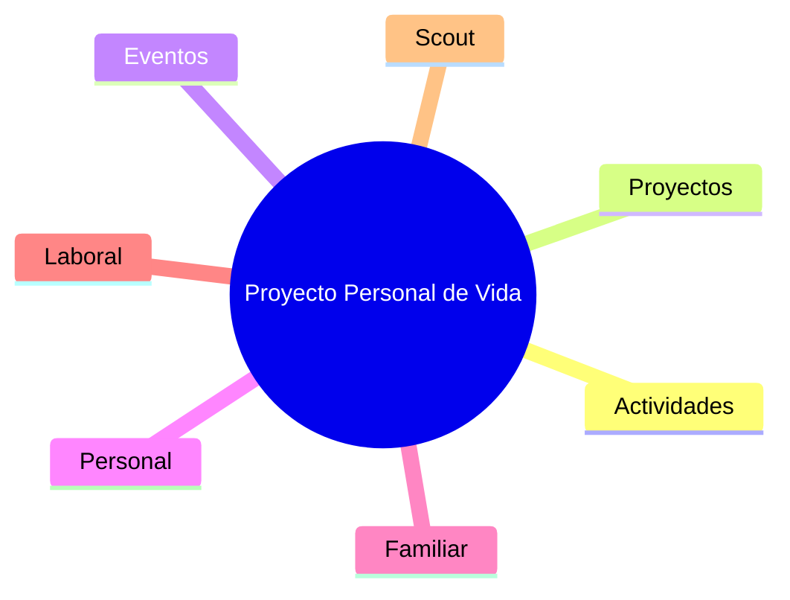
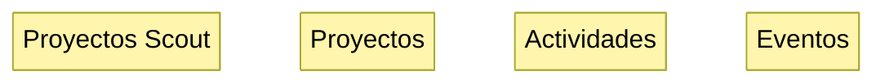

# 👷 ¿Qué es el PPV o Proyecto Personal de Vida?

## De acuerdo don DeepSeek(v1.3.1 consultado el 25 de agosto de 2025) un PPV es

Un proyecto personal de vida es un plan consciente, dinámico y flexible que una persona elabora para dirigir su propia existencia hacia la realización personal y la felicidad.

No es simplemente una lista de metas, sino una brújula interna que integra todas las áreas de la vida en una visión coherente y significativa. Se trata de responder a las preguntas fundamentales: ¿Quién soy?, ¿A dónde quiero ir? y ¿Cómo pienso llegar?

Características Clave de un Proyecto de Vida

1. Personal y Único: No hay dos proyectos de vida iguales. Se basa en tus propios valores, sueños, talentos y circunstancias.
2. Dinámico y Flexible: No es un documento grabado en piedra. Evoluciona contigo, se adapta a los cambios, los imprevistos y las nuevas experiencias.
3. Integral: Abarca todas las dimensiones de tu ser, no solo lo profesional o económico.
4. Motivador: Te da un sentido de propósito y dirección, especialmente en momentos difíciles.
5. Consciente: Requiere de introspección y autoconocimiento para ser genuino.

¿Qué Elementos o Áreas Comprende?

Un buen proyecto de vida considera usualmente estas dimensiones:

- Personal: Autoconocimiento, autoestima, salud física y mental, desarrollo de carácter y valores.
- Familiar: El tipo de relaciones que deseas tener con tu familia, si quieres formar una propia, etc.
- Social/Relacional: Amistades, comunidad, red de apoyo.
- Profesional/Laboral: Aspiraciones de carrera, tipo de trabajo deseado, logros profesionales.
- Académica/Formativa: Educación, habilidades y conocimientos que quieres adquirir.
- Económica: Objetivos de estabilidad financiera, manejo del dinero, independencia.
- Espiritual: No necesariamente religiosa; puede ser la conexión con uno mismo, con la naturaleza, la búsqueda de sentido y propósito.
- De Ocio y Tiempo Libre: hobbies, viajes, actividades que te aporten alegría y descanso.

¿Cómo se Construye? (Pasos Prácticos)

Construir un proyecto de vida es un proceso que puede llevar tiempo y reflexión. Aquí te dejo una guía básica:

1. Autoconocimiento (¿Quién soy?):
   - Fortalezas y Debilidades: ¿En qué soy bueno? ¿Qué necesito mejorar?
   - Valores: ¿Qué es realmente importante para mí? (ej. honestidad, libertad, familia, seguridad, ayudar a otros).
   - Pasiones e Intereses: ¿Qué me hace perder la noción del tiempo? ¿Qué me entusiasma?
   - Análisis DAFO Personal: Identifica tus Debilidades, Amenazas, Fortalezas y Oportunidades.
2. Visión y Propósito (¿A dónde quiero ir?):
   - Propósito: ¿Cuál es mi "por qué" más grande? ¿Qué huella quiero dejar?
   - Visión: Imagina tu vida ideal en 5, 10 o 20 años. ¿Cómo te ves? ¿Qué estás haciendo? ¿Con quién estás? Sé lo más específico posible.
3. Establecimiento de Metas (¿Cómo llego?):
   - Metas a Largo Plazo: Objetivos grandes (ej. "Ser ingeniero en robótica", "Tener mi propia casa").
   - Metas a Corto y Mediano Plazo: Divide las metas grandes en pasos más pequeños y alcanzables (ej. "Terminar el semestre", "Ahorrar X cantidad este año", "Aprender los fundamentos de programación").
   - Usa el método SMART: Asegúrate de que tus metas sean Específicas, Medibles, Alcanzables, Relevantes y con un Tiempo definido.
4. Plan de Acción:
   - Define las acciones concretas que necesitas realizar para cada meta.
   - Prioriza: ¿Qué es lo más importante hacer primero?
   - Calendariza: Asigna tiempos para tus acciones.
5. Evaluación y Revisión Continua:
   - Revisa tu progreso regularmente (cada 6 meses o 1 año).
   - Celebra los logros, por pequeños que sean.
   - Ajusta el plan: Si algo no funciona o tus prioridades cambian, no temas modificar tu proyecto. Su flexibilidad es su mayor virtud.

¿Por qué es tan importante tener uno?

- Da Dirección y Enfoque: Evita que te sientas perdido o que simplemente "reacciones" a lo que la vida te trae.
- Aumenta la Motivación: Tener un propósito claro te da la energía para superar obstáculos.
- Facilita la Toma de Decisiones: Cuando tienes claro tu norte, es más fácil elegir entre diferentes caminos. Te preguntas: "¿Esta opción me acerca o me aleja de mi proyecto?".
- Mejora la Autoestima: Lograr las metas que te propones refuerza la confianza en ti mismo.
- Ayuda a Vivir una Vida Auténtica: Te aseguras de estar construyendo la vida que tú quieres, no la que otros esperan de ti.

## De acuerdo a ChatGPT(consultado al 25 de agosto de 2025) un PPV es

Un proyecto personal de vida es un plan que cada persona diseña para orientar su existencia de manera consciente, organizada y con sentido. Es como un mapa que te ayuda a definir quién eres, qué quieres lograr y cómo vas a trabajar para alcanzarlo.

Incluye aspectos personales, familiares, académicos, profesionales, sociales y espirituales, según las prioridades de cada individuo.

En términos sencillos:
👉 Es una guía de vida que te permite fijar metas claras y tomar decisiones coherentes con tus valores y sueños.

Elementos principales de un proyecto de vida:

Autoconocimiento
Reconocer tus fortalezas, debilidades, valores, intereses y talentos.

Misión personal
Definir tu propósito, lo que le da sentido a tu vida.

Visión de futuro
Imaginar cómo quieres verte en unos años.

Metas y objetivos
Establecer logros a corto, mediano y largo plazo.

Plan de acción
Especificar qué pasos vas a seguir para cumplir tus metas.

Evaluación y ajuste
Revisar periódicamente tus avances y hacer cambios cuando sea necesario.

En otras palabras, es el diseño consciente de tu futuro, que te permite crecer de manera integral y vivir con mayor plenitud.

### Herramientas auxiliares

- FODA personal
- IKIGAI

#### FODA personal

Imagenes en orden:
- rosanarosas, Rosana Rosas, FODA, Consultado el 26 de agosto de 2025, https://rosanarosas.com/https://rosanarosas.com/matriz-foda-personal/
- Pinterest, FODA, miriam mendez, Consultado el 26 de agosto de 2025, https://ar.pinterest.com/pin/403705554119281021/
- Pinterest, Cómo hacer un análisis DAFO (con ejemplos),  Consultado el 26 de agosto de 2025, https://ar.pinterest.com/pin/8796161769767975/
- Pinterest, FODA PERSONAL,  Fabiola,  Consultado el 26 de agosto de 2025, https://ar.pinterest.com/pin/509399407875568385/

#### IKIGAI
!(IKIGAI)[https://tristanelosegui.com/wp-content/uploads/2022/05/Ikigai.jpeg]
!(IKIGAI más detallado)[https://tiewellness.com/wp-content/uploads/2022/12/ikigai2-768x788.png]
!(Ejemplo IKIGAI)[https://www.educalive.com/blog/wp-content/uploads/2020/02/Ejemplo_IKIGAI-1-1024x768.jpg]

Imagenes en orden:
- tristanelosegui, Qué es el IKIGAI y cómo definirlo, Consultado al 26 de agosto de 2025, https://tristanelosegui.com/2022/05/26/que-es-el-ikigai-y-como-definirlo/
- tiewellness, Descubre tu ikigai, el método japonés para encontrar tu verdadero propósito en la vida, Consultado al 26 de agosto de 2025,  https://tiewellness.com/descubre-tu-ikigai/
- educalive, Orientación IKIGAI: trabajar en lo que te apasiona., Consultado asl 26 de agosto 2025, https://www.educalive.com/blog/ikigai-descubrir-trabajar-que-te-apasiona  

##### Ejemplo de un PPV generado por ChatGpt(25 de agosto de 2025)

🌱 Proyecto Personal de Vida de Ana (ejemplo)
1. Autoconocimiento

Fortalezas: responsable, creativa, buena para escuchar.

Debilidades: inseguridad al hablar en público, procrastinación.

Valores: honestidad, respeto, solidaridad.

Intereses: leer, ayudar a otros, viajar, aprender idiomas.

2. Misión personal

"Vivir con propósito, desarrollarme como persona y profesional, y contribuir a que otros también crezcan."

3. Visión de futuro (10 años)

"Me veo como una psicóloga reconocida, con una maestría en educación, trabajando en proyectos sociales, teniendo una familia estable y viajando por el mundo."

4. Metas y objetivos

Corto plazo (1-3 años):

Terminar la universidad con buenas calificaciones.

Mejorar mis habilidades de hablar en público.

Ahorrar para un viaje al extranjero.

Mediano plazo (4-6 años):

Conseguir un empleo en mi área profesional.

Iniciar una maestría en educación o psicología clínica.

Participar en voluntariados sociales.

Largo plazo (7-10 años):

Tener mi propio consultorio psicológico.

Publicar un libro o investigación.

Formar una familia y lograr estabilidad económica.

5. Plan de acción

Estudiar al menos 2 horas diarias y organizar mi tiempo con una agenda.

Tomar un curso de oratoria y practicar frente a amigos.

Abrir una cuenta de ahorros y depositar cada mes una cantidad fija.

Buscar prácticas profesionales en proyectos sociales.

Mantener hábitos de salud: ejercicio 3 veces por semana y alimentación balanceada.

6. Evaluación y ajuste

Revisar cada 6 meses si estoy cumpliendo mis metas.

Ajustar lo que no funcione (por ejemplo, cambiar de estrategia de estudio o de ahorro).

Celebrar los logros alcanzados.

👉 Como ves, el proyecto personal de vida es como un mapa: te ayuda a saber hacia dónde vas y qué pasos seguir para llegar allí.

## Un PPV enfocado a los Scouts

El PPV en los Scout se puede ver como

   
