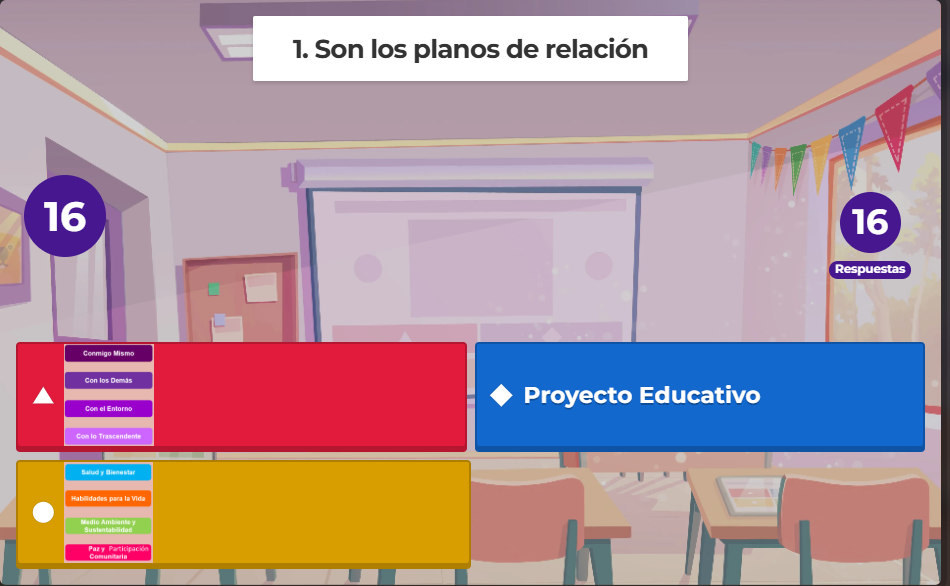

# ⌛ Quiz para presentar el nuevo esquema de adelantos

Importante, recientemente se actualizó el nombre de "Paz y Acción Comunitaria" 
a "Paz y Participación Comunitaria"

## Mentimeter
Mediante la herramienta https://www.mentimeter.com/ se creó
un quiz sobre las nuevas insignias del nuevo programa que pueden encontrar en 

https://www.menti.com/al7cxfnatgxt (agosto 2025)

Algunas de las preguntas que se pueden encontrar en el quiz

## Kahoot

Y mediante la herramienta   https://kahoot.com/ se creó
un quiz sobre las nuevas insignias del nuevo programa que pueden encontrar en 

https://create.kahoot.it/share/nuevo-programa/958e9926-2822-4460-ab73-5028cf85ea74 (septiembre 2025)

Algunas de las preguntas que se pueden encotrar en el quiz

## Otras herramientas para crear pizarras interactivas

- https://padlet.com/
- https://miro.com/es/pizarra-virtual/

##### Autora

- Yolanda Castillo

