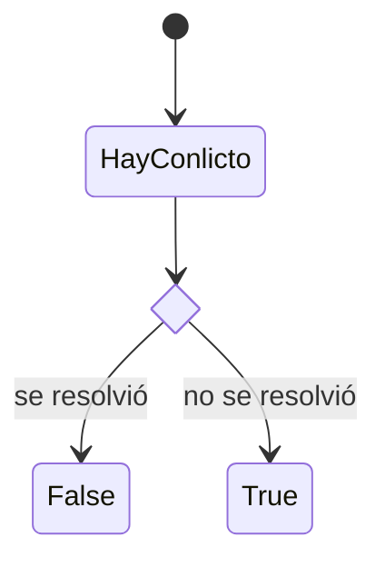

# 👷 Resolución de conflictos

Ésta es un propuesta sobre cómo resolver conflictos

```mermaid
stateDiagram-v2
    state if_state <<choice>>
    [*] --> HayConlicto
    HayConlicto --> if_state
    if_state --> False: se resolvió
    if_state --> True : no se resolvió
```

