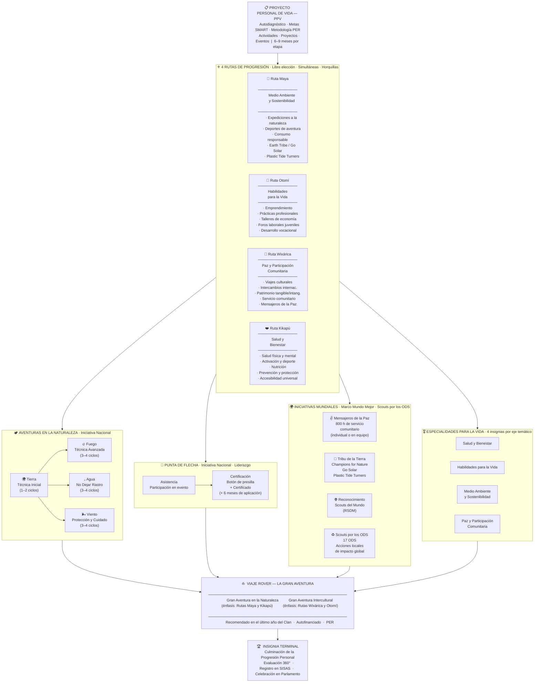

# Diagrama: Las Rutas del Rover — Progresión Personal



---

## Resumen de las 4 Rutas

| Ruta | Eje Temático | Enfoque principal |
|---|---|---|
| **Maya** | Medio Ambiente y Sostenibilidad | Naturaleza, expediciones, ecología |
| **Otomí** | Habilidades para la Vida | Vida profesional, emprendimiento |
| **Wixárica** | Paz y Participación Comunitaria | Viajes, cultura, servicio |
| **Kikapú** | Salud y Bienestar | Salud física, mental y espiritual |

## Insignias de Aventuras en la Naturaleza

| Insignia | Área | Duración |
|---|---|---|
| 🌍 **Tierra** | Técnica Inicial | 1–2 ciclos de programa |
| 🔥 **Fuego** | Técnica Avanzada | 3–4 ciclos de programa |
| 💧 **Agua** | No Dejar Rastro | 3–4 ciclos de programa |
| 🌬️ **Viento** | Protección y Cuidado | 3–4 ciclos de programa |

## Claves del sistema

- **Libre elección**: no hay orden obligatorio entre rutas
- **Transversal**: avanzar en una ruta suma competencias a las demás
- **Simultáneo**: rutas, especialidades e iniciativas se trabajan en paralelo
- **Duración**: 6 a 9 meses por etapa/proyecto
- **Registro**: todo avance se registra en **SISAS**
```
