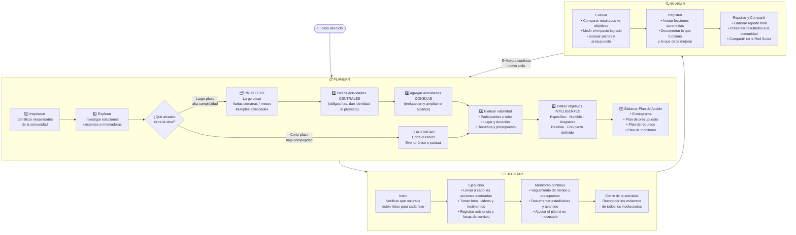

# Proceso de Selección de Proyectos y Actividades — Ciclo PER

```mermaid
flowchart TD
    INICIO(["🌟 Inicio del ciclo"])

    %% ─── PLANEAR ───────────────────────────────────────────
    subgraph PLANEAR ["📋 PLANEAR"]
        P1["1️⃣ Inspirarse\nIdentificar necesidades\nde la comunidad"]
        P2["2️⃣ Explorar\nInvestigar soluciones\nexistentes e innovadoras"]
        P3{"¿Qué alcance\ntiene la idea?"}
        P4A["🗂️ PROYECTO\nLargo plazo\nVarias semanas / meses\nMúltiples actividades"]
        P4B["📌 ACTIVIDAD\nCorta duración\nEvento único o puntual"]
        P5["3️⃣ Definir actividades CENTRALES\n(obligatorias, dan identidad al proyecto)"]
        P6["4️⃣ Agregar actividades CONEXAS\n(enriquecen y amplían el alcance)"]
        P7["5️⃣ Evaluar viabilidad\n• Participantes y roles\n• Lugar y duración\n• Recursos y presupuesto"]
        P8["6️⃣ Definir objetivos INTELIGENTES\nEspecífico · Medible · Asignable\nRealista · Con plazo definido"]
        P9["7️⃣ Elaborar Plan de Acción\n• Cronograma\n• Plan de presupuesto\n• Plan de recursos\n• Plan de monitoreo"]

        P1 --> P2 --> P3
        P3 -->|"Largo plazo\nalta complejidad"| P4A
        P3 -->|"Corto plazo\nbaja complejidad"| P4B
        P4A --> P5 --> P6 --> P7
        P4B --> P7
        P7 --> P8 --> P9
    end

    %% ─── EJECUTAR ───────────────────────────────────────────
    subgraph EJECUTAR ["🚀 EJECUTAR"]
        E1["Inicio\nVerificar que recursos\nestén listos para cada fase"]
        E2["Ejecución\n• Llevar a cabo las acciones acordadas\n• Tomar fotos, videos y testimonios\n• Registrar asistencia y horas de servicio"]
        E3["Monitoreo continuo\n• Seguimiento de tiempo y presupuesto\n• Documentar estadísticas y avances\n• Ajustar el plan si es necesario"]
        E4["Cierre de la actividad\nReconocer los esfuerzos\nde todos los involucrados"]

        E1 --> E2 --> E3 --> E4
    end

    %% ─── REVISAR ────────────────────────────────────────────
    subgraph REVISAR ["🔍 REVISAR"]
        R1["Evaluar\n• Comparar resultados vs objetivos\n• Medir el impacto logrado\n• Evaluar planes y presupuesto"]
        R2["Registrar\n• Anotar lecciones aprendidas\n• Documentar lo que funcionó\ny lo que debe mejorar"]
        R3["Reportar y Compartir\n• Elaborar reporte final\n• Presentar resultados a la comunidad\n• Compartir en la Red Scout"]

        R1 --> R2 --> R3
    end

    %% ─── FLUJO PRINCIPAL ────────────────────────────────────
    INICIO --> PLANEAR
    PLANEAR --> EJECUTAR
    EJECUTAR --> REVISAR
    REVISAR -->|"♻️ Mejora continua\nnuevo ciclo"| PLANEAR
```
