# 🚀 Trello: herramientas administrativa para Ciclo de Programa

## Introducción

Ésta propuesta no sustituyen la documentación oficial, no nos hacemos responsables del mal uso.

Usar la herramienta de seguimiento de proyectos [Trello](https://trello.com/es/tour) para dar seguimiento al **Proyecto de Personal de Vida** 
/ **Progresión Personal** / **Ciclo de programa**, ya que Trello es muy intuitivo y cuenta con versión Gratuita.

### Ventajas

- Ahorro en tiempo administrativo
- Los Rovers adquieren habilidades para la vida al  conocer y ejecutar metodologías Ágiles, Scrum, Trello con las que adquieren habilidades de planeación y seguimiento
- Seguimiento desde navegador web o desde el celular
- Se pueden visualizar al instante los avances
- Exportación de reportes que agilizan el envío de evidencia a la hora de tramitar las insignias de Mundo Mejor, Terminal, etc.

### Algunas funcionalidades Trello

- Si quiere profundizar sobre Trello puede tomar el [Curso de Trello](https://www.youtube.com/playlist?list=PLPlELOb__KoIUAmliVpZlCNqlvw2i4NGk)

#### Vista Tableros, espacio de trabajo defecto **Espacio de trabajo de Trello**

  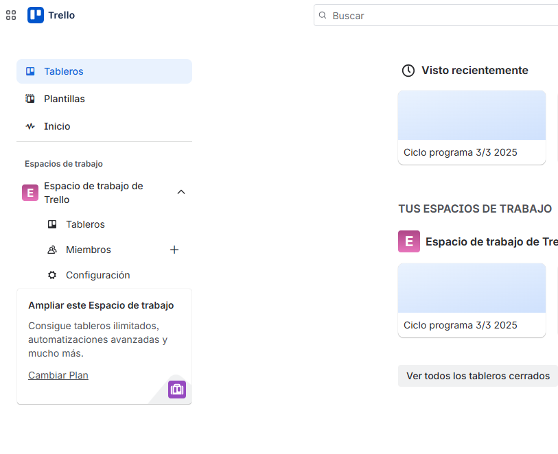

#### Creación Trablero de seguimiento de Proyectos 

  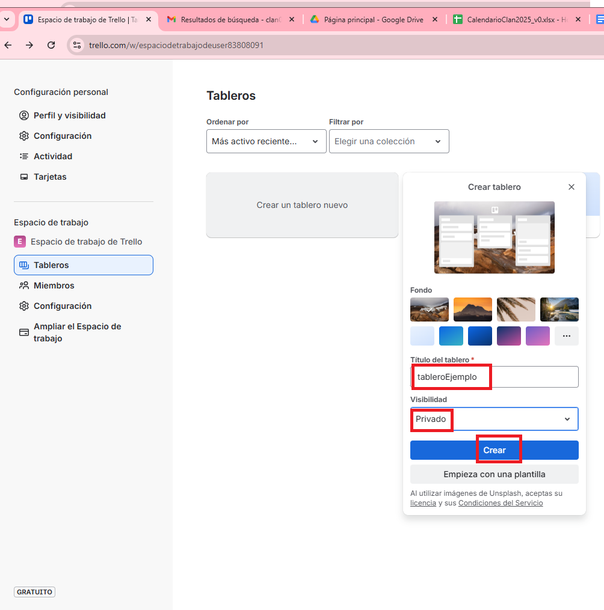 

  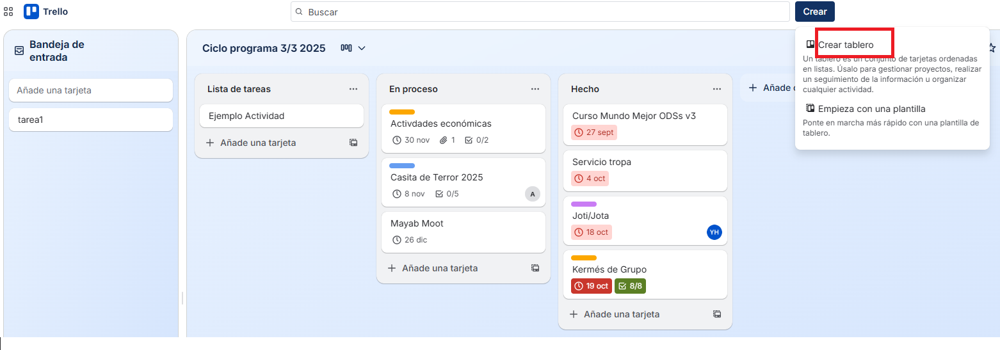

#### Cambiar vista 

  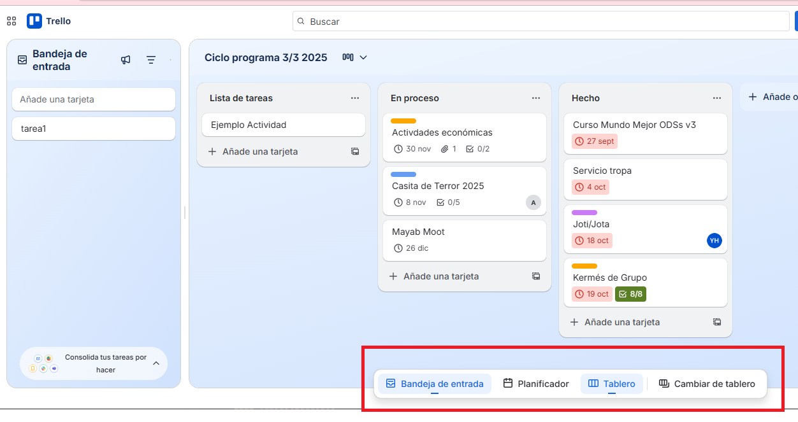 

#### Crear tareas

  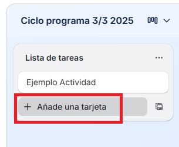

#### Crear lista (por defecto se crea la lista de tareas, **En proceso** y **Hecho**) 

  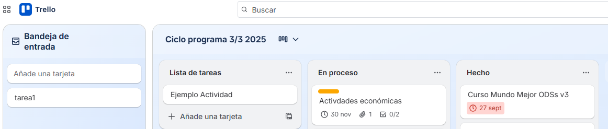 

  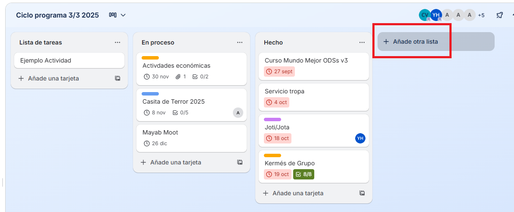

  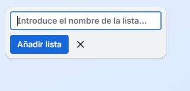
#### Crear etiquetas de colores y/o con texto 

  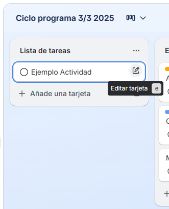 

  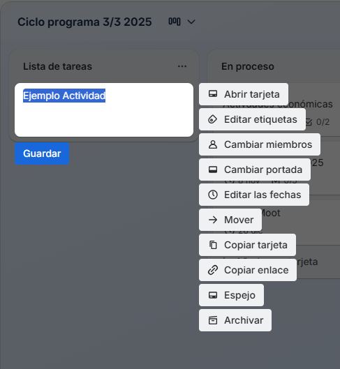

  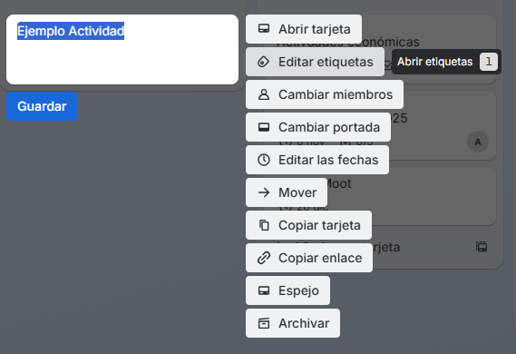

  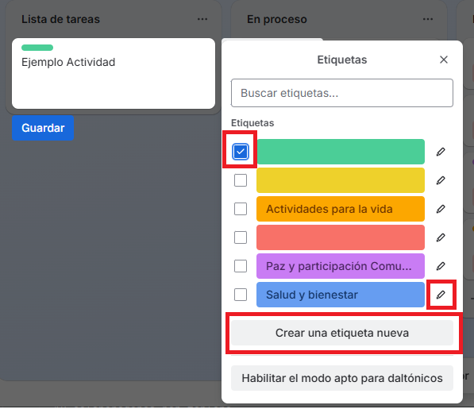

#### Asignar responsable(s)

  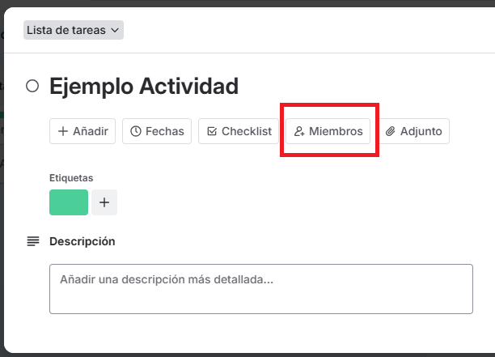 

  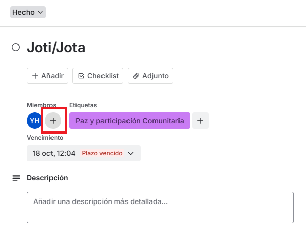

#### Asignar Fecha de Vencimiento

  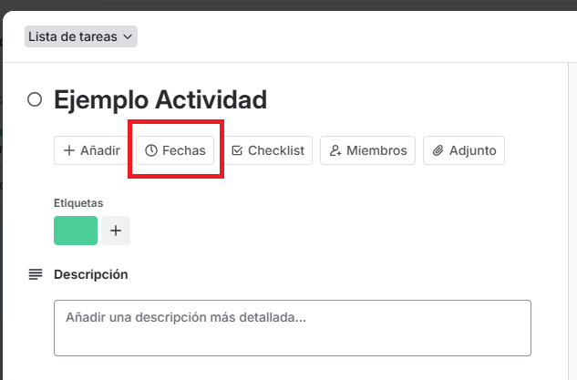

  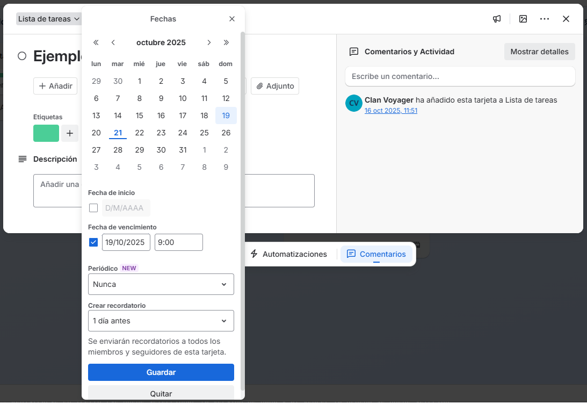

#### Automaticamente envía email con actividades proximas a vencer

  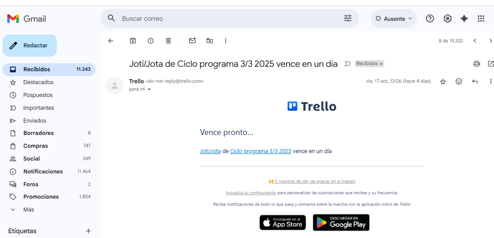

#### Vista rápida de porcentajes de avance de la tareas

  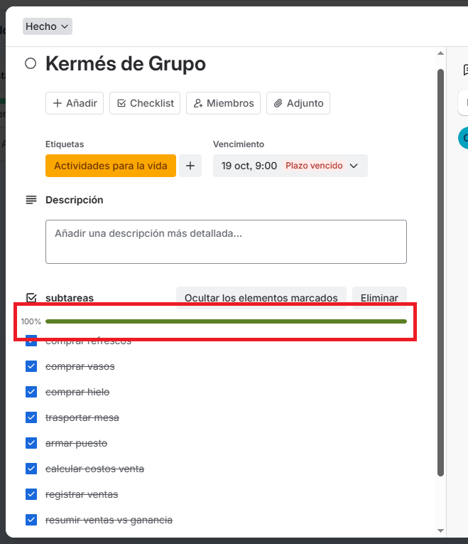

#### Reportes a los que se le pueden aplicar diversos filtros

#### Se pueden archivar alguna lista
  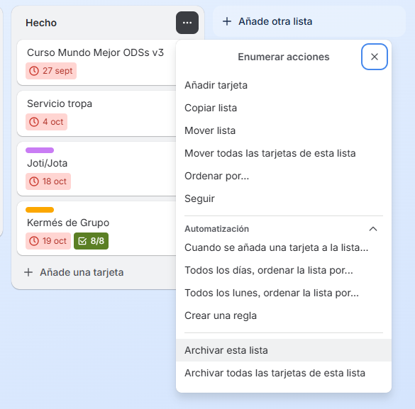

#### Ver elementos archivados

  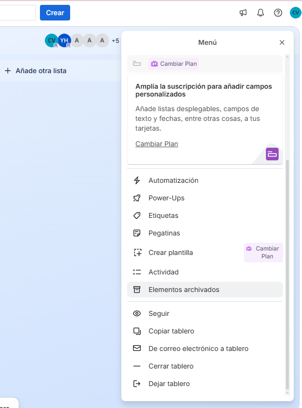

#### Además de la vista web, Trello se puede instalar en el celular, es compatible con Andriod y iPhone

### Algunas limitantes de Trello

- Únicamente 10 colaboradores por tablero

### Pasos para dar de alta un tablero

#### Usuarios administradores(Consejeros)
 
- Seleccionar el plan gratuito 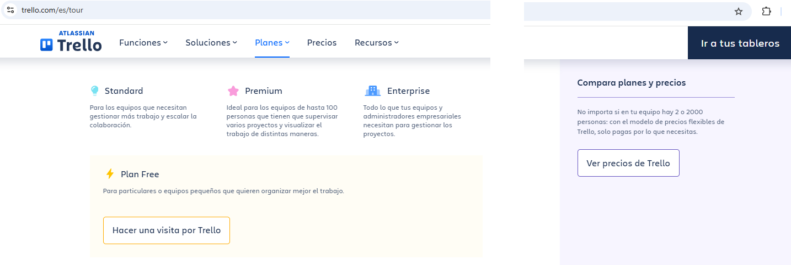
- Registrarse en Trello (se puede seleccionar la version de paga y al vencer la prueba se puede selccionar la version Free)
- Crear un tablero 
- Crear la lista de tarea
- Invitar a miembros del equipo
- Crear estados de las tareas, se sugieren **en proceso** y **Hecho** 

- Asignar Tareas a los Rovers

#### Rovers(Usuarios o grupo de seguimiento)

- Crear lista de tareas relacionadas a su PPV / Progresión / Ciclo de Programa 
- Agregar subtareas 
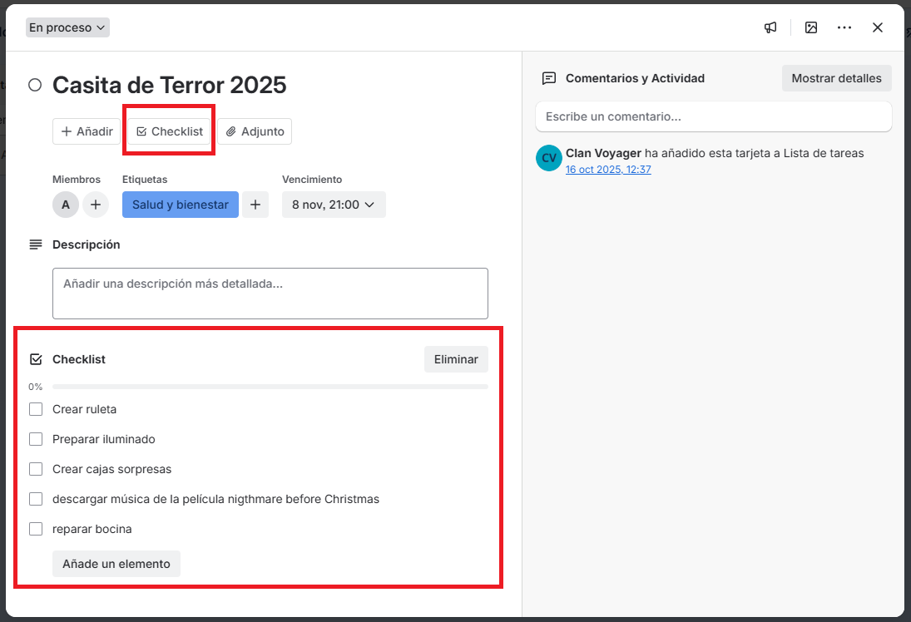
- Mover las tareas al estado correspondiente 

- Adjuntar evidencia, marca lista de subtareas terminadas 

## Otras herramientas para administrar proyectos

- [Jira](https://www.atlassian.com/) de paga
- [Monday](https://monday.com/) de paga
- [Matis Bug Traker](https://mantisbt.org/)

## Kanban Board

[Kanban Board](https://www.atlassian.com/es/agile/kanban/boards) es una herramienta para visualizar el estado de las actividades, 
con visibilidad del tiempo, estado de las actividades.

## Agile

[Agil](https://sentrio.io/blog/valores-principios-agile-manifiesto-agil/) es una metodología comunmente usada de desarrollo de sistemas

### 4 Valores
- Individuos e interacciones por encima de procesos y herramientas
- Software funcionando por encima de documentación exhaustiva
- Colaboración con el cliente por encima de negociación contractual
- Respuesta ante el cambio por encima de seguir un plan

### 12 principios
- Satisfacer al cliente mediante la entrega temprana y continua
- Aprovechar el cambio como ventaja competitiva
- Entregar valor frecuentemente
- Cooperación negocio-desarrolladores durante todo el proyecto
- Construir proyectos en torno a individuos motivados
- Utilizar la comunicación cara a cara
- Software funcionando como medida de progreso
- Promover y mantener un desarrollo sostenible
- La excelencia técnica mejora la agilidad
- La simplicidad es fundamental
- Equipos auto-organizados para generar más valor
- Reflexión y ajustes frecuentes del trabajo de los equipos

## Scrum

[Scrum](https://www.atlassian.com/es/agile/scrum)  es una metodología ágil, comúnmente
se usa en desarrollo de software, sin embargo se puede aplicar al Ciclo de Programa

Para tomar Scrum gratuito [Scrum Study](https://www.scrumstudy.com/) 
también brinda la certificación curricular de Scrum fundamentos y es gratuita

### Aplicación de Scrum al Ciclo de Programa

- El Sprint sería el Ciclo de Programa(de 3 o 4 meses) definiendo el enfoque del mismo
- Scrum Team sería uno o más Rovers
- Scrum Master serían un consejero
- Product Owner podría ser un consejero o el equipo de seguimiento(que se conforma de Rovers)
- Las historias de usuario serían resumenes del Ciclo de Programa o PPV o la Progresión Personal, etc.
- El backlog serían las tareas del Ciclo de Programa o PPV o la Progresión Personal, etc.
- Las épicas prodían ser grupos o subclasificación de tareas del backlog
- El planning la planeación de ciclo de programa en un parlamento
- La implementación sería la ejecución de las tareas
- La revisión sería el seguimiento de la tareas
- La retrospectiva sería el Parlamento de evaluación
- El término o Producto sería la celebranción o entrega de progresión, especialidad, insignias de mundo mejor, etc..

##### Agradecimientos

- Diana Unzueta, que lleva tiempo usando Trello, junto la metodología Scrum y Kanban Board para dar seguimiento al Ciclo de Programa/PPV/Progresión Personal, etc..

##### Redactora

- Yolanda Castillo