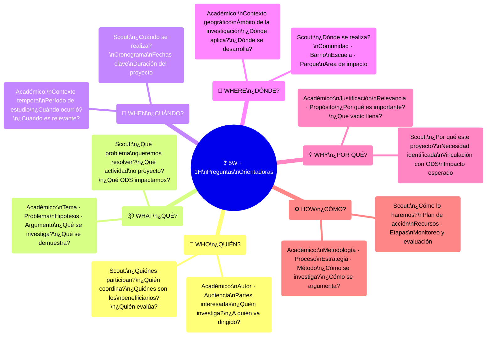

```mermaid
flowchart TD
    TITLE["🧭 PREGUNTAS ORIENTADORAS EN EL ESCULTISMO\nAplicación en Proyectos y Actividades Scout"]

    TITLE --> PLAN

    subgraph PLAN["📋 FASE DE PLANEACIÓN"]
        direction LR
        WHO["👤 ¿QUIÉN?\nCoordinadores · Colaboradores\nBeneficiarios · Scouters"]
        WHAT["📦 ¿QUÉ?\nProblema a resolver\nTipo de proyecto o actividad\nODS a impactar"]
        WHY["💡 ¿POR QUÉ?\nNecesidad detectada\nJustificación del proyecto\nConexión con la Promesa y Ley"]
        WHO --- WHAT --- WHY
    end

    PLAN --> EXEC

    subgraph EXEC["⚡ FASE DE EJECUCIÓN"]
        direction LR
        WHEN["📅 ¿CUÁNDO?\nCronograma · Fechas clave\nDuración · Horas de servicio"]
        WHERE["📍 ¿DÓNDE?\nComunidad · Espacio físico\nÁrea de impacto"]
        HOW["⚙️ ¿CÓMO?\nPlan de acción · Etapas\nRecursos · Método de trabajo"]
        WHEN --- WHERE --- HOW
    end

    EXEC --> EVAL

    subgraph EVAL["🔍 FASE DE EVALUACIÓN"]
        direction LR
        E1["¿Quién participó\nrealmente?"]
        E2["¿Qué se logró\nvs. lo planeado?"]
        E3["¿Por qué se\nlograron o no\nlos objetivos?"]
        E4["¿Cuándo se\nalcanzaron los\nhitos clave?"]
        E5["¿Dónde fue\nel mayor\nimpacto?"]
        E6["¿Cómo se puede\nmejorar para la\npróxima vez?"]
        E1 --- E2 --- E3 --- E4 --- E5 --- E6
    end

    EVAL --> MOP

    subgraph MOP["🕊️ APLICACIÓN EN MENSAJEROS DE LA PAZ"]
        M1["¿QUIÉN?\n→ Máx. 5 coordinadores Rovers\nBeneficiarios activos en el proyecto"]
        M2["¿QUÉ?\n→ Proyecto de servicio comunitario\nalineado a un ODS"]
        M3["¿POR QUÉ?\n→ Construir una Cultura de Paz\nContribuir a la Agenda 2030"]
        M4["¿CUÁNDO?\n→ Inicio conteo de horas al informar\nal Jefe de Sección · 800 h mínimo"]
        M5["¿DÓNDE?\n→ Comunidad local · scout.org\nsdgs.scout.org → mapa global"]
        M6["¿CÓMO?\n→ 4 Pasos: Inspira · Aprende\nActúa · Comparte"]
    end

    style TITLE fill:#1a1a2e,color:#f0c040,stroke:#c8a92b
    style PLAN fill:#0a1628,stroke:#1e40af
    style EXEC fill:#0a1a0a,stroke:#15803d
    style EVAL fill:#1a0a0a,stroke:#991b1b
    style MOP fill:#1a120a,stroke:#92400e
    style WHO fill:#1e3a8a,color:#93c5fd,stroke:#1e40af
    style WHAT fill:#1e3a8a,color:#93c5fd,stroke:#1e40af
    style WHY fill:#1e3a8a,color:#93c5fd,stroke:#1e40af
    style WHEN fill:#14532d,color:#86efac,stroke:#15803d
    style WHERE fill:#14532d,color:#86efac,stroke:#15803d
    style HOW fill:#14532d,color:#86efac,stroke:#15803d
    style M1 fill:#431407,color:#fed7aa,stroke:#92400e
    style M2 fill:#431407,color:#fed7aa,stroke:#92400e
    style M3 fill:#431407,color:#fed7aa,stroke:#92400e
    style M4 fill:#431407,color:#fed7aa,stroke:#92400e
    style M5 fill:#431407,color:#fed7aa,stroke:#92400e
    style M6 fill:#431407,color:#fed7aa,stroke:#92400e
```

# 🔨 Framework 5W + 1H — Preguntas Orientadoras

## Introducción

Ésta propuesta no sustituyen la documentación oficial, no nos hacemos responsables del mal uso.

> En escritura académica se conoce como **5W + 1H**.
> En el Movimiento Scout se aplica como **Preguntas Orientadoras** para planear, ejecutar y evaluar proyectos y actividades.

## Diagrama Preguntas Orientadoras

---

---

---

## Las 6 Preguntas Orientadoras — Referencia rápida

| Pregunta | Inglés | En escritura académica | En Scouts (planeación) |
|---|---|---|---|
| **¿Quién?** | Who | Autor, audiencia, actores | Coordinadores, beneficiarios, scouters |
| **¿Qué?** | What | Tema, problema, hipótesis | Proyecto, actividad, ODS a impactar |
| **¿Cuándo?** | When | Período, contexto temporal | Cronograma, duración, horas de servicio |
| **¿Dónde?** | Where | Ámbito geográfico o conceptual | Comunidad, espacio físico, alcance |
| **¿Por qué?** | Why | Justificación, relevancia, propósito | Necesidad detectada, conexión con valores scout |
| **¿Cómo?** | How | Metodología, proceso, estrategia | Plan de acción, etapas, recursos, evaluación |

---

## Fuentes

- Framework 5W+1H — Center for Teaching & Learning, UAF (ctl.uaf.edu)
- Guía Nacional MoP ASMAC 2018 — aplicación como Preguntas Orientadoras
- Las Rutas del Rover — ASMAC 2024
