# 👷 Demo Curso de Inducción

Éste es un demo de lo que podría ser un Curso de Inducción que se ejecuta sobre el motodo de video juegos [Phaser](https://phaser.io/)

## Pantallas

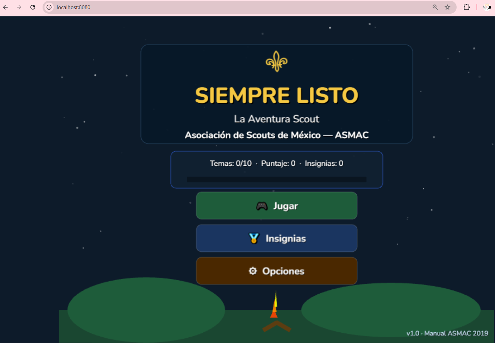

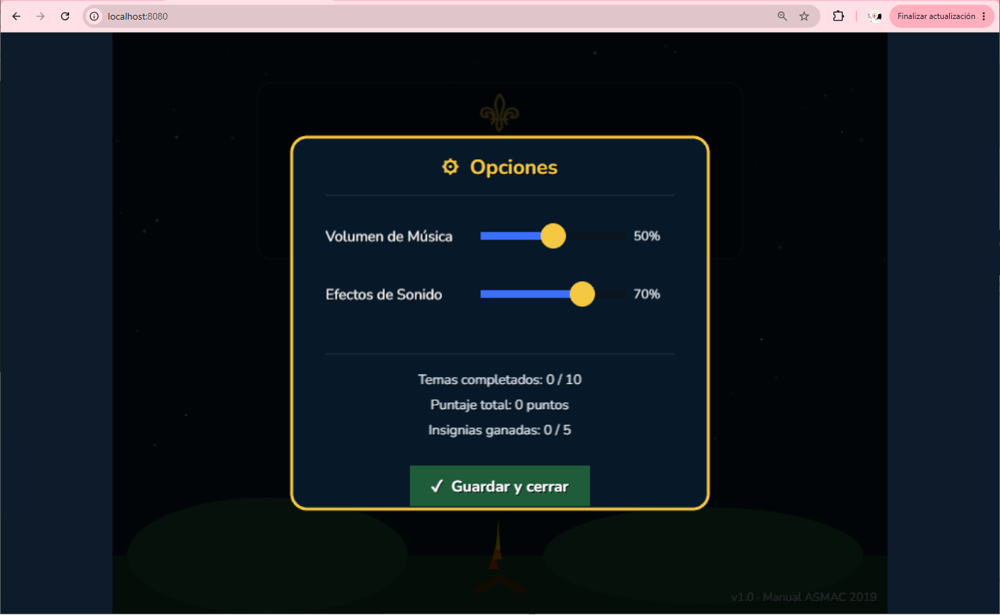

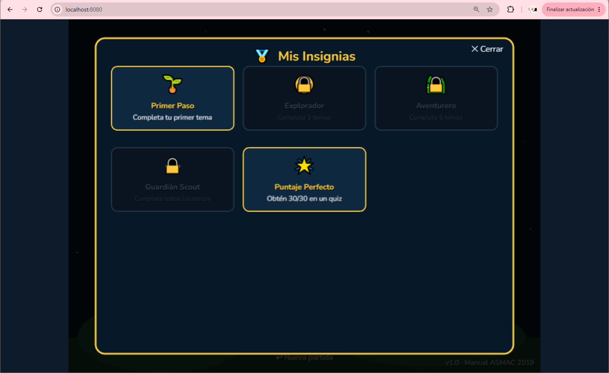

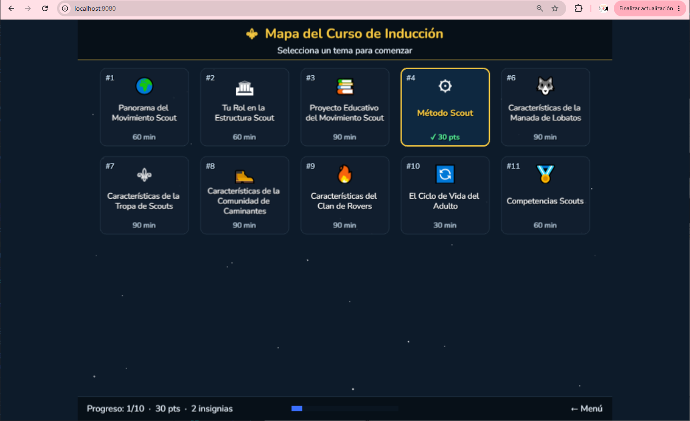

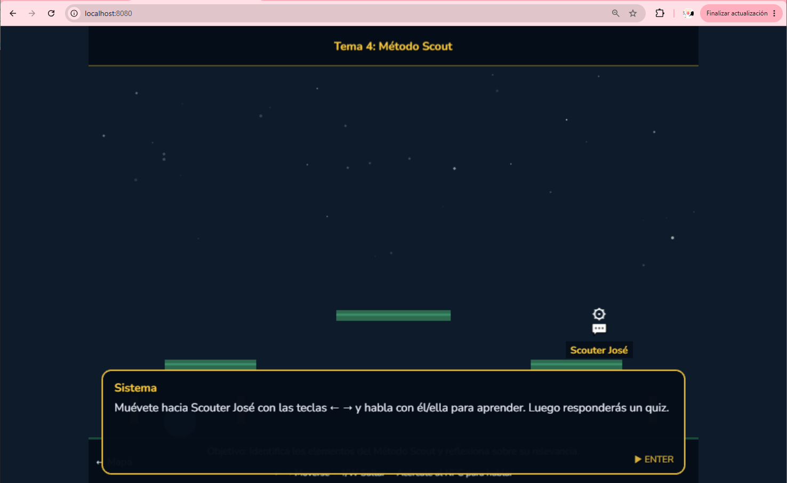

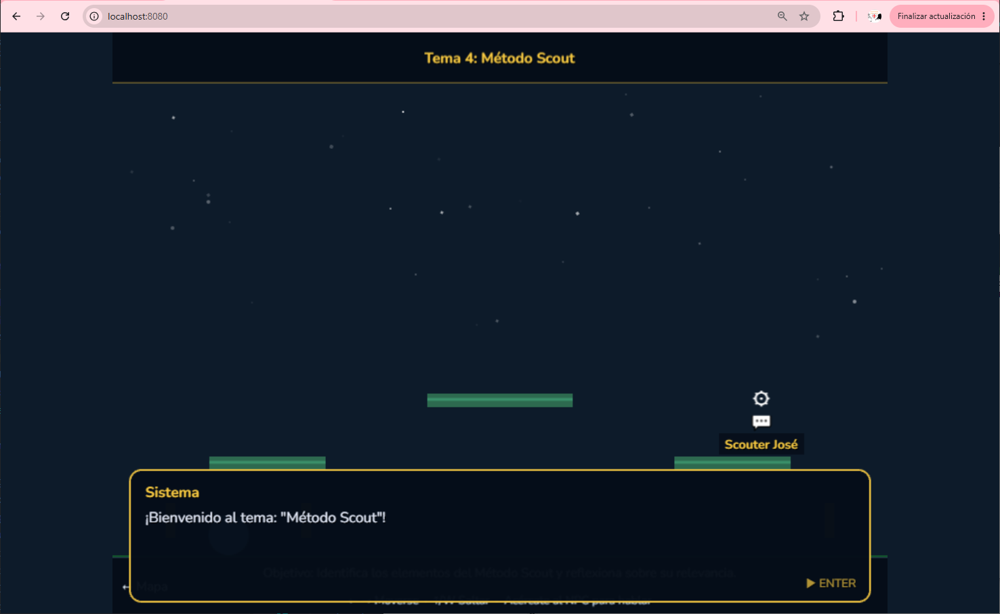

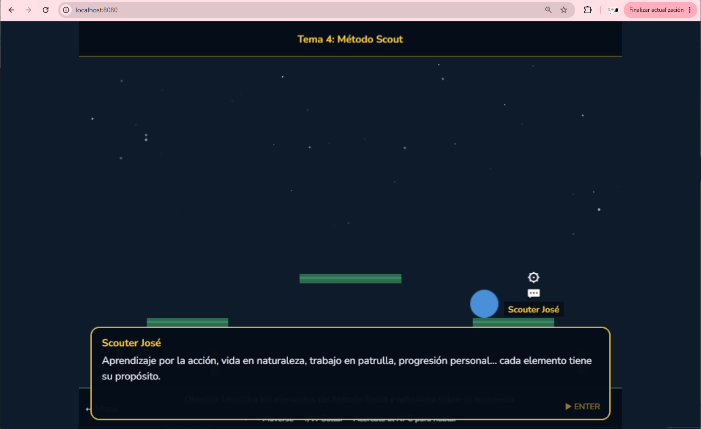

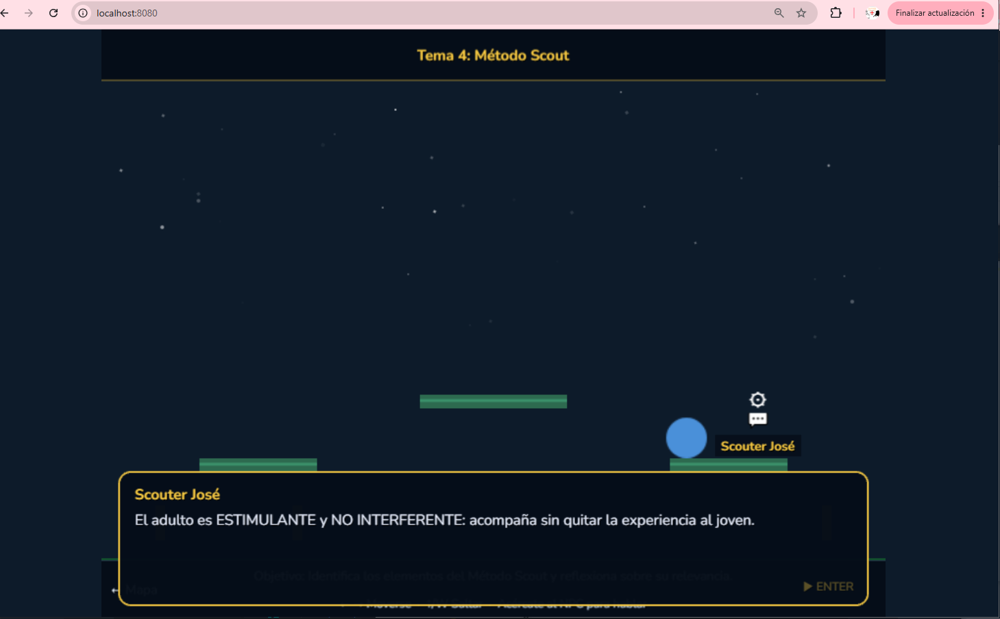

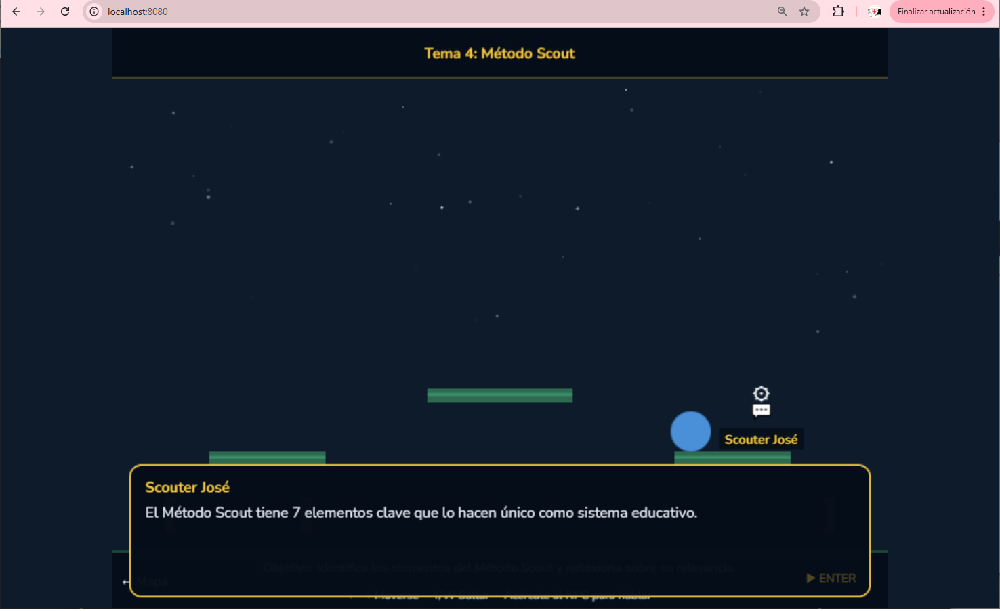

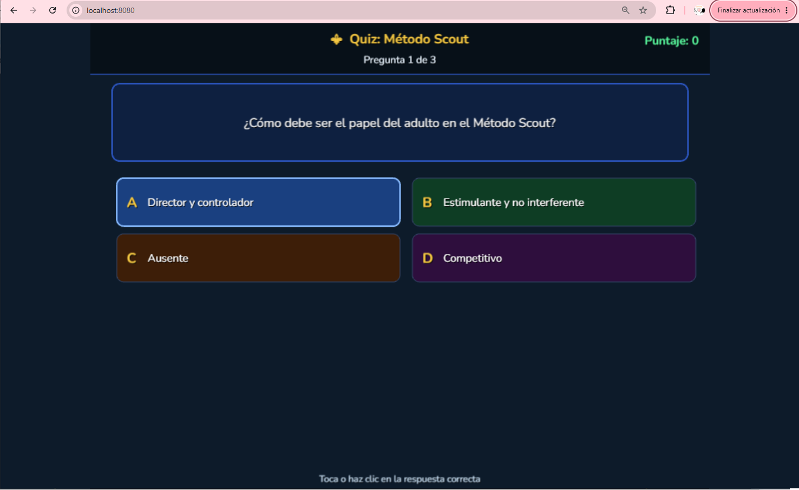

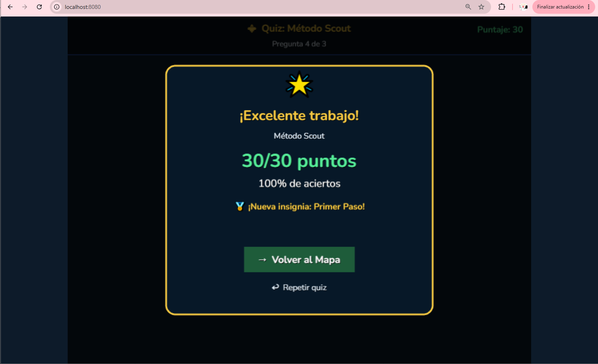

## Preguntas y respues

Las preguntas y respuestas son configurables en un archivo "%HOME-PROJECT%/src/data/scoutData.js"

### Código fuente

- **[⬇ Descargar carpeta de fuentes](https://github.com/conecta-clanes/my-website/tree/main/curso-phaser-fuentes)** 

##### Autora

- Yolanda Castillo