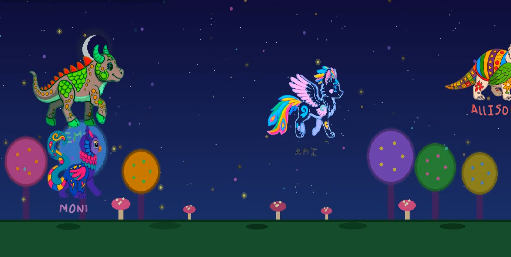

# 👷 Juego interactivo "Dibujos animados"

## Introducción

Éste proyecto fue inspirado en una visita al acuero Michin de la CDMX sobre su experiencia interactiva en el que los niños iluminan o colorean un dibujo, se escanea y aparece en una proyección su dibujo.

Con la llegada de la la IA generativa, nos hicimos de la pregunta si ese tipo de experiencia digitales no se podrían llevar a una actividad en el local de grupo.

Creemos que con la llegada de la IA ahora el límite es la imaginación

## Material

- PC o laptop
- Fuente de energía
- impresiones de los alebrijes en hojas tamaño carta
- Crayones
- Scanner
- Proyector, monitor o pantalla

## Ténologías usadas:

- [Python](https://www.python.org/)
- [Meshy](https://www.meshy.ai/) pero se puede usar el Modelo de ChatGPT Images 2.0
- [Claude Code](https://claude.com/product/claude-code) para generar el código
- [Auto Sprite](https://www.autosprite.io/)

### Experiencia

- Al comenzar no sabíamos hacer animaciones así que liberamos una versión 1.0 únicamente con la imagen escaneada y movimiento sencillo sobre el escenario
- Fue gratificante ver la sorpresa de los niños y jóvenes a difrenete nivel, los más pequelos sorprendidos, los adolescentes buscando en pantalla su personaje, los más grandes preguntando como se creo la aplicación

### Código fuente

- **[⬇ Descargar carpeta de fuentes](https://github.com/conecta-clanes/my-website/tree/main/dibujos-animados-fuentes)** 

### Aplicación
- la version 1 ya fue probada
- en cuanto probemos la versión 2 en una actividad real, actualizaremos el código fuente

##### Autora

- Yolanda Castillo