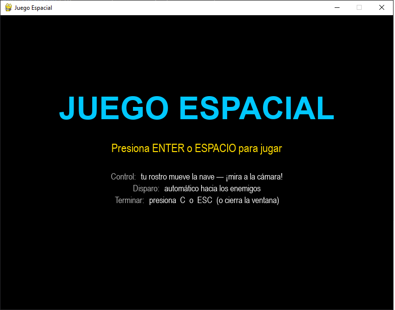
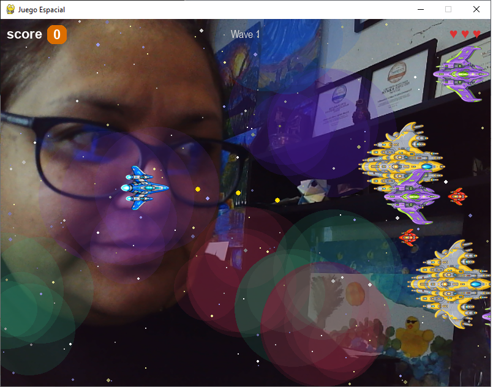

# 👷 Juego espacial

# Introducción

Fue inspirada en un juego educativo con otro motor de juegos, esta versión fue hecha con python y reconocmiento facial

## Material

- PC o laptop
- Web Camára interna o externa o equivalente

## Ténologías usadas:

- [Python](https://www.python.org/)
- [Meshy](https://www.meshy.ai/) pero se puede usar el Modelo de ChatGPT Images 2.0
- [Claude Code](https://claude.com/product/claude-code) para generar el código

## Aplicación

- El juego ya esta funcional, sin embargo no lo hemos aplicado en una actividad real, en cuanto tengamos la prueba de campo subiremos el código fuente

#### Autora

- Yolanda Castillo