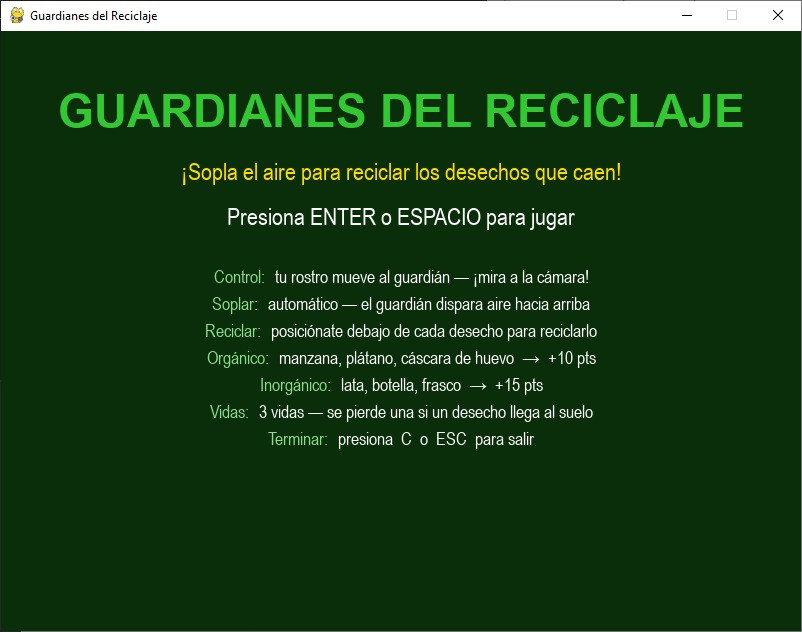
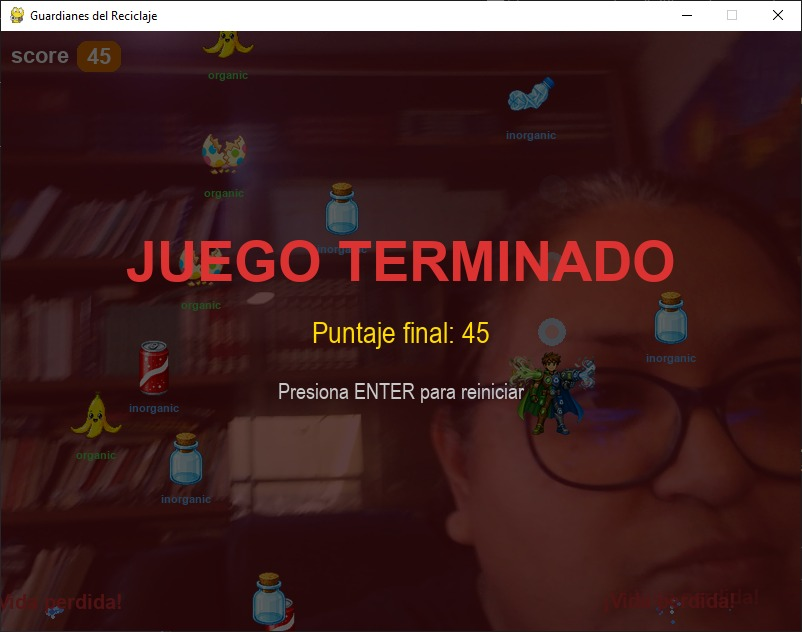

# 👷 Juego reciclaje

# Introducción

Juego educativo de reciclaje con reconocimiento de rostro

## Material

- PC o laptop
- Web Camára interna o externa o equivalente

## Ténologías usadas:

- [Python](https://www.python.org/)
- [Meshy](https://www.meshy.ai/) pero se puede usar el Modelo de ChatGPT Images 2.0
- [Claude Code](https://claude.com/product/claude-code) para generar el código

## Aplicación

- **[⬇ Descargar carpeta de fuentes](https://github.com/conecta-clanes/my-website/tree/main/juego-reciclaje-fuentes)** (clonar el repo o descargar como ZIP desde GitHub)

- El juego ya esta funcional, sin embargo no lo hemos aplicado en una actividad real, en cuanto tengamos la prueba de campo actualizaremos el código fuente

#### Autores

- Leticia Cortes
- Yolanda Castillo