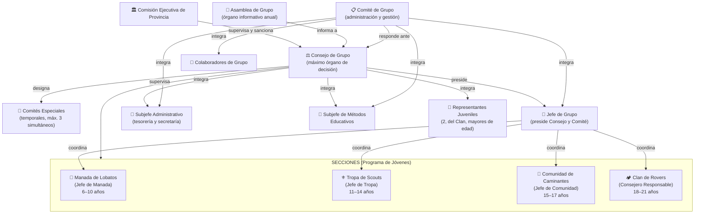
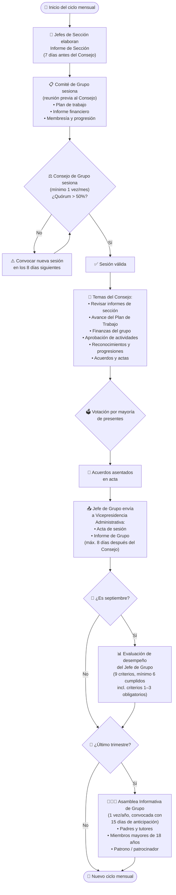

# Diagramas del Grupo Scout

---

## 1. Estructura Organizacional del Grupo Scout

---

## 2. Funcionamiento del Grupo Scout

---

### Notas clave

| Órgano | Autoridad | Sesiones |
|---|---|---|
| **Consejo de Grupo** | Máxima del grupo | Mínimo 1/mes |
| **Comité de Grupo** | Administrativa (responde ante el Consejo) | Mínimo 1/mes |
| **Asamblea de Grupo** | Informativa (sin voto en decisiones del grupo) | Mínimo 1/año |
| **Comités Especiales** | Temporal, designada por el Consejo | Según necesidad (máx. 1 año) |

**Jerarquía de decisiones:** Comisión Ejecutiva de Provincia → Consejo de Grupo → Comité de Grupo → Secciones
