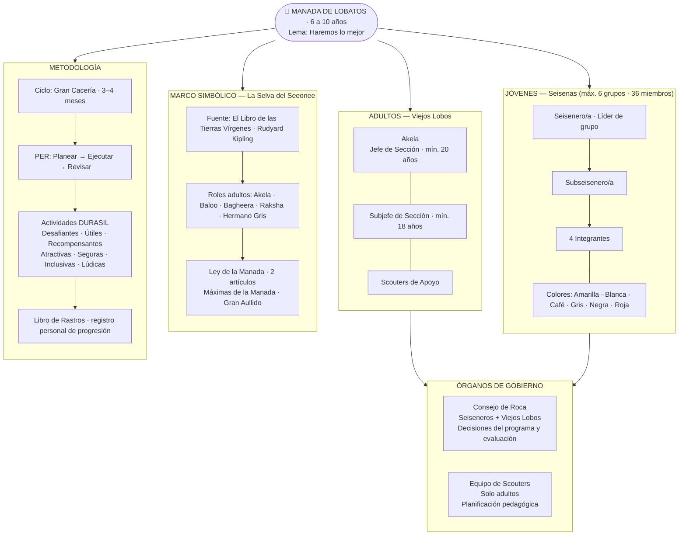

# Diagrama 1: Cómo Funciona la Manada

```mermaid
flowchart TD
    MANADA(["🐺 MANADA DE LOBATOS · 6 a 10 años\nLema: Haremos lo mejor"])

    subgraph ADU["ADULTOS — Viejos Lobos"]
        direction TB
        AKELA["Akela\nJefe de Sección · mín. 20 años"]
        SUB["Subjefe de Sección · mín. 18 años"]
        APO["Scouters de Apoyo"]
        AKELA --- SUB --- APO
    end

    subgraph SEI["JÓVENES — Seisenas (máx. 6 grupos · 36 miembros)"]
        direction TB
        SEIS["Seisenero/a · Líder de grupo"]
        SUBSEIS["Subseisenero/a"]
        INT["4 Integrantes"]
        COL["Colores: Amarilla · Blanca · Café · Gris · Negra · Roja"]
        SEIS --> SUBSEIS --> INT
        INT --- COL
    end

    subgraph GOB["ÓRGANOS DE GOBIERNO"]
        direction LR
        CR["Consejo de Roca\nSeiseneros + Viejos Lobos\nDecisiones del programa y evaluación"]
        ES["Equipo de Scouters\nSolo adultos\nPlanificación pedagógica"]
    end

    subgraph SIM["MARCO SIMBÓLICO — La Selva del Seeonee"]
        direction TB
        KIP["Fuente: El Libro de las Tierras Vírgenes · Rudyard Kipling"]
        PERS["Roles adultos: Akela · Baloo · Bagheera · Raksha · Hermano Gris"]
        LEY["Ley de la Manada · 2 artículos\nMáximas de la Manada · Gran Aullido"]
        KIP --> PERS --> LEY
    end

    subgraph MET["METODOLOGÍA"]
        direction TB
        CAC["Ciclo: Gran Cacería · 3–4 meses"]
        PER["PER: Planear → Ejecutar → Revisar"]
        DUR["Actividades DURASIL\nDesafiantes · Útiles · Recompensantes\nAtractivas · Seguras · Inclusivas · Lúdicas"]
        LIB["Libro de Rastros · registro personal de progresión"]
        CAC --> PER --> DUR --> LIB
    end

    MANADA --> ADU
    MANADA --> SEI
    ADU --> GOB
    SEI --> GOB
    MANADA --> SIM
    MANADA --> MET
```
