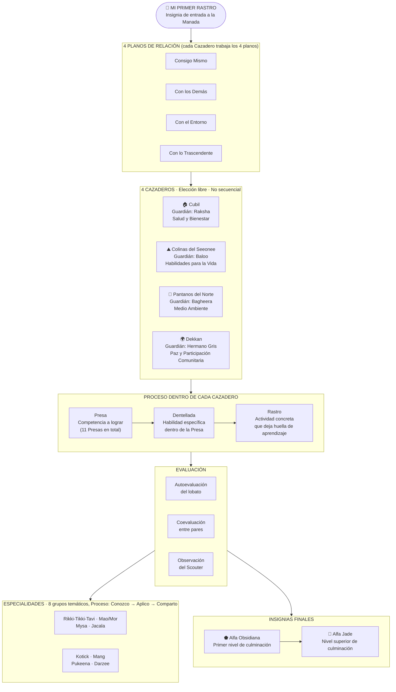

# Diagrama 2: Progresión en la Manada

```mermaid
flowchart TD
    INI(["🐾 MI PRIMER RASTRO\nInsignia de entrada a la Manada"])

    subgraph PLANOS["4 PLANOS DE RELACIÓN (cada Cazadero trabaja los 4 planos)"]
        PL1["Consigo Mismo"]
        PL2["Con los Demás"]
        PL3["Con el Entorno"]
        PL4["Con lo Trascendente"]
    end

    subgraph CAZ["4 CAZADEROS · Elección libre · No secuencial"]
        direction LR
        CUBIL["🏠 Cubil\nGuardián: Raksha\nSalud y Bienestar"]
        COLI["⛰️ Colinas del Seeonee\nGuardián: Baloo\nHabilidades para la Vida"]
        PANT["🌿 Pantanos del Norte\nGuardián: Bagheera\nMedio Ambiente"]
        DEKK["🌍 Dekkan\nGuardián: Hermano Gris\nPaz y Participación Comunitaria"]
    end

    subgraph PROCESO["PROCESO DENTRO DE CADA CAZADERO"]
        direction LR
        PRESA["Presa\nCompetencia a lograr\n(11 Presas en total)"]
        DENT["Dentellada\nHabilidad específica\ndentro de la Presa"]
        RAST["Rastro\nActividad concreta\nque deja huella de aprendizaje"]
        PRESA --> DENT --> RAST
    end

    subgraph EVAL["EVALUACIÓN"]
        direction LR
        E1["Autoevaluación\ndel lobato"]
        E2["Coevaluación\nentre pares"]
        E3["Observación\ndel Scouter"]
    end

    subgraph ESP["ESPECIALIDADES · 8 grupos temáticos, Proceso: Conozco → Aplico → Comparto"]
        direction LR
        G1["Rikki-Tikki-Tavi · Mao/Mor\nMysa · Jacala"]
        G2["Kotick · Mang\nPukeena · Darzee"]
    end

    subgraph FIN["INSIGNIAS FINALES"]
        direction LR
        OBS["⬟ Alfa Obsidiana\nPrimer nivel de culminación"]
        JAD["💎 Alfa Jade\nNivel superior de culminación"]
        OBS --> JAD
    end

    INI --> PLANOS
    PLANOS --> CAZ
    CAZ --> PROCESO
    PROCESO --> EVAL
    EVAL --> ESP
    EVAL --> FIN
```
