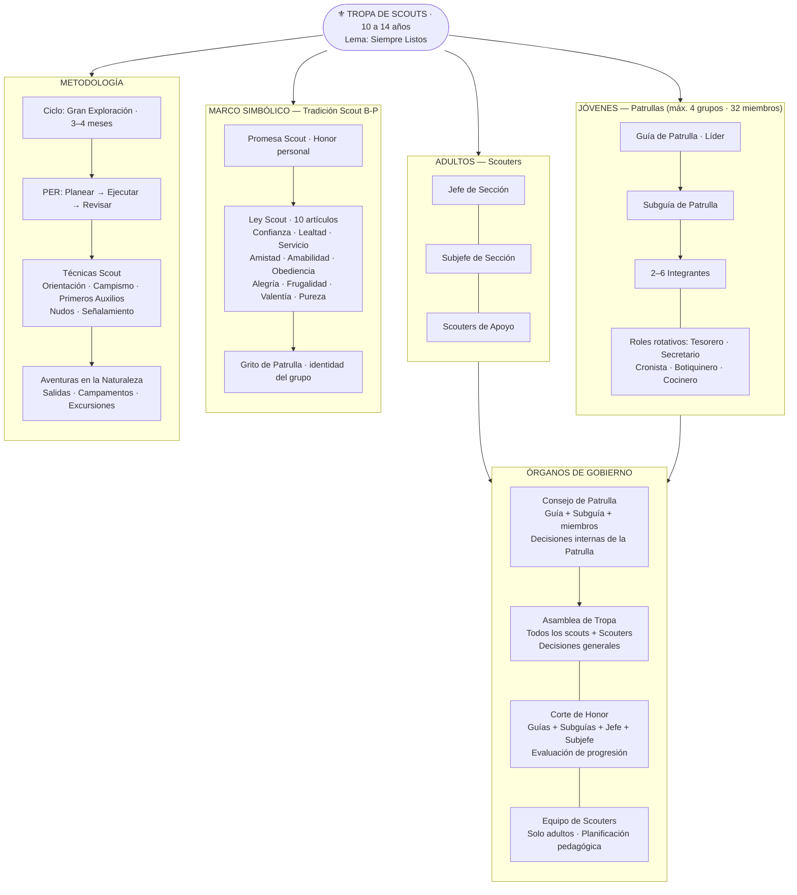

# Diagrama 3: Cómo Funciona la Tropa

```mermaid
flowchart TD
    TROPA(["⚜️ TROPA DE SCOUTS · 10 a 14 años\nLema: Siempre Listos"])

    subgraph ADU["ADULTOS — Scouters"]
        direction TB
        JEF["Jefe de Sección"]
        SUBJ["Subjefe de Sección"]
        APO["Scouters de Apoyo"]
        JEF --- SUBJ --- APO
    end

    subgraph PAT["JÓVENES — Patrullas (máx. 4 grupos · 32 miembros)"]
        direction TB
        GUIA["Guía de Patrulla · Líder"]
        SUBG["Subguía de Patrulla"]
        MIEMB["2–6 Integrantes"]
        ROLES["Roles rotativos: Tesorero · Secretario\nCronista · Botiquinero · Cocinero"]
        GUIA --> SUBG --> MIEMB
        MIEMB --- ROLES
    end

    subgraph GOB["ÓRGANOS DE GOBIERNO"]
        direction TB
        CP["Consejo de Patrulla\nGuía + Subguía + miembros\nDecisiones internas de la Patrulla"]
        AT["Asamblea de Tropa\nTodos los scouts + Scouters\nDecisiones generales"]
        CH["Corte de Honor\nGuías + Subguías + Jefe + Subjefe\nEvaluación de progresión"]
        ES["Equipo de Scouters\nSolo adultos · Planificación pedagógica"]
        CP --> AT
        AT --- CH
        CH --- ES
    end

    subgraph SIM["MARCO SIMBÓLICO — Tradición Scout B-P"]
        direction TB
        PROM["Promesa Scout · Honor personal"]
        LEY10["Ley Scout · 10 artículos\nConfianza · Lealtad · Servicio\nAmistad · Amabilidad · Obediencia\nAlegría · Frugalidad · Valentía · Pureza"]
        GRITO["Grito de Patrulla · identidad del grupo"]
        PROM --> LEY10 --> GRITO
    end

    subgraph MET["METODOLOGÍA"]
        direction TB
        EXP["Ciclo: Gran Exploración · 3–4 meses"]
        PER["PER: Planear → Ejecutar → Revisar"]
        TEC["Técnicas Scout\nOrientación · Campismo · Primeros Auxilios\nNudos · Señalamiento"]
        NAT["Aventuras en la Naturaleza\nSalidas · Campamentos · Excursiones"]
        EXP --> PER --> TEC --> NAT
    end

    TROPA --> ADU
    TROPA --> PAT
    ADU --> GOB
    PAT --> GOB
    TROPA --> SIM
    TROPA --> MET
```
##### Redactora
    - Yolanda Castillo