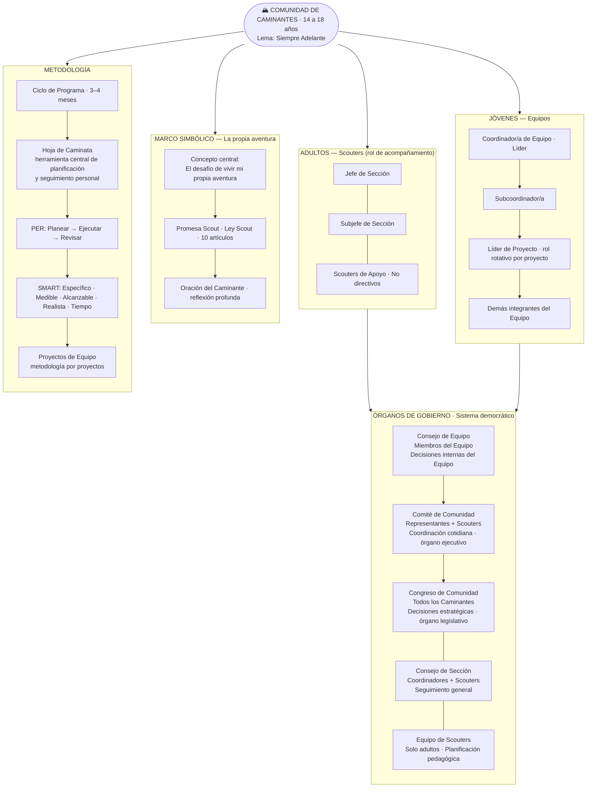

# Diagrama 5: Cómo Funciona la Comunidad

```mermaid
flowchart TD
    COM(["🏔️ COMUNIDAD DE CAMINANTES · 14 a 18 años\nLema: Siempre Adelante"])

    subgraph ADU["ADULTOS — Scouters (rol de acompañamiento)"]
        direction TB
        JEF["Jefe de Sección"]
        SUBJ["Subjefe de Sección"]
        APO["Scouters de Apoyo · No directivos"]
        JEF --- SUBJ --- APO
    end

    subgraph EQU["JÓVENES — Equipos"]
        direction TB
        COORD["Coordinador/a de Equipo · Líder"]
        SUBCO["Subcoordinador/a"]
        LPROY["Líder de Proyecto · rol rotativo por proyecto"]
        INT["Demás integrantes del Equipo"]
        COORD --> SUBCO --> LPROY --> INT
    end

    subgraph GOB["ÓRGANOS DE GOBIERNO · Sistema democrático"]
        direction TB
        CE["Consejo de Equipo\nMiembros del Equipo\nDecisiones internas del Equipo"]
        CC["Comité de Comunidad\nRepresentantes + Scouters\nCoordinación cotidiana · órgano ejecutivo"]
        CON["Congreso de Comunidad\nTodos los Caminantes\nDecisiones estratégicas · órgano legislativo"]
        CS["Consejo de Sección\nCoordinadores + Scouters\nSeguimiento general"]
        ES["Equipo de Scouters\nSolo adultos · Planificación pedagógica"]
        CE --> CC
        CC --> CON
        CON --- CS
        CS --- ES
    end

    subgraph SIM["MARCO SIMBÓLICO — La propia aventura"]
        direction TB
        CONC["Concepto central:\nEl desafío de vivir mi propia aventura"]
        PROM["Promesa Scout · Ley Scout · 10 artículos"]
        ORA["Oración del Caminante · reflexión profunda"]
        CONC --> PROM --> ORA
    end

    subgraph MET["METODOLOGÍA"]
        direction TB
        CIC["Ciclo de Programa · 3–4 meses"]
        HOJ["Hoja de Caminata\nherramienta central de planificación\ny seguimiento personal"]
        PER["PER: Planear → Ejecutar → Revisar"]
        SMART["SMART: Específico · Medible · Alcanzable · Realista · Tiempo"]
        PROY["Proyectos de Equipo\nmetodología por proyectos"]
        CIC --> HOJ --> PER --> SMART --> PROY
    end

    COM --> ADU
    COM --> EQU
    ADU --> GOB
    EQU --> GOB
    COM --> SIM
    COM --> MET
```
