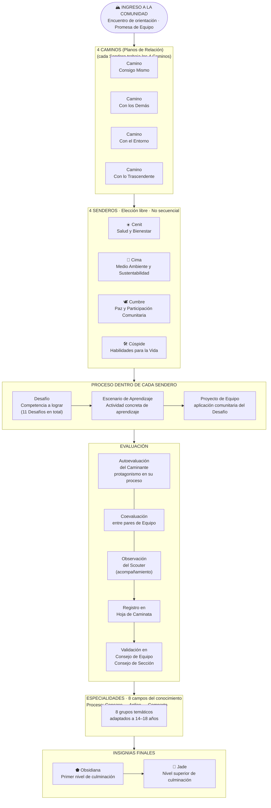

# Diagrama 6: Progresión en la Comunidad

```mermaid
flowchart TD
    INI(["🏔️ INGRESO A LA COMUNIDAD\nEncuentro de orientación · Promesa de Equipo"])

    subgraph CAMINOS["4 CAMINOS (Planos de Relación)\n(cada Sendero trabaja los 4 Caminos)"]
        direction LR
        C1["Camino\nConsigo Mismo"]
        C2["Camino\nCon los Demás"]
        C3["Camino\nCon el Entorno"]
        C4["Camino\nCon lo Trascendente"]
    end

    subgraph SEN["4 SENDEROS · Elección libre · No secuencial"]
        direction LR
        CEN["☀️ Cenit\nSalud y Bienestar"]
        CIM["🌲 Cima\nMedio Ambiente y Sustentabilidad"]
        CUM["🕊️ Cumbre\nPaz y Participación Comunitaria"]
        CUS["🛠️ Cúspide\nHabilidades para la Vida"]
    end

    subgraph PROCESO["PROCESO DENTRO DE CADA SENDERO"]
        direction LR
        DES["Desafío\nCompetencia a lograr\n(11 Desafíos en total)"]
        ESC["Escenario de Aprendizaje\nActividad concreta de aprendizaje"]
        PROY["Proyecto de Equipo\naplicación comunitaria del Desafío"]
        DES --> ESC --> PROY
    end

    subgraph EVAL["EVALUACIÓN"]
        direction TB
        E1["Autoevaluación\ndel Caminante\nprotagonismo en su proceso"]
        E2["Coevaluación\nentre pares de Equipo"]
        E3["Observación\ndel Scouter\n(acompañamiento)"]
        REG["Registro en\nHoja de Caminata"]
        VAL["Validación en\nConsejo de Equipo\nConsejo de Sección"]
        E1 --- E2 --- E3 --> REG --> VAL
    end

    subgraph ESP["ESPECIALIDADES · 8 campos del conocimiento\nProceso: Conozco → Aplico → Comparto"]
        EC["8 grupos temáticos\nadaptados a 14–18 años"]
    end

    subgraph FIN["INSIGNIAS FINALES"]
        direction LR
        OBS["⬟ Obsidiana\nPrimer nivel de culminación"]
        JAD["💎 Jade\nNivel superior de culminación"]
        OBS --> JAD
    end

    INI --> CAMINOS
    CAMINOS --> SEN
    SEN --> PROCESO
    PROCESO --> EVAL
    EVAL --> ESP
    ESP --> FIN
```
