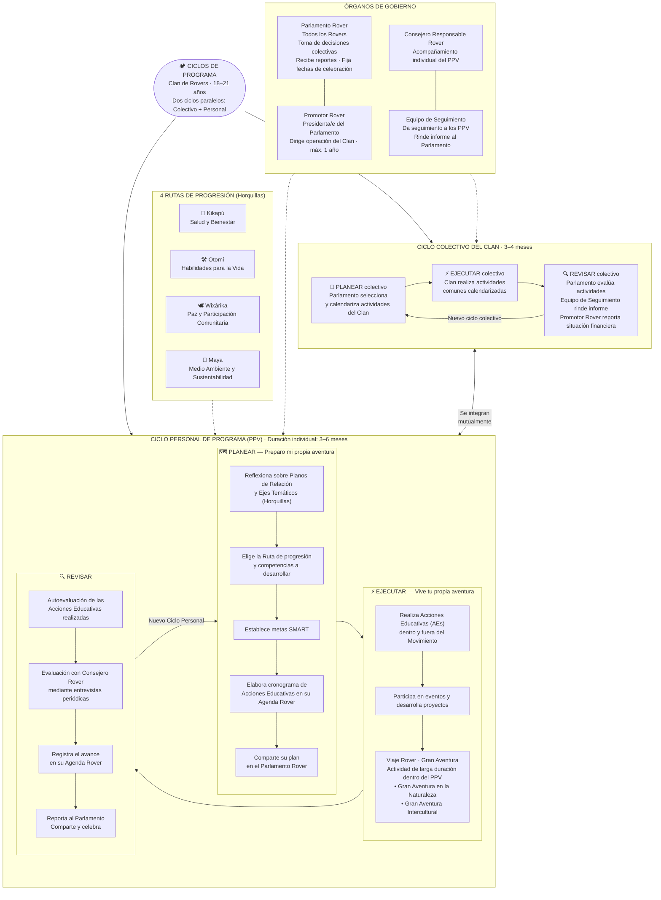

# Ciclo de Programa — Clan de Rovers

```mermaid
flowchart TD
    TITLE(["🏕️ CICLOS DE PROGRAMA\nClan de Rovers · 18–21 años\nDos ciclos paralelos: Colectivo + Personal"])

    subgraph COL["CICLO COLECTIVO DEL CLAN · 3–4 meses"]
        direction LR
        COL1["📌 PLANEAR colectivo\nParlamento selecciona\ny calendariza actividades del Clan"]
        COL2["⚡ EJECUTAR colectivo\nClan realiza actividades\ncomunes calendarizadas"]
        COL3["🔍 REVISAR colectivo\nParlamento evalúa actividades\nEquipo de Seguimiento rinde informe\nPromotor Rover reporta situación financiera"]
        COL1 --> COL2 --> COL3
        COL3 -->|"Nuevo ciclo colectivo"| COL1
    end

    subgraph PER["CICLO PERSONAL DE PROGRAMA (PPV) · Duración individual: 3–6 meses"]

        subgraph PP["🗺️ PLANEAR — Preparo mi propia aventura"]
            PP1["Reflexiona sobre Planos de Relación\ny Ejes Temáticos (Horquillas)"]
            PP2["Elige la Ruta de progresión\ny competencias a desarrollar"]
            PP3["Establece metas SMART"]
            PP4["Elabora cronograma de\nAcciones Educativas en su Agenda Rover"]
            PP5["Comparte su plan\nen el Parlamento Rover"]
            PP1 --> PP2 --> PP3 --> PP4 --> PP5
        end

        subgraph EP["⚡ EJECUTAR — Vive tu propia aventura"]
            EP1["Realiza Acciones Educativas (AEs)\ndentro y fuera del Movimiento"]
            EP2["Participa en eventos y desarrolla proyectos"]
            EP3["Viaje Rover · Gran Aventura\nActividad de larga duración dentro del PPV\n• Gran Aventura en la Naturaleza\n• Gran Aventura Intercultural"]
            EP1 --> EP2 --> EP3
        end

        subgraph RP["🔍 REVISAR"]
            RP1["Autoevaluación de las\nAcciones Educativas realizadas"]
            RP2["Evaluación con Consejero Rover\nmediante entrevistas periódicas"]
            RP3["Registra el avance\nen su Agenda Rover"]
            RP4["Reporta al Parlamento\nComparte y celebra"]
            RP1 --> RP2 --> RP3 --> RP4
        end

        PP --> EP
        EP --> RP
        RP -->|"Nuevo Ciclo Personal"| PP
    end

    subgraph RUTA["4 RUTAS DE PROGRESIÓN (Horquillas)"]
        direction LR
        R1["🧘 Kikapú\nSalud y Bienestar"]
        R2["🛠️ Otomí\nHabilidades para la Vida"]
        R3["🕊️ Wixárika\nPaz y Participación Comunitaria"]
        R4["🌿 Maya\nMedio Ambiente y Sustentabilidad"]
    end

    subgraph ORG["ÓRGANOS DE GOBIERNO"]
        direction TB
        PARL["Parlamento Rover\nTodos los Rovers\nToma de decisiones colectivas\nRecibe reportes · Fija fechas de celebración"]
        PROM["Promotor Rover\nPresidenta/e del Parlamento\nDirige operación del Clan · máx. 1 año"]
        CRR["Consejero Responsable Rover\nAcompañamiento individual del PPV"]
        ES["Equipo de Seguimiento\nDa seguimiento a los PPV\nRinde informe al Parlamento"]
        PARL --- PROM
        CRR --- ES
    end

    TITLE --> COL
    TITLE --> PER
    RUTA -.-> PER
    ORG -.-> COL
    ORG -.-> PER
    COL <-->|"Se integran\nmutualmente"| PER
```
##### Redactora
    - Yolanda Castillo