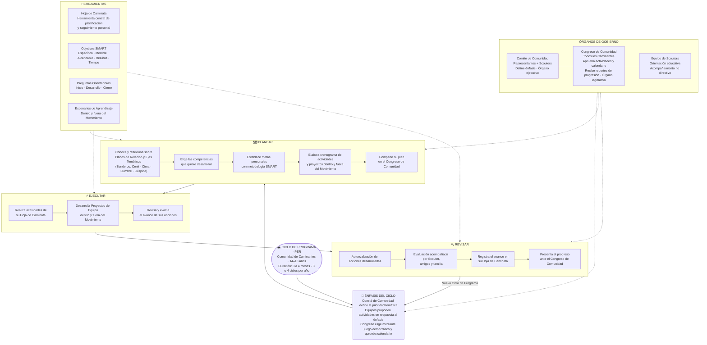

# Ciclo de Programa — PER (Comunidad)

```mermaid
flowchart TD
    TITLE(["🏔️ CICLO DE PROGRAMA · PER\nComunidad de Caminantes · 14–18 años\nDuración: 3 a 4 meses · 3 o 4 ciclos por año"])

    ENFA["📌 ÉNFASIS DEL CICLO\nComité de Comunidad define la prioridad temática\nEquipos proponen actividades en respuesta al énfasis\nCongreso elige mediante juego democrático y aprueba calendario"]

    subgraph PLAN["🗺️ PLANEAR"]
        P1["Conoce y reflexiona sobre\nPlanos de Relación y Ejes Temáticos\n(Senderos: Cenit · Cima · Cumbre · Cúspide)"]
        P2["Elige las competencias\nque quiere desarrollar"]
        P3["Establece metas personales\ncon metodología SMART"]
        P4["Elabora cronograma de actividades\ny proyectos dentro y fuera del Movimiento"]
        P5["Comparte su plan\nen el Congreso de Comunidad"]
        P1 --> P2 --> P3 --> P4 --> P5
    end

    subgraph EJEC["⚡ EJECUTAR"]
        E1["Realiza actividades de\nsu Hoja de Caminata"]
        E2["Desarrolla Proyectos de Equipo\ndentro y fuera del Movimiento"]
        E3["Revisa y evalúa\nel avance de sus acciones"]
        E1 --> E2 --> E3
    end

    subgraph REVI["🔍 REVISAR"]
        R1["Autoevaluación de acciones desarrolladas"]
        R2["Evaluación acompañada por Scouter,\namigos y familia"]
        R3["Registra el avance en\nsu Hoja de Caminata"]
        R4["Presenta el progreso\nante el Congreso de Comunidad"]
        R1 --> R2 --> R3 --> R4
    end

    subgraph GOB["ÓRGANOS DE GOBIERNO"]
        direction LR
        CC["Comité de Comunidad\nRepresentantes + Scouters\nDefine énfasis · Órgano ejecutivo"]
        CON["Congreso de Comunidad\nTodos los Caminantes\nAprueba actividades y calendario\nRecibe reportes de progresión · Órgano legislativo"]
        ES["Equipo de Scouters\nOrientación educativa\nAcompañamiento no directivo"]
        CC --- CON
        CON --- ES
    end

    subgraph HERR["HERRAMIENTAS"]
        H1["Hoja de Caminata\nHerramienta central de planificación\ny seguimiento personal"]
        H2["Objetivos SMART\nEspecífico · Medible · Alcanzable · Realista · Tiempo"]
        H3["Preguntas Orientadoras\nInicio · Desarrollo · Cierre"]
        H4["Escenarios de Aprendizaje\nDentro y fuera del Movimiento"]
    end

    TITLE --> ENFA
    ENFA --> PLAN
    PLAN --> EJEC
    EJEC --> REVI
    REVI -->|"Nuevo Ciclo de Programa"| ENFA

    GOB -.-> ENFA
    GOB -.-> PLAN
    GOB -.-> REVI
    HERR -.-> PLAN
    HERR -.-> EJEC
    HERR -.-> REVI
```

##### Redactora
    - Yolanda Castillo
