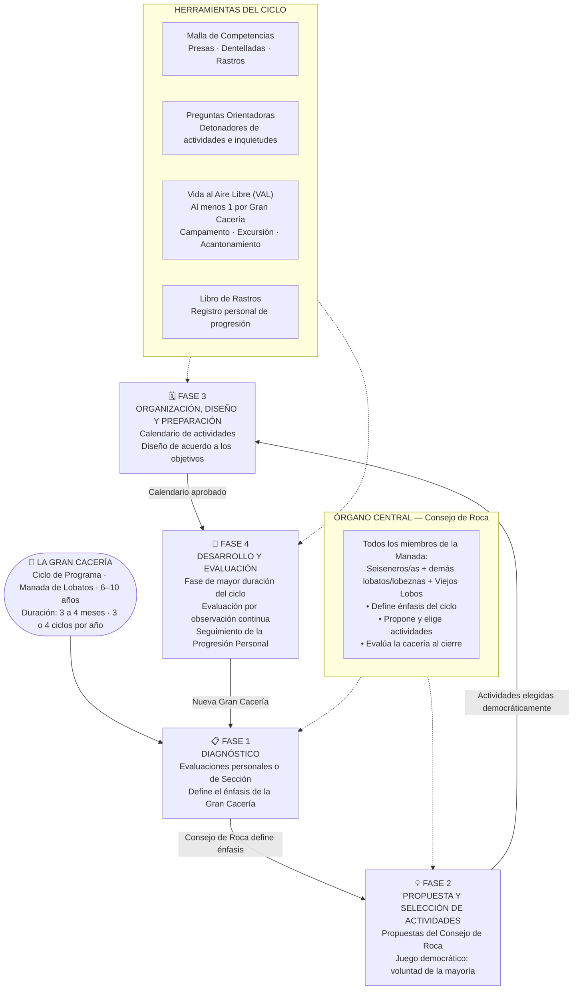

# Ciclo de Programa — La Gran Cacería (Manada)

```mermaid
flowchart TD
    TITLE(["🐺 LA GRAN CACERÍA\nCiclo de Programa · Manada de Lobatos · 6–10 años\nDuración: 3 a 4 meses · 3 o 4 ciclos por año"])

    F1["📋 FASE 1\nDIAGNÓSTICO\nEvaluaciones personales o de Sección\nDefine el énfasis de la Gran Cacería"]

    F2["💡 FASE 2\nPROPUESTA Y SELECCIÓN DE ACTIVIDADES\nPropuestas del Consejo de Roca\nJuego democrático: voluntad de la mayoría"]

    F3["🗓️ FASE 3\nORGANIZACIÓN, DISEÑO Y PREPARACIÓN\nCalendario de actividades\nDiseño de acuerdo a los objetivos"]

    F4["🏃 FASE 4\nDESARROLLO Y EVALUACIÓN\nFase de mayor duración del ciclo\nEvaluación por observación continua\nSeguimiento de la Progresión Personal"]

    subgraph GOB["ÓRGANO CENTRAL — Consejo de Roca"]
        OR["Todos los miembros de la Manada:\nSeiseneros/as + demás lobatos/lobeznas + Viejos Lobos\n• Define énfasis del ciclo\n• Propone y elige actividades\n• Evalúa la cacería al cierre"]
    end

    subgraph HERR["HERRAMIENTAS DEL CICLO"]
        H1["Malla de Competencias\nPresas · Dentelladas · Rastros"]
        H2["Preguntas Orientadoras\nDetonadores de actividades e inquietudes"]
        H3["Vida al Aire Libre (VAL)\nAl menos 1 por Gran Cacería\nCampamento · Excursión · Acantonamiento"]
        H4["Libro de Rastros\nRegistro personal de progresión"]
    end

    TITLE --> F1
    F1 -->|"Consejo de Roca define énfasis"| F2
    F2 -->|"Actividades elegidas democráticamente"| F3
    F3 -->|"Calendario aprobado"| F4
    F4 -->|"Nueva Gran Cacería"| F1

    GOB -.-> F1
    GOB -.-> F2
    HERR -.-> F3
    HERR -.-> F4
```
