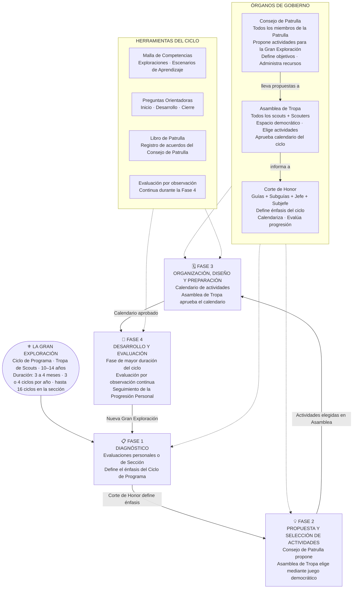

# Ciclo de Programa — La Gran Exploración (Tropa)

```mermaid
flowchart TD
    TITLE(["⚜️ LA GRAN EXPLORACIÓN\nCiclo de Programa · Tropa de Scouts · 10–14 años\nDuración: 3 a 4 meses · 3 o 4 ciclos por año · hasta 16 ciclos en la sección"])

    F1["📋 FASE 1\nDIAGNÓSTICO\nEvaluaciones personales o de Sección\nDefine el énfasis del Ciclo de Programa"]

    F2["💡 FASE 2\nPROPUESTA Y SELECCIÓN DE ACTIVIDADES\nConsejo de Patrulla propone\nAsamblea de Tropa elige mediante juego democrático"]

    F3["🗓️ FASE 3\nORGANIZACIÓN, DISEÑO Y PREPARACIÓN\nCalendario de actividades\nAsamblea de Tropa aprueba el calendario"]

    F4["🏃 FASE 4\nDESARROLLO Y EVALUACIÓN\nFase de mayor duración del ciclo\nEvaluación por observación continua\nSeguimiento de la Progresión Personal"]

    subgraph GOB["ÓRGANOS DE GOBIERNO"]
        direction TB
        CP["Consejo de Patrulla\nTodos los miembros de la Patrulla\nPropone actividades para la Gran Exploración\nDefine objetivos · Administra recursos"]
        AT["Asamblea de Tropa\nTodos los scouts + Scouters\nEspacio democrático · Elige actividades\nAprueba calendario del ciclo"]
        CH["Corte de Honor\nGuías + Subguías + Jefe + Subjefe\nDefine énfasis del ciclo\nCalendariza · Evalúa progresión"]
        CP -->|"lleva propuestas a"| AT
        AT -->|"informa a"| CH
    end

    subgraph HERR["HERRAMIENTAS DEL CICLO"]
        H1["Malla de Competencias\nExploraciones · Escenarios de Aprendizaje"]
        H2["Preguntas Orientadoras\nInicio · Desarrollo · Cierre"]
        H3["Libro de Patrulla\nRegistro de acuerdos del Consejo de Patrulla"]
        H4["Evaluación por observación\nContinua durante la Fase 4"]
    end

    TITLE --> F1
    F1 -->|"Corte de Honor define énfasis"| F2
    F2 -->|"Actividades elegidas en Asamblea"| F3
    F3 -->|"Calendario aprobado"| F4
    F4 -->|"Nueva Gran Exploración"| F1

    GOB -.-> F1
    GOB -.-> F2
    GOB -.-> F3
    HERR -.-> F3
    HERR -.-> F4
```
##### Redactora
    - Yolanda Castillo