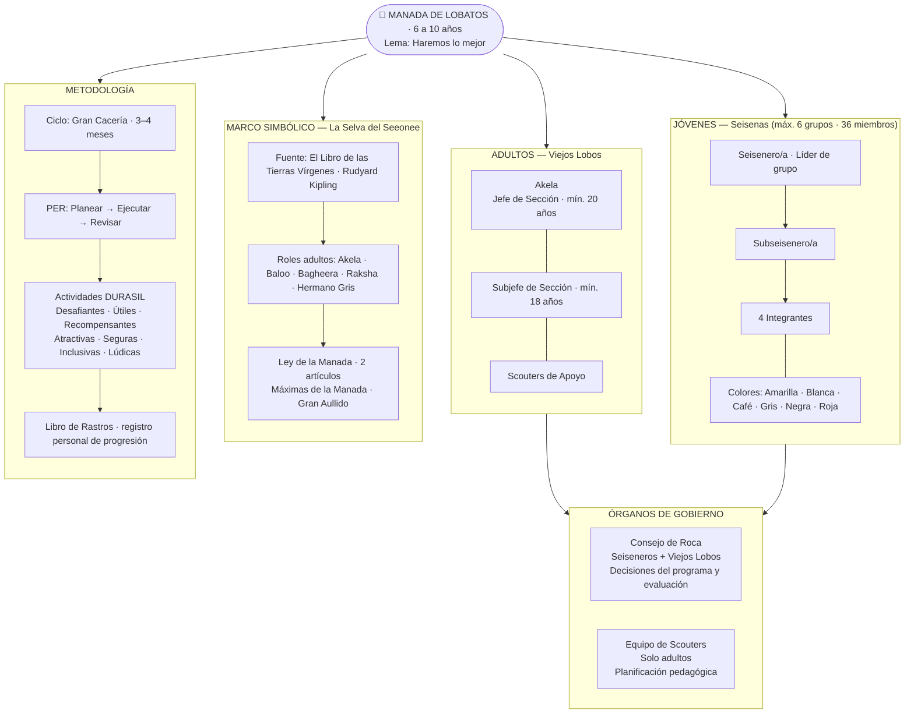
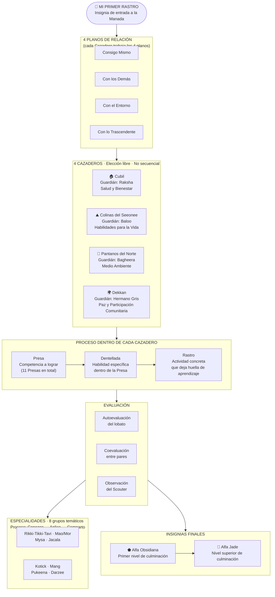
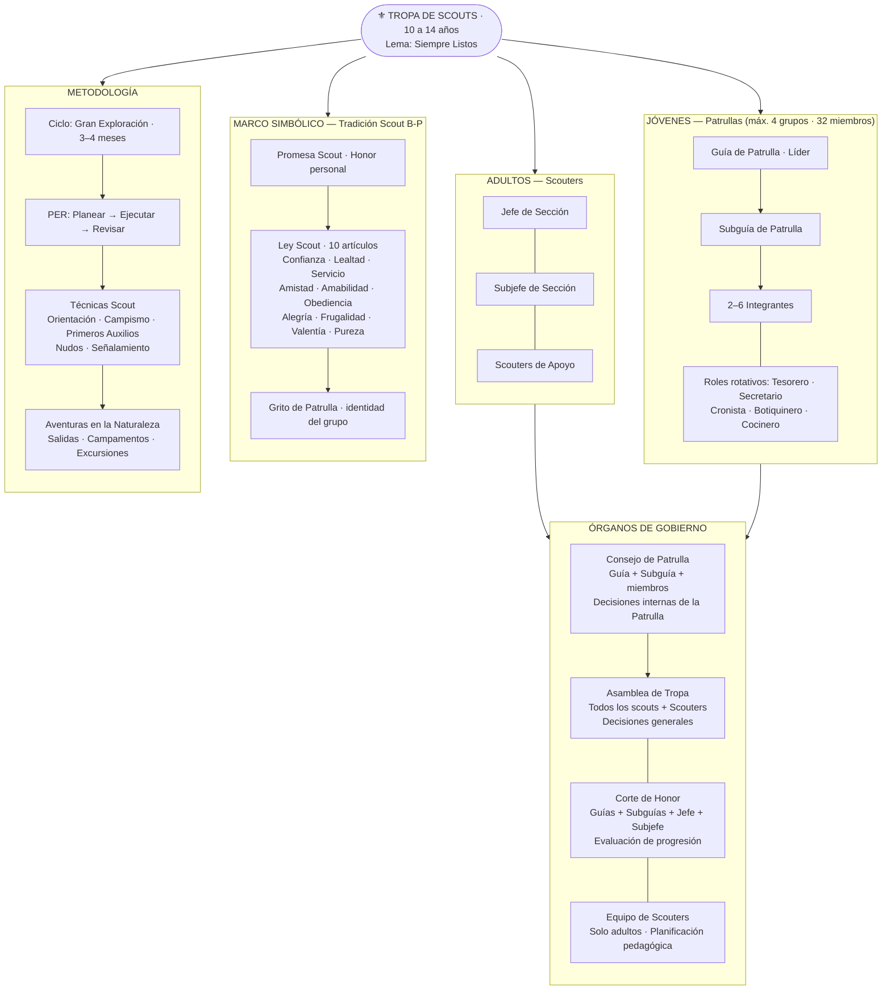
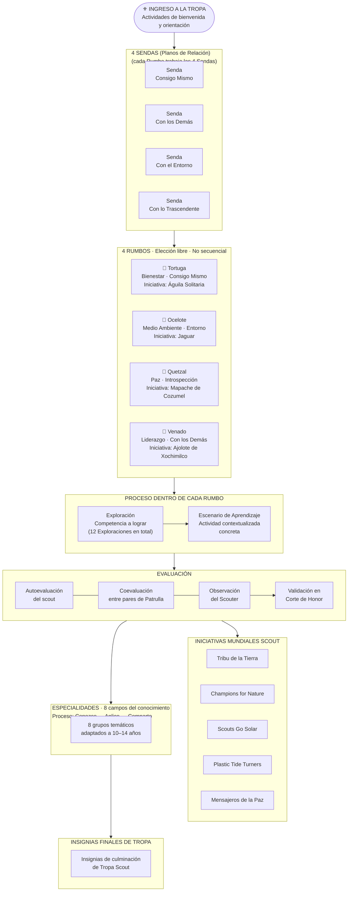
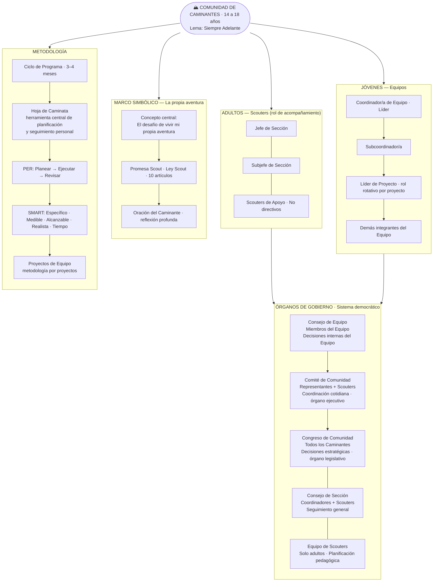
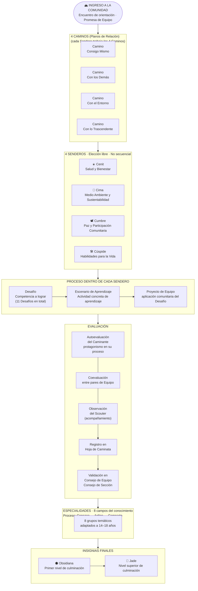

# Diagramas Scout en Mermaid

---

## Diagrama 1: Cómo Funciona la Manada

---

## Diagrama 2: Progresión en la Manada

---

## Diagrama 3: Cómo Funciona la Tropa

---

## Diagrama 4: Progresión en la Tropa

---

## Diagrama 5: Cómo Funciona la Comunidad

---

## Diagrama 6: Progresión en la Comunidad

