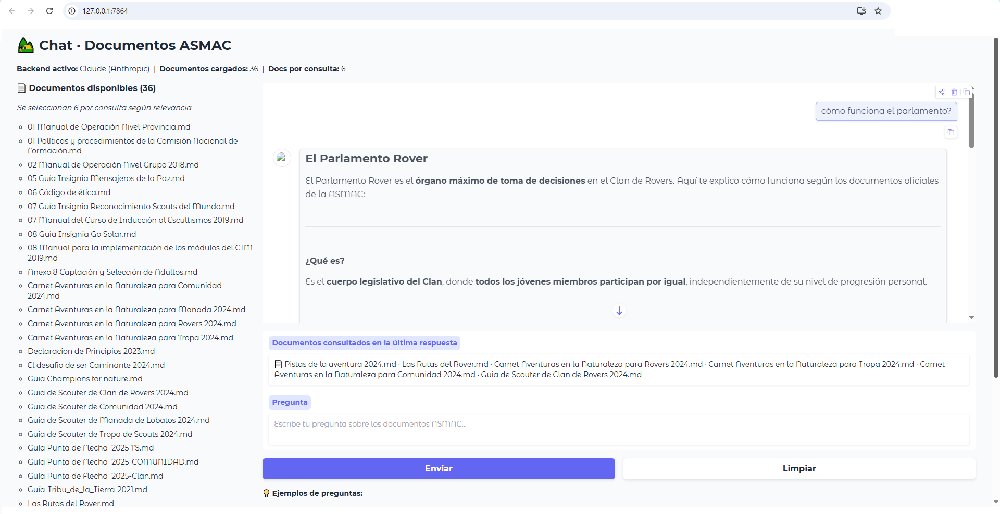

# 👷 Interface para hacer preguntas sobre el nuevo programa

## Introducción

Son demasiados los cursos que se tiene que tomar y mucha información que se tiene que leer, por lo que se me ocurrió un chat con ayuda de la IA generativa para contestar todas las dudas que puedan surgir con el fin de aprender más rápido, está aplicació no tiene fines de lucro.

### Cómo se creó

- Se descargaron los documentos con fecha del 23 de julio de 2026 de la página oficial
- Se convirtieron todos los archivos a MD para poder carga a memoria la base de conocmiento descargada
- se pidió a la IA generativa generar el chat multiplataforma

### Antes de empezar

- Instalar pythhon
- Tener alguna cuenta de IA generativa
- Considerar que constantemente se actualizan los documentos oficiales, en tal caso, descagrar, convertir a .md y reemplazar en la carpeta md

### Cómo usar 

- Descargar la carpeta de fuentes
- Para usar el proyecto, se requiere tener cuenta en alguna de la IAs generativas
- Configurar la variables pertinentes hacer copia del archivo ".env.example"  llamada .env
- Actualizarle las variables de ambiente segun la IA a Utilizar
- Ejecutar sobre "python.exe chat_scouts.py"
- Se puede acceder al chat mediante "http://127.0.0.1:7864/" 

#### Herramientas usadas

- [Python](https://www.python.org/downloads/)
- [Claude Code](https://claude.com/pricing) 
- [Microsoft Marktdown](https://github.com/microsoft/markitdown) 
- [Graphify](https://github.com/Graphify-Labs/graphify)
- [Gradio](https://gradio.app/)

#### Otras herramientas

- [Kimi] (https://www.kimi.com/es-419/help/kimi-code/cli-getting-started)
- [Ollama](https://ollama.com/)

##### Autora

- Yolanda Castillo
