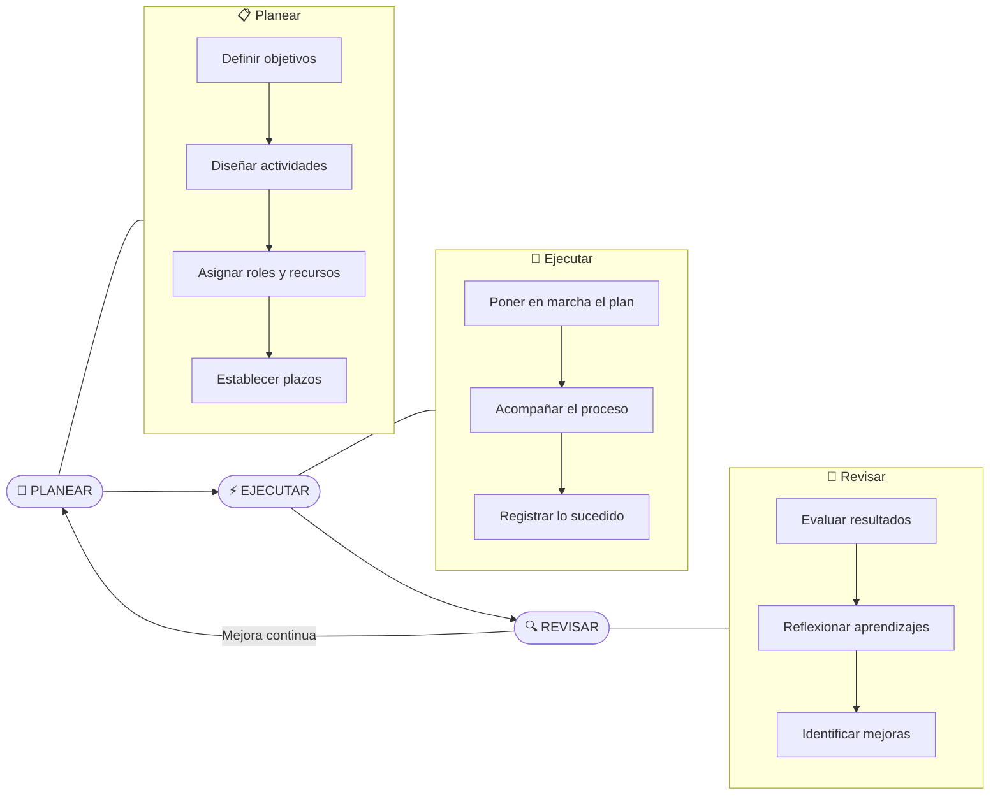

# ✏️ Metodología PER — Planear · Ejecutar · Revisar

```mermaid
flowchart LR
    P(["🎯 PLANEAR"])
    E(["⚡ EJECUTAR"])
    R(["🔍 REVISAR"])

    P --> E
    E --> R
    R -->|"Mejora continua"| P

    subgraph plan ["📋 Planear"]
        P1["Definir objetivos"]
        P2["Diseñar actividades"]
        P3["Asignar roles y recursos"]
        P4["Establecer plazos"]
        P1 --> P2 --> P3 --> P4
    end

    subgraph exec ["🚀 Ejecutar"]
        E1["Poner en marcha el plan"]
        E2["Acompañar el proceso"]
        E3["Registrar lo sucedido"]
        E1 --> E2 --> E3
    end

    subgraph rev ["🔎 Revisar"]
        R1["Evaluar resultados"]
        R2["Reflexionar aprendizajes"]
        R3["Identificar mejoras"]
        R1 --> R2 --> R3
    end

    P --- plan
    E --- exec
    R --- rev
```
