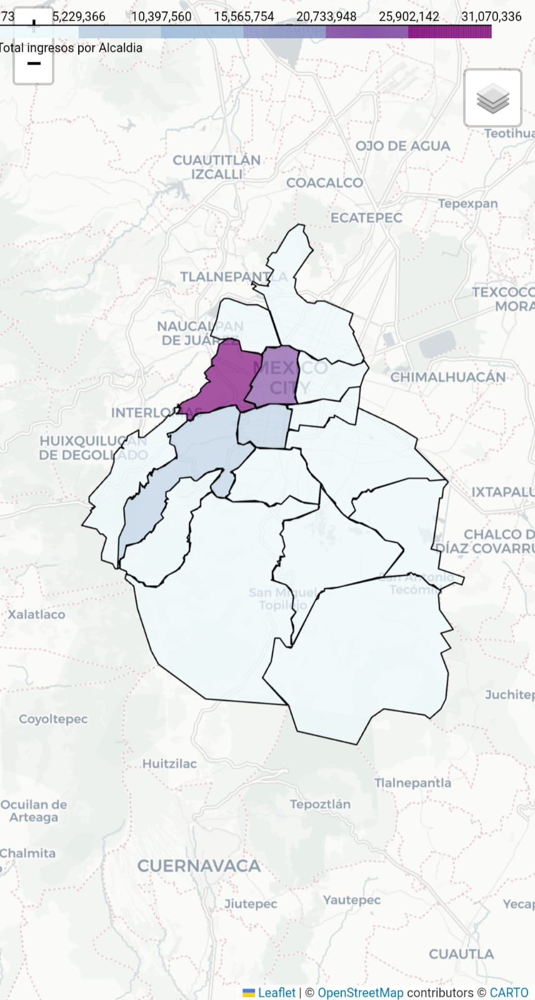
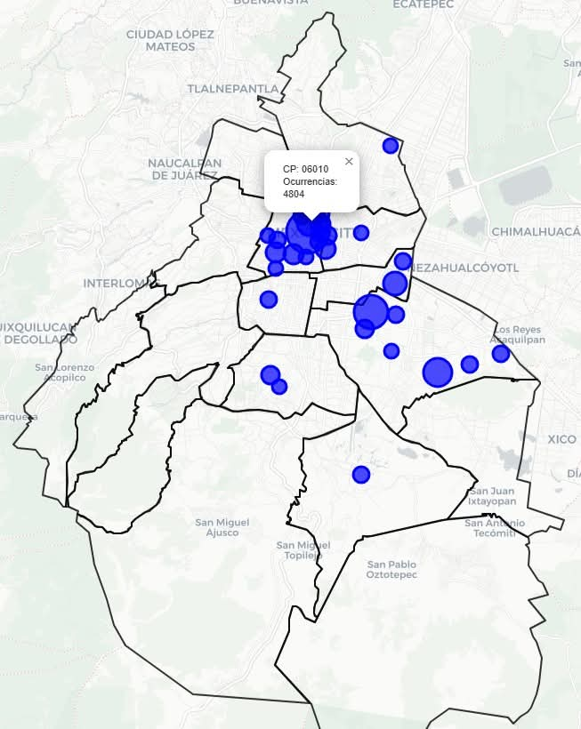
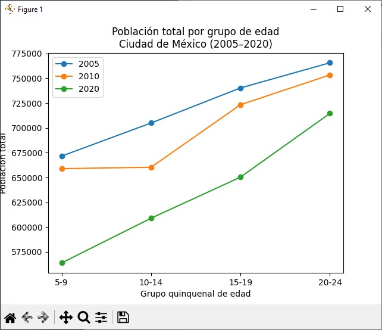

#  🔥 Propuesta de estrategias para aumento de la membresía en la asociación

Fecha: julio 2025-diciembre 2025
Actualización 7 de octubre de 2026

## Introducción

- Esta propuesta pretende proponer estrategias para incrementar la membresía.

- Los estudios fueron iniciados en julio del 2025 y terminados a finales del 2025

- Las estadísticas  y límites de alcaldías fueron tomados de fuentes oficiales como [INEGI](https://inegi.org.mx/)

- Miembros del Grupo 007 de Azcapotzalco estuvimos intercambiando éstas ideas y analizando los estudios para generar las propuestas

- Las ideas de explorar con estudios de distribución de  dinero por negocios por Alcandía fueron idea de Antonio Bernal

- El 70% de la membresía se encuentra en la CMDX, por lo que es una buena  representativa de la membresía

- Los gráficos fuero hechos con Python

## Tecnologías usadas

- [Claude Code](https://claude.com/product/claude-code) 
- [Python](https://www.python.org/)

## Resultados

- Distribución de dinero por negocios por Alcaldía
        [Ver gráfica interactiva](https://y-castillo.com/estrategia-membresia/ingresos-x-negocio.html)

        El top de Alcaldías donde circula más dinero son
            - Cuahutemoc
            - Benito Juarez
            - Álvaro Obregón
            - Miguel Hidalgo

        Reflejando  el top de membresía por Alcaldía en la CDMX

- Distribución de cantidad de negocios por Alcaldía 
        [Ver gráfica interactiva](https://y-castillo.com/estrategia-membresia/total_negocios.html)

Iztapalapa sería un buen blanco por su cantidad de población en edad reglamentaría, sin embargo, no circula tanto dinero

- Decaimiento de la infancia de población para ser Scout

|Grupo |Edad   | 2005   | 2020   | Decaimiento (%) |
|------|-------|--------|--------|-----------------|
|0     |   5-9 | 671579 | 563907 |           16.03 |
|1     | 10-14 | 704950 | 608962 |           13.62 |
|2     | 15-19 | 740280 | 650389 |           12.14 |
|3     | 20-24 | 765641 | 714605 |            6.67 |

La población de manada ha caído un 16%,  mientras que la de clan solo 6%

## Propuestas

- Incrementar la edad de clan como en Europa, es decir, hasta los 25 años ya que la tasa de decaimiento de jóvenes es la menor.

- Zonarizar la membresía, a  alcaldías como Iztapalapa  le beneficiaría bajar el costo de la membresía

- Como la mayor amenaza al menos en nuestro grupo son los Pilares, se requiere un estudio para demostrar a la comunidad que las actividades de Pilares aunque son gratis, a largo plazo son más caras que el pago anual de una membresía

### Propuestas de crecimiento

Estrategia vs Pilares
        Para llegar a las familias

                Jornada de puertas abiertas o "Día de prueba": una actividad gratis donde los niños vivan un mini campamento, juegos y nudos, y los papás conozcan al equipo.
                
                Alianzas con escuelas: pláticas de 10 minutos en recesos o juntas de padres, con una demostración corta (fogata simulada, primeros auxilios).
                
                Referidos ("Trae a un amigo"): una insignia o reconocimiento para quien invite a alguien que se quede.

        Para redes sociales

                Reels con rostro humano: momentos reales del campamento, el antes y después de una actividad, o "un día en la vida de un scout". Siempre con autorización de los papás para publicar imágenes de menores.
                
                Testimonios cortos: un papá, un joven o un 
                
                Rover diciendo qué ganó en el grupo.
                
                Retos virales: "reto de 30 segundos para hacer un nudo", con un hashtag del grupo.
                
                Contenido útil: tips de campismo, supervivencia o primeros auxilios que la gente guarde y comparta.

        Para construir identidad

                Marca visual consistente: pañoleta, colores, logo y un lema fácil de recordar.
                
                Merchandising simple: parches, calcomanías o gorras que los chicos presuman en la escuela.
                
                Eventos públicos con propósito: limpieza de parques, colectas o servicio comunitario, que dan visibilidad y confianza.

                Para convertir interés en inscripción

                Folleto digital con código QR que lleve a un formulario o WhatsApp.
                
                Primer mes sin costo o con descuento para quitar la barrera de entrada.
                
                Seguimiento personal: un mensaje a cada familia interesada en las 48 horas siguientes.

                

Estrategia vs a grupos Scout tradicionales.

        Si el otro grupo es más barato, no ganas bajando precios sino justificando el valor y quitando fricción. Esta es la estrategia:

        1. Diagnostica antes de actuar

        Compara con honestidad: cuota, uniforme, número de salidas al año, campamentos incluidos, seguro, materiales y ratio de adultos por joven.
        Una cuota baja suele significar menos actividades. Si tú ofreces más, el precio por actividad puede ser igual o menor.

        2. Baja el costo percibido

        Uniforme por etapas: al inicio solo pañoleta y playera; el resto se compra conforme avanza el joven.
        Banco de uniformes: intercambio y donación de prendas usadas entre familias.
        Cuotas escalonadas: pago mensual, trimestral o por hermanos con descuento.
        Mes de prueba sin compra obligatoria de uniforme.

        3. Haz visible lo que incluye la cuota

        Publica un "¿Qué incluye tu membresía?": salidas, seguro, materiales, capacitación de dirigentes, insignias.
        Muestra el costo por actividad: "Menos de $X por salida".
        Rendición de cuentas trimestral a las familias. La transparencia genera confianza, y la gente paga más tranquila cuando sabe a dónde va su dinero.

        4. Diferénciate por experiencia, no por precio

        Programa con más aventura (campamentos, rutas, actividades acuáticas si aplica) y más calidad en la planeación.
        Dirigentes capacitados y con constancia: es lo que más retiene familias.
        Proyectos de impacto visibles: servicio comunitario, expediciones, eventos propios con identidad.

        5. Reduce los costos reales para competir mejor

        Patrocinios locales (negocios del barrio) a cambio de visibilidad en tus eventos.
        Actividades de recaudación periódicas (venta de garage, colectas, rifas) para becar cuotas.
        Convenios con tiendas scout o talleres de costura para uniformes a precio de mayoreo.

        6. Comunica sin atacar

        Mensaje: "Aventura de calidad, a un costo justo y transparente."
        Evita criticar a otros grupos; el movimiento es el mismo y los papás lo notan. Mejor deja que tus resultados hablen: testimonios, fotos de campamentos y logros de los jóvenes.

        7. Retención, tu mejor defensa

        Un joven que progresa, tiene amigos y cargos de responsabilidad no se va por $100 pesos de diferencia.
        Reconocimientos frecuentes, ceremonias bien hechas y comunicación constante con las familias.

        

Estrategia vs Grupos Juveniles cercanos y otro grupos Scout

        La clave es posicionarte con claridad: que las familias sepan en una frase por qué tu grupo es distinto. 

        

        Paso 1: Mapea tu entorno

                Haz una tabla con cada grupo cercano (scouts, iglesias, deportes, Pilares, academias, otros):

                Edades que atienden, horarios, costo, tipo de actividades
                
                Qué hacen bien y qué no ofrecen
                
                Cómo se comunican (redes, volantes, boca a boca)

                Con eso encuentras tu hueco: lo que las familias buscan y nadie cubre bien.

        Frente 1: Otros grupos juveniles (deporte, iglesias, academias)

                Posicionamiento: "El único lugar donde tu hijo aprende a liderar, convivir y vivir la naturaleza." Ellos enseñan una habilidad; tú formas carácter.
                
                Complementariedad: muchos jóvenes ya tienen futbol o inglés. Ofrece horarios que no choquen y vende al scout como "el complemento".
                        
                Pruebas sociales: testimonios de papás sobre autonomía, confianza y disciplina.
                        
                Experiencias que no pueden copiar: campamentos, fogatas, rutas y ceremonias.

        Frente 2: Otros grupos scouts

                No compitas por los mismos jóvenes; crece el mercado. Hay muchos niños sin ningún grupo, así que apunta a ellos.
                
                Especialízate: un enfoque propio (aire libre, servicio comunitario, tecnología, expediciones) te hace memorable.
                
                Calidad de dirigentes: constancia, capacitación y trato cercano con las familias es lo que más retiene.
                
                Colaboración estratégica: eventos conjuntos (campamentos distritales, juegos entre grupos) que te dan visibilidad ante sus familias sin atacar a nadie.
                
                Evita el choque directo: no captes miembros de otros grupos activamente. Genera mala fama en el movimiento y se nota.

        Acciones para ambos frentes: Otros grupos juveniles (deporte, iglesias, academias) y Otros grupos scouts

                Una frase de posicionamiento repetida en todo (redes, volantes, pláticas).

                Presencia local constante: módulos en parques, pláticas en escuelas y un evento abierto cada mes.
        
                Embudo claro: contenido en redes → día de prueba gratis → seguimiento por WhatsApp en 48 horas → inscripción.
        
                Retención: programa anual publicado, comunicación semanal a papás y reconocimientos visibles para los jóvenes.
        
                Métricas simples: nuevos interesados, asistentes al día de prueba, inscritos y bajas por trimestre.

#### Autora

- Mtra. en C. de D. para N. Yolanda Castillo

#### Colaboradores

- Doc. Antonio Bernal (idea original del estudio de distribución de dinero)
- Mtro. David Flores
- Doc. Julio César Castillo
- Lic. Luis Antonio Rea