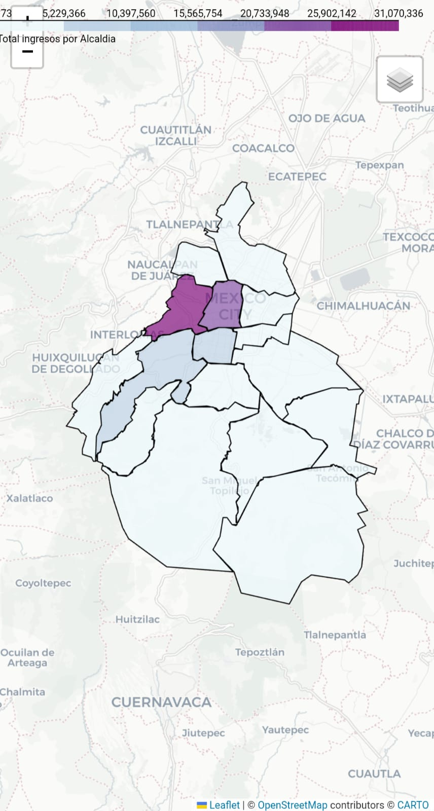
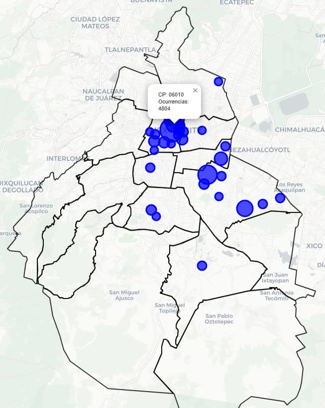
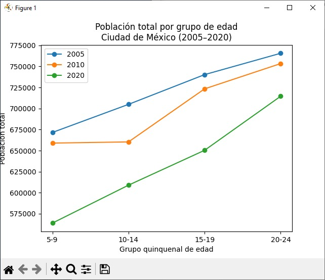

#  🔥 Propuesta de estragías para aumento de la membresía en la asociación

## Introducción
- Esta propuesta pretende proponer estrategías para incrementar la membresía.

- Los estudios fueron inciados en julio del 2025 y terminados a finales del 2025

- Los estadisticas límites de alcaldías fueron tomados de fuentes oficiales como [INEGI](https://inegi.org.mx/)

- Miembros del Grupo 007 de Azcapotzalco estuvimos intercambiando éstas ideas y analizando los estudios para generar las propuestas

- Las ideas de explorar con estudios de distribución de  dinero por negocios por Alcandía fueron idea de Antonio Bernal

- El 70% de la membresía se encuentra en la CMDX, por lo que es una buena  representativa de la membresía

- Los gráficos fuero echos con Python

## Resultados

- [Distribución de dinero por negocios por Alcaldía](https://y-castillo.com/estrategia-membresia/ingresos-x-negocio.html)

        

        El top de Alcaldías donde circula más dinero son
            - Cuahutemoc
            - Benito Juarez
            - Älvaro Obregón
            - Miguel Hidalgo

        Refeflejando el top de membresía por Alcaldía en la CDMX

- [Distribución de cantidad de negocios por Alcaldía](https://y-castillo.com/estrategia-membresia/total_negocios.html)

Iztapala sería un buen blanco por su cantidad de población en edad reglamentaría, sin embargo, no circula tanto dinero

- Decaimiento de la infancia de población para ser Scout

|Grupo |Edad   | 2005   | 2020   | Decaimiento (%) |
|------|-------|--------|--------|-----------------|
|0     |   5-9 | 671579 | 563907 |           16.03 |
|1     | 10-14 | 704950 | 608962 |           13.62 |
|2     | 15-19 | 740280 | 650389 |           12.14 |
|3     | 20-24 | 765641 | 714605 |            6.67 |

La poblacion de manada ha caido 16% mientras que la de clan solo 6%

## Propuestas

- Incrementar la edad de clan como en Europa, es decir, hasta los 25 años ya que la tasa de decaimiento de jóvenes es la menor.

- Zonalizar la membresía, a  alcaldías como Iztalapa  le beneficiría bajar el costo de la membresía

- Como la mayor amenaza al menos en nuestro grupo son los Pilares, se requiere un estudio para demostrar a la comunidad que las actividades de Pilares aunque son gratis, a largo plazo son más caras que el pago anual de una membresía

### Autora

- Mtra. en C.C. para N. Yolanda Castillo

### Agredecimientos
- Antonio Bernal
- Mtro. David Flores
- Doc. Julio César Castillo
- Lic. Luis Antonio Rea