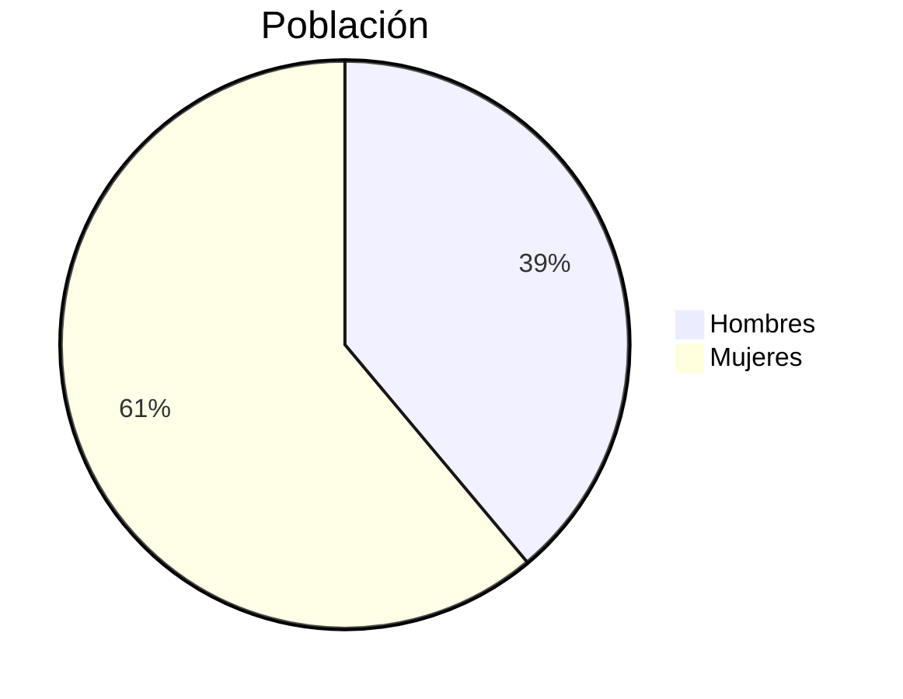
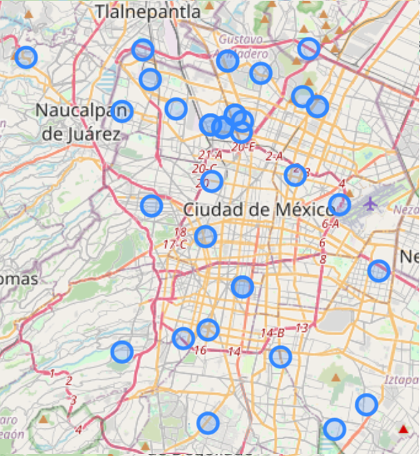
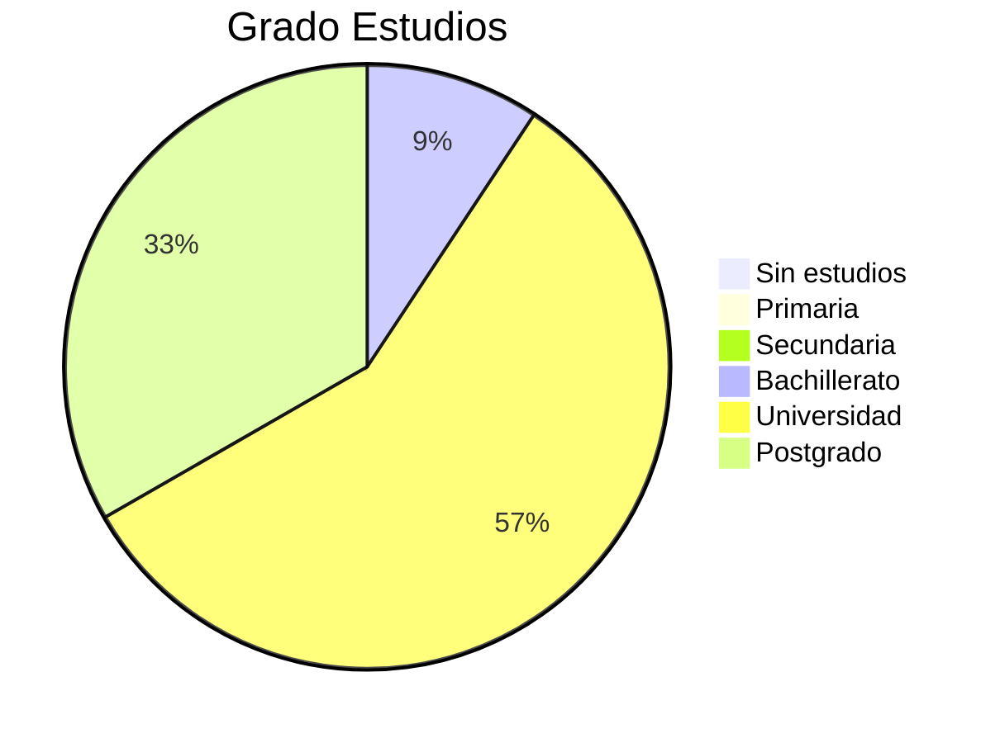
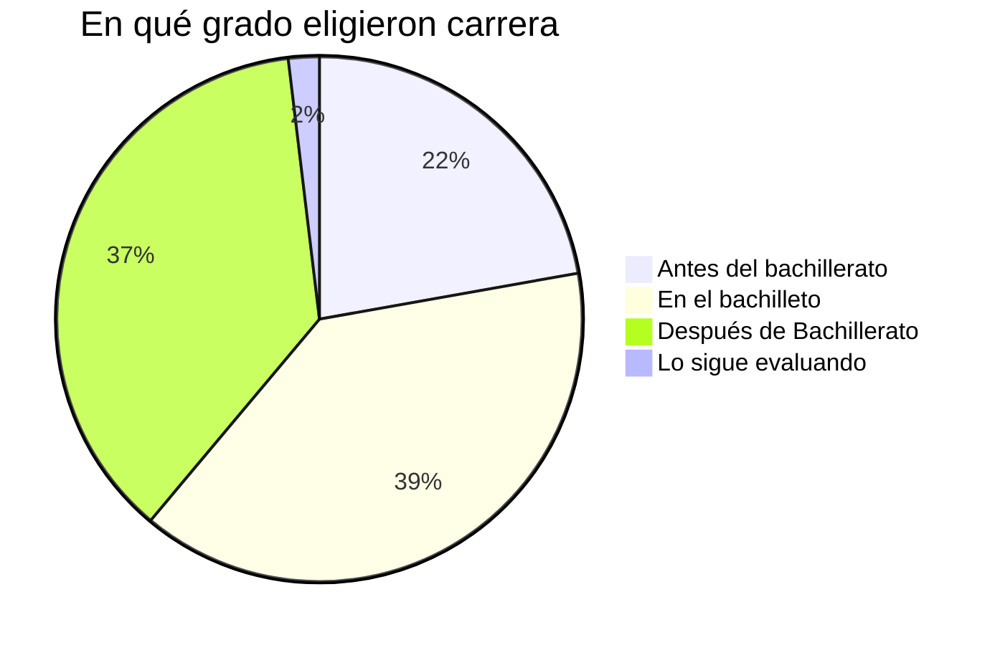
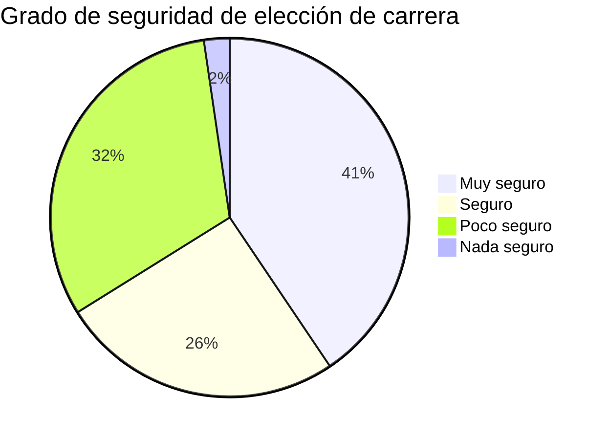
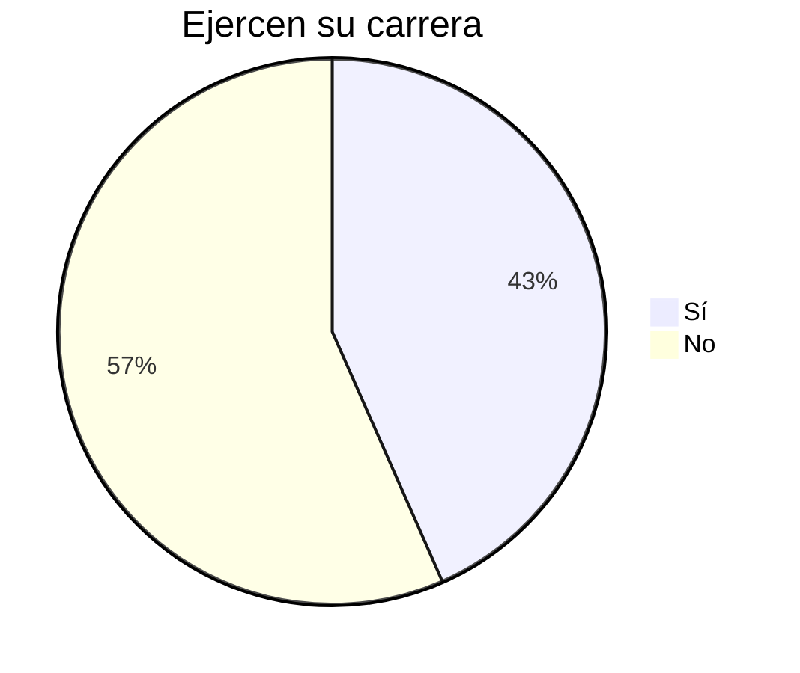
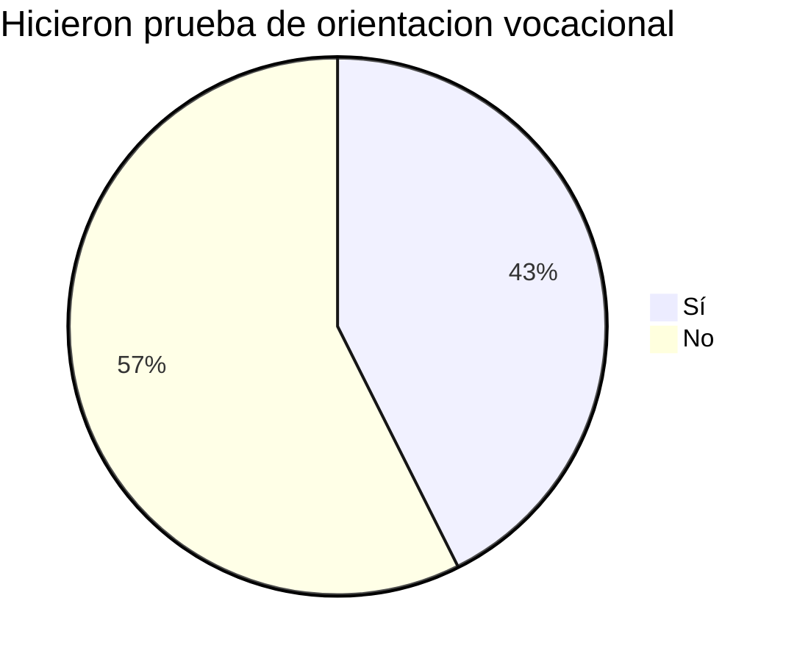
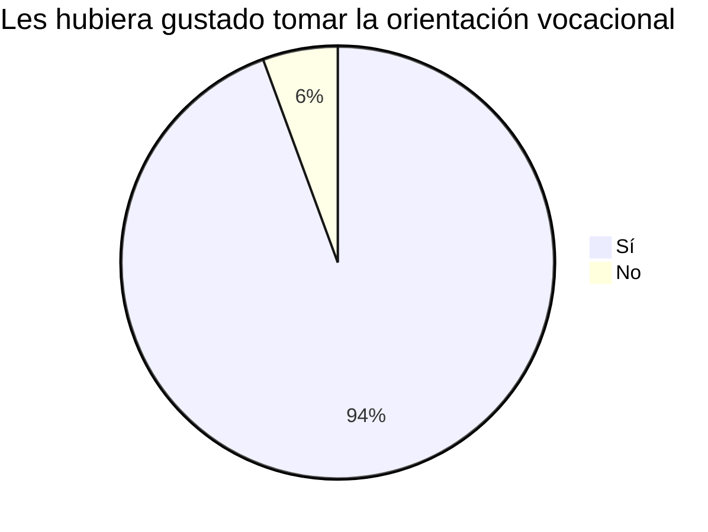

#  🔥 Propuesta PPS en la sección de Clan

## Hipótesis

El PPV idealmente se debe comenzar a ver desde la sección de la Comunidad 

## Antescedentes

- En la mayoria de las escuelas de bachillerato al menos en México al final del segundo año se elige el área a que se decide ir, por ejemplo, ciencias de la salud, fisicomatemáticas, etc.
- Cuesta tiempo e inversión desde un inicio elegir una carrera no adecuada

## ¿Qué se debería ver en la comunidad?

- Comenzar a trabajar el IKIGAI y FODA Personal
- Realizar Test de orientación de carrera
- Genera una versión de PPV

## ¿Y entonces qué se vería en el clan?

La propuesta es que se use en lugar crear un PPV, se debe crear un PPS o Proyecto Personal de Seguimiento

Nota: si el chico es recién ingresado por supuesto se le debe ayudar a cree su PPV

## Sustento

Se lanzó encuetas anónimas. Se normalizaron los datos (2025-08-21)

[Contestar Encuesta](https://docs.google.com/forms/d/1dDKZVk_P4YmnLEzyHmwG5qFOwgsKDYPIOzGSCwMJSP0/preview)

## Resultados (2025-08-21)

Hasta el momento han contestado **54 personas**

La edad promedio fue de **40 años**

Geografía de la Población Encuestada

Grado de estudios

En qué grado eligieron carrera

**Respuestas interesantes de en qué grado eligueron carrera**

- Soy polymatha, soy doble ingeniero, maestro en dirección de proyectos, también contador y lamentablemente psicólogo (ejerci como Gestalt y me arrepiento cada día) sin embargo en la dgose me ayudaron incluso a saber que existen carreras que en pendeja y joven vida sabía que existían. Aún ignoro cosas de mis propios gremios y cosas básicas. También define mucho que quieres ser, yo sabía que quería dinero y ser feliz, 15 años después un niño en una charla tedx resumio todo en un vídeo de no más de 10 minutos que se llama hackeando la escuela. Y es que sabemos que una persona que vende tacos, sin mayor preparación que 3ro de primaria ganas hasta 10 veces más por día que un letrado con honores académicos, pero aquí reside mucho el que quieres , ¿Yo? Quiero cambiar el mundo, el sujeto de los tacos solo quiere vender tacos (hay una diferencia enorme en ello).
- En ningun momento, me mantuve firme a mi ideal

De los que se cambiaron de carrera(16/54) el promedio de edad fue a los **30 años**

Qué tan seguros estaban cuando eligieron carrera

Actualmenet ejercen la carrra que eligieron

Hicieron prueba de orientacion vocacional antes de los 17 años

Les hubiera gustado tomar la orientación vocacional entre sus 14 y 17 años

#### Conslusiones

Más de l 90% de los encuenstados les hubiera gustado tener orientación vocacional antes 
de elegir carrera. 

El 37% de los encuestados eligió su depués de launiversidad y 39% en el bachillerato

Apenas el 43% de los encuestados hizo alguna prueba de orientación vacacional antes de los 17 años

El 57% de los encuestados no ejecce la carrera que estudió

El 41% estaba muy reguro de su elección y el 32% poco seguro.

### 👏 Agredecimiento por su contribución👏

- Mónica Ramírez
- David Flores